# WealthSei — Stage 1 Project Design Report
### An AI Personal Finance Agent

**Course:** EECS3311 Software Design, Fall 2026 · **Stage:** 1 (Design)
**Student:** Rishit Shah, 219773050 · **Repository:** [github.com/Rishit-Shah/EECS-3311-Project---WealthSei](https://github.com/Rishit-Shah/EECS-3311-Project---WealthSei)

**About the name:** *WealthSei* combines *wealth* with *sensei* (Japanese for teacher or mentor): the agent acts as a personal mentor for everyday money decisions.

> **Notice:** WealthSei provides informational guidance only. It is not professional financial advice. This notice is shown in the GUI footer and in the CLI banner.

## Contents

1. Project Overview
2. Detailed Feature Specifications (F01–F14)
3. UML Class Diagrams
4. Design Pattern Explanations
5. Use-Case Diagram
6. Use-Case Descriptions
7. Sequence Diagrams
8. Feature-to-Design Traceability Table
9. Feature Implementation Explanations
10. Appendices (testability map, CLI command map)

---

## 1. Project Overview

### 1.1 Problem and motivation

Most people can see *what* they spent (bank apps and spreadsheets show that), but not what it *means* for decisions they face every week: *Can I afford this laptop? How much can I safely spend today without missing rent? Am I still on track for my vacation fund? What would change if I cancelled two subscriptions?* Answering these questions means combining several data sources (transaction history, budgets, upcoming bills, savings goals) and reasoning across several steps. Existing budgeting tools mostly categorize and chart; they stop before the decision.

### 1.2 Target users

Individuals who manage a personal budget without financial expertise: university students, early-career workers, and freelancers with irregular income.

### 1.3 What the agent can do

- Import bank CSV exports (two layouts, auto-detected) and categorize transactions, learning from the user's corrections.
- Track monthly budgets and push alerts to both the GUI and the CLI.
- Compute a **daily Safe-to-Spend allowance**, forecast the next 30 days of cash flow, and warn before the balance drops below a safety buffer.
- Detect recurring payments and subscriptions, spending habits, and a transparent **Financial Health Score**.
- **Plan multi-step answers with tools:** "Can I afford $600 for a laptop?", savings-goal planning and automatic re-planning, and natural-language **what-if simulations**.
- Write a **monthly review** with concrete "fix" suggestions.
- Answer free-form finance questions with memory of the conversation and a **"How did you get this?" trace**.
- Never change the user's data on its own: every suggested change goes to an **approval queue**.

### 1.4 Why an AI agent is appropriate

| Need | Why plain code or a single prompt is not enough | Agent behaviour used |
|---|---|---|
| "Can I afford X?" | Which data matters depends on the item, price, date, and the user's goals; 3–4 lookups must be chosen and combined | **Planning, tool use, multi-step execution, decision-making** (verdict) |
| Goal replanning | Requires checking feasibility, generating alternatives, then choosing which to propose | **Multi-step reasoning** over deterministic goal tools |
| What-if in plain English | Free text must become structured changes; ambiguity must be detected and clarified | **Reasoning, tool use, clarification** |
| Follow-up questions ("and last month?") | Needs context from earlier turns and stored user preferences | **Memory** (short-term and long-term) |
| Trustworthy numbers | LLMs are unreliable at arithmetic | **Retrieval via tools + grounding check**: the LLM never computes money values |

**Design rule:** *the LLM decides what to look up and how to explain; deterministic code computes every number.*

### 1.5 AI/LLM models

| Role | Model | Used by |
|---|---|---|
| Agent reasoning, planning, monthly review | Claude Sonnet 5 (`claude-sonnet-5`) | `Planner` (via `LLMProvider`) |
| Lightweight tasks: categorization fallback, explanations | Claude Haiku 4.5 (`claude-haiku-4-5-20251001`) | `LLMCategorizationStrategy`, `ExplanationService` |
| Offline development and automated tests | `MockLLMProvider` (scripted replies) | Unit and integration tests |

All models sit behind one interface, `LLMProvider`, and are reached through the official `anthropic` Python SDK (wrapped by `ClaudeProvider`, see the Adapter pattern in Section 4). Model names are read from `config.properties`, so any other provider can be substituted without changing agent code.

### 1.6 How the AI interacts with the rest of the software

1. **The LLM never touches the database or the UI.** `Planner` asks it for one structured step at a time (JSON): either `ToolCallStep` or `FinalAnswerStep`.
2. **Tools are a whitelist.** `ToolManager` validates arguments against each `ToolSpec` before running a `Tool`; invalid calls are never executed.
3. **Numbers come from tools only.** `GroundingChecker` compares figures in the final answer with tool results and triggers a correction if any are unsupported.
4. **Changes go through proposals.** Agent suggestions become `Proposal` objects that the user approves; approval runs an undoable `Command`.
5. **Memory is explicit.** `MemoryManager` supplies bounded recent messages and stored preferences (e.g., protected categories such as Groceries).
6. **Graceful degradation.** If the LLM is unavailable, deterministic fallbacks are used (template explanations, "Uncategorized" flag, metrics-only review).

### 1.7 Overall architecture

**Planned stack:** Python 3.11+; **Tkinter/ttk** for the GUI (standard library, optional `matplotlib` for charts); **`argparse`** sub-commands for the CLI; **`sqlite3`** for persistence; the official **`anthropic`** Python SDK for LLM access; `decimal.Decimal` for money; `dataclasses` for value objects; `abc.ABC` for interfaces (UML «interface»); **`pytest`** for tests.

**Fig 1 — Layered architecture**

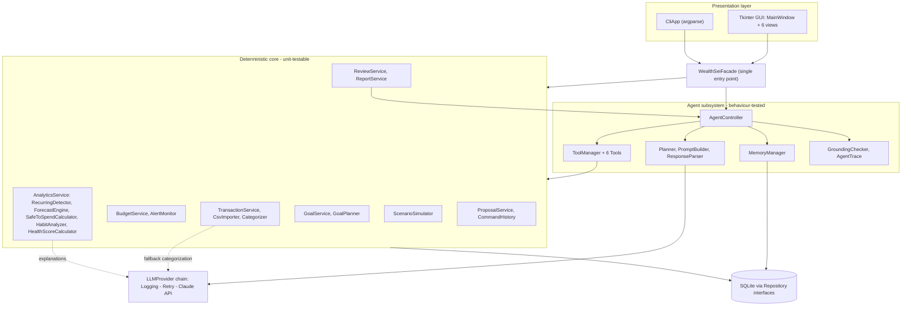
```mermaid
flowchart TB
    subgraph P["Presentation layer"]
        GUI["Tkinter GUI: MainWindow + 6 views"]
        CLI["CliApp (argparse)"]
    end
    FAC["WealthSeiFacade (single entry point)"]
    subgraph S["Deterministic core - unit-testable"]
        TS["TransactionService, CsvImporter, Categorizer"]
        BS["BudgetService, AlertMonitor"]
        AN["AnalyticsService: RecurringDetector, ForecastEngine, SafeToSpendCalculator, HabitAnalyzer, HealthScoreCalculator"]
        GS["GoalService, GoalPlanner"]
        SIM["ScenarioSimulator"]
        PS["ProposalService, CommandHistory"]
        RS["ReviewService, ReportService"]
    end
    subgraph A["Agent subsystem - behaviour-tested"]
        AC["AgentController"]
        PL["Planner, PromptBuilder, ResponseParser"]
        MM["MemoryManager"]
        TM["ToolManager + 6 Tools"]
        GC["GroundingChecker, AgentTrace"]
    end
    LLM["LLMProvider chain: Logging - Retry - Claude API"]
    DB[("SQLite via Repository interfaces")]

    GUI --> FAC
    CLI --> FAC
    FAC --> S
    FAC --> AC
    RS --> AC
    AC --> PL
    PL --> LLM
    AC --> MM
    AC --> TM
    AC --> GC
    TM --> S
    S --> DB
    MM --> DB
    TS -. "fallback categorization" .-> LLM
    AN -. "explanations" .-> LLM
```

**Planned Python package layout** (each UML class maps to one module, which is what Stage 2 will trace to):

| Package | Contents |
|---|---|
| `wealthsei/presentation/` | `main_window.py` and the six Tkinter views; `cli_app.py` |
| `wealthsei/facade.py` | `WealthSeiFacade` |
| `wealthsei/services/` | `transaction_service.py`, `budget_service.py`, `analytics_service.py`, `goal_service.py`, `proposal_service.py`, `review_service.py`, `report_service.py`, `explanation_service.py` |
| `wealthsei/analytics/` | `recurring_detector.py`, `forecast_engine.py`, `safe_to_spend.py`, `habit_analyzer.py`, `health_score.py`, `goal_planner.py`, `scenario_simulator.py` |
| `wealthsei/importing/` | `csv_importer.py`, `bank_adapters.py`, `categorizer.py`, `strategies.py` |
| `wealthsei/agent/` | `agent_controller.py`, `planner.py`, `prompt_builder.py`, `response_parser.py`, `tool_manager.py`, `tools/`, `memory.py`, `grounding.py`, `trace.py` |
| `wealthsei/llm/` | `provider.py` (`LLMProvider`), `claude_provider.py`, `mock_provider.py`, `decorators.py` |
| `wealthsei/commands/` | `command.py`, `command_history.py`, `command_factory.py`, concrete commands; `proposal.py` and `proposal_states.py` |
| `wealthsei/reports/` | `report_exporter.py`, `markdown_exporter.py`, `csv_exporter.py`, `text_exporter.py` |
| `wealthsei/domain/` | `money.py`, `year_month.py`, dataclasses for `Transaction`, `Budget`, `SavingsGoal`, etc. |
| `wealthsei/repositories/` | repository interfaces and `sqlite_*` implementations |
| `tests/` | `pytest` tests (Stage 3) |

### 1.8 What makes WealthSei distinctive (beyond the sample "Personal Finance Assistant")

| ★ | Feature | Why it is different |
|---|---|---|
| ★ | **Safe-to-Spend Coach (F05)** | Turns budgets into one actionable number for *today*, accounting for upcoming bills and goal contributions, with a 30-day low-balance forecast |
| ★ | **Spending Habit Detective (F06)** | Finds behavioural patterns (weekend spikes, post-payday splurges, small-purchase leaks), not just category totals |
| ★ | **Financial Health Score (F07)** | Transparent 0–100 score with a component breakdown and improvement hints |
| ★ | **Goal Planner with Auto-Replan (F09)** | Goals re-evaluate after every import and the agent proposes a revised plan when a goal slips |
| ★ | **What-If Scenario Simulator (F10)** | Plain-English scenarios simulated by deterministic code and compared with the baseline |
| ★ | **Proposal Approval Queue (F13)** | Human-in-the-loop: the agent proposes, the user decides; every change is undoable |
| ★ | **Agent Trace + Grounding Check (F12)** | Users can see exactly which tools and data produced an answer; unsupported figures are caught |

### 1.9 Minimum-requirements checklist

| Requirement | How WealthSei satisfies it |
|---|---|
| GUI | Tkinter `MainWindow` with 6 views covering all major features (Section 3, Fig 3.1) |
| CLI | `CliApp` exposes the same `WealthSeiFacade` operations (Appendix B) |
| ≥ 10 meaningful features | 14 features (F01–F14); none are login/logout/about-type features |
| ≥ 5 design patterns | 9: Facade, Strategy, Adapter, Observer, Command, State, Decorator, Template Method, Factory (Section 4) |
| AI/LLM model | Claude Sonnet 5 and Claude Haiku 4.5 behind `LLMProvider` |
| Agent behaviour | Planning, tool use, memory, multi-step execution, decision-making, self-check (grounding), human-in-the-loop |

---

## 2. Detailed Feature Specifications

| ID | Feature | Type | ★ |
|---|---|---|---|
| F01 | Import Transactions (CSV) | Deterministic | |
| F02 | Smart Categorization and Correction (with Undo) | Hybrid | |
| F03 | Budget Setup, Tracking and Alerts | Deterministic | |
| F04 | Recurring Payment and Subscription Detector | Hybrid | |
| F05 | Safe-to-Spend Coach | Hybrid | ★ |
| F06 | Spending Habit Detective | Hybrid | ★ |
| F07 | Financial Health Score | Hybrid | ★ |
| F08 | Purchase Affordability Check | AI (agent) | |
| F09 | Savings Goal Planner with Auto-Replan | AI (agent) | ★ |
| F10 | What-If Scenario Simulator | AI (agent) | ★ |
| F11 | Monthly AI Review and Fix Plan | AI (agent) | |
| F12 | Natural-Language Finance Chat with Agent Trace | AI (agent) | ★ |
| F13 | Proposal Approval Queue | Hybrid | ★ |
| F14 | Report Export | Deterministic | |

_Type meanings: **Deterministic** = no LLM. **Hybrid** = deterministic core, LLM used for a bounded sub-task. **AI (agent)** = LLM plans and calls tools; all numbers still come from deterministic tools._

### F01 — Import Transactions (CSV) · Deterministic

| Field | Details |
|---|---|
| **Description** | Loads a bank or credit-card CSV export, auto-detects one of two supported layouts (single signed-amount column, or separate debit/credit columns) using a matching adapter that wraps Python's `csv.DictReader`, normalizes rows into `Transaction` objects, skips duplicates, and auto-categorizes new rows (F02). |
| **User interaction** | `TransactionsView` → **Import CSV** → file chooser → summary dialog. CLI: `wealthsei import <file>`. |
| **Input** | Path to a CSV file. |
| **Output** | `ImportResult` (imported count, duplicates skipped, rejected rows with reasons); transactions appear in the table. |
| **AI involvement** | Deterministic parsing and de-duplication. Categorization of the new rows is F02 (hybrid). |
| **Expected workflow** | 1) User picks file. 2) `CsvImporter` reads the header and picks a matching `BankCsvAdapter`. 3) The adapter's `read_transactions()` turns each row into a `Transaction`. 4) Duplicates (same date, amount, merchant) are removed. 5) `Categorizer` assigns categories. 6) Rows are saved. 7) Budget alerts and goal status are refreshed. 8) Summary is shown. |
| **Error / alternative cases** | Unreadable or non-CSV file → error, nothing saved. Unknown header → "unsupported format" listing supported layouts. Invalid row (bad date or amount) → skipped and listed. All rows duplicates → "0 new transactions". |

### F02 — Smart Categorization and Correction (with Undo) · Hybrid

| Field | Details |
|---|---|
| **Description** | Each transaction is categorized by a priority chain: learned user rules → keyword rules → LLM fallback (only for merchants nothing else recognizes). The user can correct a category; the correction is stored as a learned rule so the same merchant is categorized correctly next time. Corrections can be undone and redone. |
| **User interaction** | `TransactionsView`: category drop-down per row; **Undo / Redo** buttons. CLI: `wealthsei categorize <tx_id> <category>`, `wealthsei undo`, `wealthsei redo`. |
| **Input** | New transactions (automatic), or `(tx_id, new_category)` (manual). |
| **Output** | Categorized transactions; updated row; new learned rule. |
| **AI involvement** | **Hybrid.** Rules are deterministic. The LLM is called only as the last strategy, and must answer with one category from the allowed list. |
| **Expected workflow** | Auto: `Categorizer` tries each `CategorizationStrategy` in order until one returns a category. Manual: Facade wraps the change in a `RecategorizeCommand`; `CommandHistory` executes it (update transaction + learn rule); Undo restores the old category and forgets the rule. |
| **Error / alternative cases** | LLM unavailable or times out → `UNCATEGORIZED`, flagged for manual review. LLM returns a category not in the list → rejected, `UNCATEGORIZED`. Unknown `tx_id` → error. Undo with empty history → "nothing to undo". |

### F03 — Budget Setup, Tracking and Alerts · Deterministic

| Field | Details |
|---|---|
| **Description** | User sets monthly spending limits per category. The app tracks spent/limit/percentage live and raises alerts at 80% (warning) and 100% (over budget). Alerts are delivered to whichever interfaces are listening (GUI toast, CLI console). |
| **User interaction** | `DashboardView` budget panel: editable limits, progress bars, alert toasts. CLI: `wealthsei budget set <month> <category> <amount>`, `wealthsei budget status <month>`. |
| **Input** | Month; category limits (≥ 0). |
| **Output** | `BudgetStatus` (per-category spent, limit, ratio, level); `Alert` events. |
| **AI involvement** | None (deterministic). |
| **Expected workflow** | 1) Limits validated. 2) `BudgetService` saves the `Budget`. 3) Status computed from transactions. 4) `AlertMonitor.evaluate()` publishes an `Alert` for each line at or above 80%. 5) Listeners display it. |
| **Error / alternative cases** | Negative or non-numeric limit → rejected with message. Spending in a category with no budget → shown as "unbudgeted". No transactions → all usage 0%. |

### F04 — Recurring Payment and Subscription Detector · Hybrid

| Field | Details |
|---|---|
| **Description** | Finds payments that repeat at a regular interval (weekly, monthly, yearly) with similar amounts; lists subscriptions, total monthly cost, next due dates, and price increases. Users can flag an item for review. |
| **User interaction** | `DashboardView` → **Recurring** panel. CLI: `wealthsei recurring`. |
| **Input** | Transaction history (≥ 3 occurrences per pattern). |
| **Output** | List of `RecurringPayment` (merchant, amount, frequency, next due, confidence), total monthly cost, plain-language summary. |
| **AI involvement** | **Hybrid.** Detection is deterministic (interval regularity + amount tolerance). The LLM only phrases the summary from the computed facts. |
| **Expected workflow** | 1) `AnalyticsService.detect_recurring()` loads history. 2) `RecurringDetector.detect()` groups by merchant and tests regularity. 3) `ExplanationService.explain()` writes the summary. 4) Panel is displayed. |
| **Error / alternative cases** | Fewer than 3 occurrences → "not enough history". Irregular amounts → shown as "possible" with lower confidence. LLM failure → template summary. |

### F05 — Safe-to-Spend Coach ★ · Hybrid

| Field | Details |
|---|---|
| **Description** | Computes a **daily discretionary allowance** for the rest of the month: *(balance + expected income − upcoming recurring bills − goal contributions − safety buffer) ÷ days left*. Projects the next 30 days of balance and raises a low-balance alert if the projection falls below the buffer. |
| **User interaction** | `DashboardView` **Safe to Spend Today** card and 30-day balance chart. CLI: `wealthsei safe [date]`. |
| **Input** | Date (default today); opening balance and transactions; recurring payments; goals; buffer setting (default $200). |
| **Output** | `SafeToSpendResult` (daily allowance, remaining this month, upcoming bills, goal reserve), `Forecast`, explanation, optional `LOW_BALANCE` alert. |
| **AI involvement** | **Hybrid.** All figures deterministic; the LLM only explains and gives tips from those figures. |
| **Expected workflow** | 1) `AnalyticsService.safe_to_spend()` detects recurring payments. 2) `ForecastEngine.project()` builds the 30-day forecast. 3) `SafeToSpendCalculator.calculate()` computes the allowance. 4) If the lowest projected balance < buffer → `AlertMonitor.publish()`. 5) `ExplanationService.explain()` adds text. |
| **Error / alternative cases** | No transactions → prompt to import. Result would be negative → show $0 and "over-committed by $X" with alert. LLM unavailable → template text. |

### F06 — Spending Habit Detective ★ · Hybrid

| Field | Details |
|---|---|
| **Description** | Detects behavioural patterns: weekend-vs-weekday spikes, post-payday splurges, end-of-month crunches, **small-purchase leaks** (many small purchases that add up), and unusual one-off expenses (amount > mean + 2σ for the category). Each `Insight` includes its evidence. |
| **User interaction** | `DashboardView` → **Habits** panel with insight cards. CLI: `wealthsei habits <month>`. |
| **Input** | Month (default current); transaction history. |
| **Output** | List of `Insight` (type, title, evidence, severity, friendly explanation). |
| **AI involvement** | **Hybrid.** Statistical rules find the patterns; the LLM turns evidence into a friendly tip. |
| **Expected workflow** | 1) `AnalyticsService.habits()` loads transactions. 2) `HabitAnalyzer.analyze()` applies rules. 3) `ExplanationService.explain()` adds text. 4) Cards displayed. |
| **Error / alternative cases** | Less than 30 days of data → "need more data". No pattern found → "no notable patterns". LLM failure → evidence-only cards. |

### F07 — Financial Health Score ★ · Hybrid

| Field | Details |
|---|---|
| **Description** | Computes a 0–100 score from transparent components: budget adherence (30), savings rate (25), emergency buffer in months of expenses (25), goal progress (20). Shows a breakdown, the change from last month, and what would improve it most. |
| **User interaction** | `DashboardView` gauge with expandable breakdown. CLI: `wealthsei score <month>`. |
| **Input** | Month; `BudgetStatus`; forecast; goals. |
| **Output** | `HealthScore` (total, `ScoreComponent` list, explanation). |
| **AI involvement** | **Hybrid.** Score is a deterministic formula; the LLM explains it. |
| **Expected workflow** | 1) `AnalyticsService.health_score()` gets `BudgetStatus` from `BudgetService`. 2) `HealthScoreCalculator.calculate()` scores each component. 3) `ExplanationService.explain()` adds text. |
| **Error / alternative cases** | No budget or no goals → that component is excluded and weights re-normalized (noted in the UI). No data → "N/A". |

### F08 — Purchase Affordability Check · AI (agent)

| Field | Details |
|---|---|
| **Description** | The user asks "Can I afford a $600 laptop?". The agent **plans**: checks budget headroom for the relevant category, safe-to-spend and the 30-day forecast *with* the purchase, impact on active goals, and recent related spending. It returns a verdict (**Yes / Yes-but / Wait / No**) with reasoning, and may suggest a better timing as a proposal. |
| **User interaction** | `AssistantView` → **Can I afford it?** form (item, price) or chat. Result card with verdict, evidence, and **Why?** trace link. CLI: `wealthsei afford "<item>" <price>`. |
| **Input** | Item description, price, optional target date. |
| **Output** | `AgentResult` (verdict, reasoning with tool figures, optional `ProposalDraft`s, trace id). |
| **AI involvement** | **AI agent** (multi-step tool use). Numbers only from tools. |
| **Expected workflow** | 1) Input validated. 2) `AgentController.handle()` builds context. 3) Loop: `Planner.next_step()` → tool calls (`BudgetStatusTool`, `ForecastTool`, `GoalTool`, `TransactionQueryTool`) → observations. 4) Final answer → `GroundingChecker.verify()`. 5) Trace saved; result shown. |
| **Error / alternative cases** | Missing or non-positive price → validation error, agent not called. Tool failure → agent states which data was unavailable and qualifies its answer (no guessing). Malformed LLM output → one repair retry, then error message. Step limit reached → partial answer flagged. Ungrounded figures → answer revised or blocked. |

### F09 — Savings Goal Planner with Auto-Replan ★ · AI (agent)

| Field | Details |
|---|---|
| **Description** | User defines a goal (name, target, deadline). The agent checks feasibility using `GoalTool` (required monthly amount vs projected surplus) and proposes a plan with options: raise contribution, extend deadline, or trim named categories. After every import, goals are re-evaluated; if a goal becomes **AT_RISK** or **BEHIND**, an alert fires and the user can click **Replan**. |
| **User interaction** | `GoalsView`: goal cards with progress bar and status chip; **Plan** and **Replan** buttons. CLI: `wealthsei goal add "<name>" <target> <deadline>`, `wealthsei goal replan <id>`. |
| **Input** | Name, target amount (> 0), deadline (in the future), amount saved so far. |
| **Output** | `SavingsGoal`, plan explanation, `Proposal`s (contribution change, budget trims). |
| **AI involvement** | **AI agent** over deterministic goal tools. |
| **Expected workflow** | 1) `GoalService.create_goal()` validates and saves. 2) `AgentController.handle()` runs the loop; `GoalTool` → `GoalService.feasibility()` → `GoalPlanner`. 3) Drafts pass guardrails (protected categories) and become pending proposals. 4) Plan and proposals shown. |
| **Error / alternative cases** | Deadline in the past or target ≤ 0 → validation error. Infeasible even if all discretionary spending is cut → agent says so and proposes only a deadline extension. Little history → uses budget totals with a "lower confidence" note. |

### F10 — What-If Scenario Simulator ★ · AI (agent)

| Field | Details |
|---|---|
| **Description** | User types a scenario ("What if I cancel Spotify, cap dining at $150 and get a $200/month raise?"). The agent converts it to structured changes, `ScenarioTool` simulates baseline vs scenario over 6 months, and the agent explains differences in monthly savings, end balance, and goal completion dates. The scenario can be turned into proposals. |
| **User interaction** | `AssistantView` → **What-If** tab: text box; result as side-by-side table and chart. CLI: `wealthsei whatif "<text>"`. |
| **Input** | Natural-language scenario description. |
| **Output** | `ScenarioResult` comparison plus explanation; optional proposals. |
| **AI involvement** | **AI agent:** NL → structured changes (LLM), simulation (deterministic). |
| **Expected workflow** | 1) `AgentController.handle()` starts the loop. 2) `Planner` emits `ToolCallStep` for `ScenarioTool` with structured changes. 3) `ScenarioSimulator.simulate()` runs baseline and modified forecasts. 4) Agent explains; grounding verified. 5) Optional: user clicks **Turn into proposals**. |
| **Error / alternative cases** | Ambiguous request ("cut my expenses") → agent asks a clarifying question. Refers to a nonexistent subscription or category → tool reports "not found". More than 5 changes → agent asks to split. Negative values → rejected by `ToolManager` validation. |

### F11 — Monthly AI Review and Fix Plan · AI (agent)

| Field | Details |
|---|---|
| **Description** | At month-end (or on demand), produces a review: deterministic metrics (income, spending, savings rate, over-budget categories, habits, score, goal status) plus an agent-written narrative (*what happened, what went well, what to fix*) and up to **3 concrete fix proposals** (e.g., "lower Dining limit by $60", "flag Subscription X for review"). The agent compares against the previous review from memory. |
| **User interaction** | `ReportView` → **Generate Review**; **See proposals** button. CLI: `wealthsei review <month>`. |
| **Input** | Month with transactions. |
| **Output** | `MonthlyReview` (saved) and pending `Proposal`s. |
| **AI involvement** | **AI agent** plus deterministic metrics. |
| **Expected workflow** | 1) `ReviewService.generate()` gathers score, habits, budget status, goal status. 2) `AgentController.handle()` writes narrative and drafts using tools. 3) `ProposalService.create_from_drafts()` filters and stores proposals. 4) Review saved and shown. |
| **Error / alternative cases** | No transactions in month → refused with message. Review exists → offer to regenerate. Agent fails → metrics-only review saved (no narrative). Proposals touching protected categories are filtered out. |

### F12 — Natural-Language Finance Chat with Agent Trace ★ · AI (agent)

| Field | Details |
|---|---|
| **Description** | Free-form questions ("How much did I spend on coffee in July?", "Am I on track for my vacation?"). The agent selects tools, uses conversation memory for follow-ups ("and last month?") and stored preferences. Each answer has **How did you get this?** showing the tool calls and data used (`AgentTrace`); the grounding check flags figures not found in tool output. |
| **User interaction** | `AssistantView` chat panel with trace toggle. CLI: `wealthsei ask "<question>"`, `wealthsei trace <id>`. |
| **Input** | Question text. |
| **Output** | Answer, trace id, grounding status. |
| **AI involvement** | **AI agent.** |
| **Expected workflow** | 1) `MemoryManager.build_context()` adds recent messages and preferences. 2) Loop of `Planner.next_step()` → tool calls. 3) `GroundingChecker.verify()`. 4) Trace saved; `MemoryManager.remember()` stores the turn. 5) Answer displayed; trace available on demand. |
| **Error / alternative cases** | Off-topic question → polite redirect, no tools. No data → says none available. Vague time ("recently") → assumes last 30 days and states it, or asks. LLM unavailable → offline message suggesting dashboard/CLI commands. History over the window → oldest messages dropped. |

### F13 — Proposal Approval Queue ★ · Hybrid

| Field | Details |
|---|---|
| **Description** | The agent **never edits budgets or goals directly**. Every suggested change (from F08–F11) is stored as a `Proposal` (title, rationale, source trace) with a lifecycle **Pending → Applied / Rejected / Expired**. Approving runs the underlying undoable `Command`. Proposals that touch a *protected category* are blocked. |
| **User interaction** | `ProposalView`: list with **Approve / Reject** and **Why?** (trace). CLI: `wealthsei proposals list`, `wealthsei proposals approve <id>`, `wealthsei proposals reject <id>`. |
| **Input** | Proposal id and decision. |
| **Output** | Updated `Proposal`; the applied change is visible in budget or goal views. |
| **AI involvement** | **Hybrid:** AI-generated content inside a deterministic workflow. |
| **Expected workflow** | 1) `ProposalService.decide()` loads the `Proposal`. 2) `Proposal.approve()` delegates to its current `ProposalState`. 3) `PendingState` executes the `Command` through `CommandHistory` and switches to `AppliedState`. 4) Proposal saved; UI refreshed. |
| **Error / alternative cases** | Approving a non-pending proposal → `IllegalStateTransitionError`, message shown. Command fails (e.g., category deleted) → proposal stays Pending with error. Proposals from a past month auto-expire. |

### F14 — Report Export · Deterministic

| Field | Details |
|---|---|
| **Description** | Exports the monthly report (summary, category-vs-budget table, review narrative, goal status) as Markdown, CSV, or plain text. |
| **User interaction** | `ReportView` → **Export** → format drop-down → save dialog. CLI: `wealthsei export <month> --format md --out report.md`. |
| **Input** | Month, format, output path. |
| **Output** | A file at the given path. |
| **AI involvement** | None (deterministic). |
| **Expected workflow** | 1) `ReportService.build_report_data()` collects data. 2) `exporter_for(format)` picks the exporter. 3) `ReportExporter.export()` runs header → summary → category table → review → footer. 4) File written. |
| **Error / alternative cases** | No data for month → error. Path not writable → `ExportError`. Review not generated → metrics-only report with a note. File exists → confirm overwrite. |

---

## 3. UML Class Diagrams

### 3.0 Notation used (following the EECS 3311 UML lectures)

| Lecture notation | How it appears in the diagrams |
|---|---|
| Attribute `visibility name: type` | `-amount: Decimal` |
| Method `visibility name(param: type): return_type` | `+add(other: Money) Money` (the tool draws the `:` before the return type; the return type is omitted when the method returns `None`) |
| Visibility `+` public, `-` private, `#` protected | `-` is a leading-underscore attribute in Python; `#` is a protected hook meant for subclasses |
| Derived attribute `/name` (computed, not stored) | `/ratio: float` |
| Static member (underlined) | `$` suffix, e.g. `+can_handle(header: list[str])$ bool` |
| Interface: `«interface»` above the name | `<<interface>>` (implemented as `abc.ABC`); other stereotypes such as `<<facade>>` and `<<subject>>` are used the same way |
| Abstract class `«abstract»`; abstract methods in italics | `<<abstract>>`; abstract methods are marked with `*` |
| Association (solid, arrow = direction) | `-->` |
| Dependency (dashed open arrow, «use») | `..>` |
| Aggregation (hollow diamond): parts survive the container | `o--` |
| Composition (filled diamond): parts die with the container | `*--` |
| Inheritance (solid line, hollow triangle) | `<|--` |
| Realization (dashed line, hollow triangle) | `<|..` |
| Multiplicity `1`, `0..1`, `0..*`, `1..*`, `2..7` | quoted at each end of a relationship |

**Perspective (lecture slide "Class diagram perspective"):** Figures 3.1–3.6 are at the *implementation* level, a blueprint for the Python modules listed in Section 1.7. Fig 3.7 is the *conceptual* domain model. As the lecture says, class diagrams show structure, not how objects interact or algorithmic detail; those are shown by the sequence diagrams in Section 7.

The model is split into seven figures so each stays readable. Classes that appear in several figures are the same class. Simple value objects and enums are listed in a table after Fig 3.7. SQLite implementations of repository interfaces (e.g., `SqliteTransactionRepository`) are omitted.

### Fig 3.1 — Presentation layer and Facade

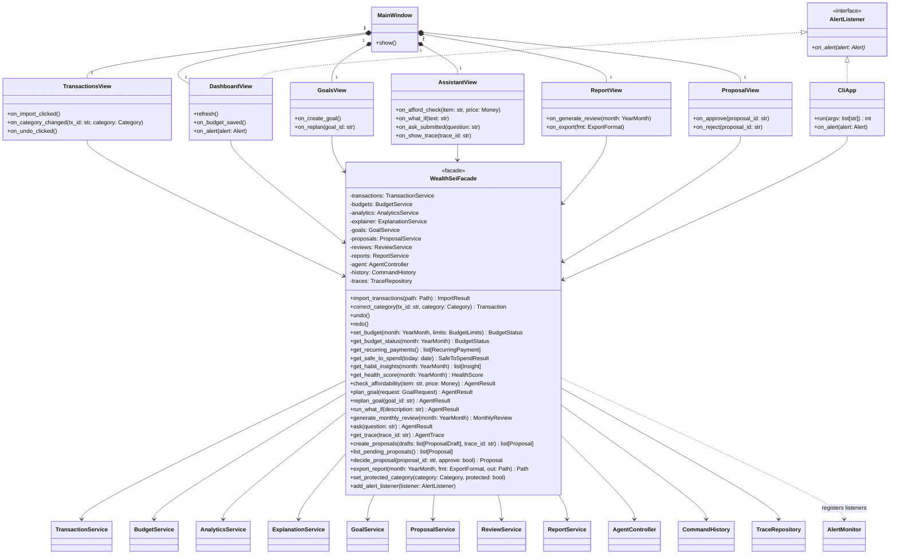
```mermaid
classDiagram
    direction TB
    class MainWindow {
        +show()
    }
    class TransactionsView {
        +on_import_clicked()
        +on_category_changed(tx_id: str, category: Category)
        +on_undo_clicked()
    }
    class DashboardView {
        +refresh()
        +on_budget_saved()
        +on_alert(alert: Alert)
    }
    class GoalsView {
        +on_create_goal()
        +on_replan(goal_id: str)
    }
    class AssistantView {
        +on_afford_check(item: str, price: Money)
        +on_what_if(text: str)
        +on_ask_submitted(question: str)
        +on_show_trace(trace_id: str)
    }
    class ReportView {
        +on_generate_review(month: YearMonth)
        +on_export(fmt: ExportFormat)
    }
    class ProposalView {
        +on_approve(proposal_id: str)
        +on_reject(proposal_id: str)
    }
    class CliApp {
        +run(argv: list[str]) int
        +on_alert(alert: Alert)
    }
    class AlertListener {
        <<interface>>
        +on_alert(alert: Alert)*
    }
    class WealthSeiFacade {
        <<facade>>
        -transactions: TransactionService
        -budgets: BudgetService
        -analytics: AnalyticsService
        -explainer: ExplanationService
        -goals: GoalService
        -proposals: ProposalService
        -reviews: ReviewService
        -reports: ReportService
        -agent: AgentController
        -history: CommandHistory
        -traces: TraceRepository
        +import_transactions(path: Path) ImportResult
        +correct_category(tx_id: str, category: Category) Transaction
        +undo()
        +redo()
        +set_budget(month: YearMonth, limits: BudgetLimits) BudgetStatus
        +get_budget_status(month: YearMonth) BudgetStatus
        +get_recurring_payments() list[RecurringPayment]
        +get_safe_to_spend(today: date) SafeToSpendResult
        +get_habit_insights(month: YearMonth) list[Insight]
        +get_health_score(month: YearMonth) HealthScore
        +check_affordability(item: str, price: Money) AgentResult
        +plan_goal(request: GoalRequest) AgentResult
        +replan_goal(goal_id: str) AgentResult
        +run_what_if(description: str) AgentResult
        +generate_monthly_review(month: YearMonth) MonthlyReview
        +ask(question: str) AgentResult
        +get_trace(trace_id: str) AgentTrace
        +create_proposals(drafts: list[ProposalDraft], trace_id: str) list[Proposal]
        +list_pending_proposals() list[Proposal]
        +decide_proposal(proposal_id: str, approve: bool) Proposal
        +export_report(month: YearMonth, fmt: ExportFormat, out: Path) Path
        +set_protected_category(category: Category, protected: bool)
        +add_alert_listener(listener: AlertListener)
    }

    MainWindow "1" *-- "1" TransactionsView
    MainWindow "1" *-- "1" DashboardView
    MainWindow "1" *-- "1" GoalsView
    MainWindow "1" *-- "1" AssistantView
    MainWindow "1" *-- "1" ReportView
    MainWindow "1" *-- "1" ProposalView
    AlertListener <|.. DashboardView
    AlertListener <|.. CliApp
    TransactionsView --> WealthSeiFacade
    DashboardView --> WealthSeiFacade
    GoalsView --> WealthSeiFacade
    AssistantView --> WealthSeiFacade
    ReportView --> WealthSeiFacade
    ProposalView --> WealthSeiFacade
    CliApp --> WealthSeiFacade
    WealthSeiFacade --> TransactionService
    WealthSeiFacade --> BudgetService
    WealthSeiFacade --> AnalyticsService
    WealthSeiFacade --> ExplanationService
    WealthSeiFacade --> GoalService
    WealthSeiFacade --> ProposalService
    WealthSeiFacade --> ReviewService
    WealthSeiFacade --> ReportService
    WealthSeiFacade --> AgentController
    WealthSeiFacade --> CommandHistory
    WealthSeiFacade --> TraceRepository
    WealthSeiFacade ..> AlertMonitor : registers listeners
```

### Fig 3.2 — Import, categorization, budgets and alerts

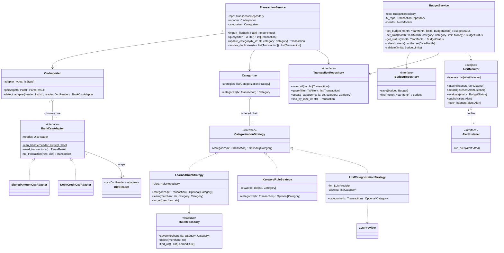
```mermaid
classDiagram
    direction TB
    class TransactionService {
        -repo: TransactionRepository
        -importer: CsvImporter
        -categorizer: Categorizer
        +import_file(path: Path) ImportResult
        +query(filter: TxFilter) list[Transaction]
        +update_category(tx_id: str, category: Category) Transaction
        -remove_duplicates(txs: list[Transaction]) list[Transaction]
    }
    class CsvImporter {
        -adapter_types: list[type]
        +parse(path: Path) ParseResult
        +detect_adapter(header: list[str], reader: DictReader) BankCsvAdapter
    }
    class BankCsvAdapter {
        <<interface>>
        #reader: DictReader
        +can_handle(header: list[str])$ bool
        +read_transactions() ParseResult
        #to_transaction(row: dict) Transaction
    }
    class SignedAmountCsvAdapter
    class DebitCreditCsvAdapter
    class Categorizer {
        -strategies: list[CategorizationStrategy]
        +categorize(tx: Transaction) Category
    }
    class CategorizationStrategy {
        <<interface>>
        +categorize(tx: Transaction) Optional[Category]*
    }
    class LearnedRuleStrategy {
        -rules: RuleRepository
        +categorize(tx: Transaction) Optional[Category]
        +learn(merchant: str, category: Category)
        +forget(merchant: str)
    }
    class KeywordRuleStrategy {
        -keywords: dict[str, Category]
        +categorize(tx: Transaction) Optional[Category]
    }
    class LLMCategorizationStrategy {
        -llm: LLMProvider
        -allowed: list[Category]
        +categorize(tx: Transaction) Optional[Category]
    }
    class TransactionRepository {
        <<interface>>
        +save_all(txs: list[Transaction])
        +query(filter: TxFilter) list[Transaction]
        +update_category(tx_id: str, category: Category)
        +find_by_id(tx_id: str) Transaction
    }
    class RuleRepository {
        <<interface>>
        +save(merchant: str, category: Category)
        +delete(merchant: str)
        +find_all() list[LearnedRule]
    }
    class BudgetService {
        -repo: BudgetRepository
        -tx_repo: TransactionRepository
        -monitor: AlertMonitor
        +set_budget(month: YearMonth, limits: BudgetLimits) BudgetStatus
        +set_limit(month: YearMonth, category: Category, limit: Money) BudgetStatus
        +get_status(month: YearMonth) BudgetStatus
        +refresh_alerts(months: set[YearMonth])
        -validate(limits: BudgetLimits)
    }
    class BudgetRepository {
        <<interface>>
        +save(budget: Budget)
        +find(month: YearMonth) Budget
    }
    class AlertMonitor {
        <<subject>>
        -listeners: list[AlertListener]
        +attach(listener: AlertListener)
        +detach(listener: AlertListener)
        +evaluate(status: BudgetStatus)
        +publish(alert: Alert)
        -notify_listeners(alert: Alert)
    }
    class AlertListener {
        <<interface>>
        +on_alert(alert: Alert)*
    }
    class DictReader {
        <<csv.DictReader - adaptee>>
    }

    TransactionService "1" --> "1" CsvImporter
    TransactionService "1" --> "1" Categorizer
    TransactionService --> TransactionRepository
    CsvImporter "1" o-- "1..*" BankCsvAdapter : chooses one
    BankCsvAdapter <|.. SignedAmountCsvAdapter
    BankCsvAdapter <|.. DebitCreditCsvAdapter
    BankCsvAdapter "1" --> "1" DictReader : wraps
    Categorizer "1" o-- "1..*" CategorizationStrategy : ordered chain
    CategorizationStrategy <|.. LearnedRuleStrategy
    CategorizationStrategy <|.. KeywordRuleStrategy
    CategorizationStrategy <|.. LLMCategorizationStrategy
    LearnedRuleStrategy --> RuleRepository
    LLMCategorizationStrategy ..> LLMProvider
    BudgetService --> BudgetRepository
    BudgetService --> TransactionRepository
    BudgetService --> AlertMonitor
    AlertMonitor "1" o-- "0..*" AlertListener : notifies
```

### Fig 3.3 — Analytics, goals and scenario simulation (all deterministic)

```mermaid
classDiagram
    direction TB
    class AnalyticsService {
        -tx_repo: TransactionRepository
        -goal_repo: GoalRepository
        -recurring_repo: RecurringRepository
        -budgets: BudgetService
        -monitor: AlertMonitor
        +detect_recurring() list[RecurringPayment]
        +flag_recurring(merchant: str, flagged: bool)
        +forecast(days: int) Forecast
        +safe_to_spend(today: date) SafeToSpendResult
        +habits(month: YearMonth) list[Insight]
        +health_score(month: YearMonth) HealthScore
    }
    class RecurringDetector {
        +detect(txs: list[Transaction]) list[RecurringPayment]
    }
    class ForecastEngine {
        +project(inputs: ForecastInputs, days: int) Forecast
        +monthly_surplus(inputs: ForecastInputs) Money
    }
    class ForecastInputs {
        -transactions: list[Transaction]
        -recurring: list[RecurringPayment]
        -opening_balance: Money
        +clone() ForecastInputs
    }
    class SafeToSpendCalculator {
        -buffer: Money
        +calculate(forecast: Forecast, goals: list[SavingsGoal], buffer: Money) SafeToSpendResult
    }
    class HabitAnalyzer {
        +analyze(txs: list[Transaction]) list[Insight]
    }
    class HealthScoreCalculator {
        +calculate(status: BudgetStatus, forecast: Forecast, goals: list[SavingsGoal]) HealthScore
    }
    class ExplanationService {
        -llm: LLMProvider
        +explain(facts: AnalysisFacts) str
        -fallback_text(facts: AnalysisFacts) str
    }
    class GoalService {
        -repo: GoalRepository
        -tx_repo: TransactionRepository
        -planner: GoalPlanner
        -forecast_engine: ForecastEngine
        -monitor: AlertMonitor
        +create_goal(request: GoalRequest) SavingsGoal
        +evaluate(goal: SavingsGoal) GoalStatus
        +evaluate_all() list[SavingsGoal]
        +feasibility(goal: SavingsGoal) FeasibilityReport
        +update_contribution(goal_id: str, amount: Money)
    }
    class GoalPlanner {
        +required_monthly(goal: SavingsGoal, today: date) Money
        +projected_completion(goal: SavingsGoal, monthly_surplus: Money) date
        +build_options(goal: SavingsGoal, monthly_surplus: Money) list[GoalOption]
    }
    class ScenarioSimulator {
        -forecast_engine: ForecastEngine
        -tx_repo: TransactionRepository
        +simulate(scenario: Scenario) ScenarioResult
    }
    class ScenarioChange {
        <<interface>>
        +apply_to(inputs: ForecastInputs) ForecastInputs*
        +describe() str*
    }
    class CancelRecurringChange {
        -merchant: str
    }
    class CapCategoryChange {
        -category: Category
        -monthly_cap: Money
    }
    class IncomeChange {
        -monthly_delta: Money
    }
    class OneTimeExpenseChange {
        -amount: Money
        -on_date: date
    }
    class GoalRepository {
        <<interface>>
        +save(goal: SavingsGoal)
        +find_all() list[SavingsGoal]
        +find_by_id(goal_id: str) SavingsGoal
    }
    class RecurringRepository {
        <<interface>>
        +save_flag(merchant: str, flagged: bool)
        +flagged_merchants() list[str]
    }

    AnalyticsService *-- RecurringDetector
    AnalyticsService *-- ForecastEngine
    AnalyticsService *-- SafeToSpendCalculator
    AnalyticsService *-- HabitAnalyzer
    AnalyticsService *-- HealthScoreCalculator
    AnalyticsService --> GoalRepository
    AnalyticsService --> RecurringRepository
    GoalService *-- GoalPlanner
    GoalService --> ForecastEngine
    GoalService --> GoalRepository
    ForecastEngine ..> ForecastInputs
    ScenarioSimulator --> ForecastEngine
    ScenarioSimulator ..> ForecastInputs : clones baseline
    ScenarioSimulator ..> Scenario
    ScenarioChange <|.. CancelRecurringChange
    ScenarioChange <|.. CapCategoryChange
    ScenarioChange <|.. IncomeChange
    ScenarioChange <|.. OneTimeExpenseChange
    ExplanationService ..> LLMProvider
```

### Fig 3.4 — Agent subsystem

```mermaid
classDiagram
    direction TB
    class AgentController {
        -planner: Planner
        -tools: ToolManager
        -memory: MemoryManager
        -grounding: GroundingChecker
        -traces: TraceRepository
        -max_steps: int
        +handle(task: AgentTask) AgentResult
    }
    class AgentTask {
        -type: TaskType
        -user_input: str
        -params: TaskParams
    }
    class TaskType {
        <<enumeration>>
        AFFORDABILITY
        GOAL_PLAN
        WHAT_IF
        MONTHLY_REVIEW
        CHAT
    }
    class AgentContext {
        -task: AgentTask
        -history: list[Message]
        -protected_categories: list[Category]
        -last_review_summary: str
        -tool_specs: list[ToolSpec]
        -observations: list[ToolResult]
        +add_observation(result: ToolResult)
        +set_tool_specs(specs: list[ToolSpec])
    }
    class AgentResult {
        -answer: str
        -drafts: list[ProposalDraft]
        -status: AgentStatus
        -grounding: GroundingReport
        -trace_id: str
    }
    class AgentStatus {
        <<enumeration>>
        COMPLETED
        TOOL_FAILURE
        STEP_LIMIT
        MODEL_UNAVAILABLE
        UNGROUNDED
    }
    class Planner {
        -prompt_builder: PromptBuilder
        -parser: ResponseParser
        -llm: LLMProvider
        +next_step(ctx: AgentContext) AgentStep
        +revise(ctx: AgentContext, report: GroundingReport) AgentStep
    }
    class PromptBuilder {
        +build(ctx: AgentContext) LLMRequest
        +build_repair_prompt(raw_text: str) LLMRequest
    }
    class ResponseParser {
        +parse(response: LLMResponse) AgentStep
    }
    class AgentStep {
        <<abstract>>
    }
    class ToolCallStep {
        -call: ToolCall
    }
    class FinalAnswerStep {
        -answer: str
        -drafts: list[ProposalDraft]
    }
    class ToolManager {
        -tools: list[Tool]
        +register(tool: Tool)
        +list_specs() list[ToolSpec]
        +execute(call: ToolCall) ToolResult
    }
    class Tool {
        <<interface>>
        +spec() ToolSpec*
        +run(args: ToolArgs) ToolResult*
    }
    class ToolSpec {
        -name: str
        -description: str
        -params: list[ParamSpec]
        +validate(args: ToolArgs)
    }
    class ToolCall {
        -tool_name: str
        -args: ToolArgs
    }
    class ToolResult {
        -success: bool
        -data_json: str
        -error: str
    }
    class TransactionQueryTool
    class BudgetStatusTool
    class ForecastTool
    class InsightTool
    class GoalTool
    class ScenarioTool
    class MemoryManager {
        -short_term: ConversationMemory
        -long_term: UserProfileMemory
        -repo: MemoryRepository
        +build_context(task: AgentTask) AgentContext
        +remember(task: AgentTask, result: AgentResult)
        +set_protected_category(category: Category, protected: bool)
    }
    class ConversationMemory {
        -window_size: int
        -messages: list[Message]
        +append(message: Message)
        +recent() list[Message]
    }
    class UserProfileMemory {
        -protected_categories: list[Category]
        -past_review_summaries: list[str]
        +get_protected_categories() list[Category]
    }
    class GroundingChecker {
        +verify(answer: str, observations: list[ToolResult]) GroundingReport
    }
    class GroundingReport {
        -grounded: bool
        -ungrounded_figures: list[str]
    }
    class AgentTrace {
        -id: str
        -task_type: TaskType
        -steps: list[TraceStep]
        +add_step(step: TraceStep)
    }
    class TraceStep {
        -index: int
        -kind: str
        -tool_name: str
        -args_json: str
        -result_summary: str
    }
    class TraceRepository {
        <<interface>>
        +save(trace: AgentTrace)
        +load(trace_id: str) AgentTrace
    }
    class MemoryRepository {
        <<interface>>
        +save_preferences(profile: UserProfileMemory)
        +load_preferences() UserProfileMemory
    }

    AgentController --> Planner
    AgentController --> ToolManager
    AgentController --> MemoryManager
    AgentController --> GroundingChecker
    AgentController --> TraceRepository
    AgentController ..> AgentTask
    AgentController ..> AgentResult
    AgentController ..> AgentContext : creates per run
    AgentController ..> AgentTrace : creates per run
    AgentTask --> TaskType
    AgentResult --> AgentStatus
    AgentTrace "1" *-- "0..*" TraceStep
    Planner --> PromptBuilder
    Planner --> ResponseParser
    Planner ..> LLMProvider
    ResponseParser ..> AgentStep
    AgentStep <|-- ToolCallStep
    AgentStep <|-- FinalAnswerStep
    ToolManager "1" o-- "1..*" Tool
    Tool <|.. TransactionQueryTool
    Tool <|.. BudgetStatusTool
    Tool <|.. ForecastTool
    Tool <|.. InsightTool
    Tool <|.. GoalTool
    Tool <|.. ScenarioTool
    Tool ..> ToolSpec
    ToolManager ..> ToolResult
    TransactionQueryTool ..> TransactionService
    BudgetStatusTool ..> BudgetService
    ForecastTool ..> AnalyticsService
    InsightTool ..> AnalyticsService
    GoalTool ..> GoalService
    ScenarioTool ..> ScenarioSimulator
    MemoryManager "1" *-- "1" ConversationMemory
    MemoryManager "1" *-- "1" UserProfileMemory
    MemoryManager --> MemoryRepository
    GroundingChecker ..> GroundingReport
```

### Fig 3.5 — LLM provider layer (Adapter + Decorator)

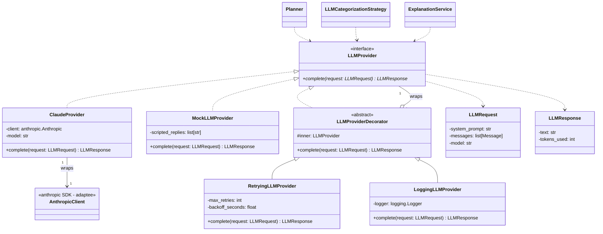
```mermaid
classDiagram
    direction TB
    class LLMProvider {
        <<interface>>
        +complete(request: LLMRequest) LLMResponse*
    }
    class ClaudeProvider {
        -client: anthropic.Anthropic
        -model: str
        +complete(request: LLMRequest) LLMResponse
    }
    class AnthropicClient {
        <<anthropic SDK - adaptee>>
    }
    class MockLLMProvider {
        -scripted_replies: list[str]
        +complete(request: LLMRequest) LLMResponse
    }
    class LLMProviderDecorator {
        <<abstract>>
        #inner: LLMProvider
        +complete(request: LLMRequest) LLMResponse
    }
    class RetryingLLMProvider {
        -max_retries: int
        -backoff_seconds: float
        +complete(request: LLMRequest) LLMResponse
    }
    class LoggingLLMProvider {
        -logger: logging.Logger
        +complete(request: LLMRequest) LLMResponse
    }
    class LLMRequest {
        -system_prompt: str
        -messages: list[Message]
        -model: str
    }
    class LLMResponse {
        -text: str
        -tokens_used: int
    }

    LLMProvider <|.. ClaudeProvider
    LLMProvider <|.. MockLLMProvider
    LLMProvider <|.. LLMProviderDecorator
    LLMProviderDecorator <|-- RetryingLLMProvider
    LLMProviderDecorator <|-- LoggingLLMProvider
    LLMProviderDecorator "1" o-- "1" LLMProvider : wraps
    ClaudeProvider "1" --> "1" AnthropicClient : wraps
    LLMProvider ..> LLMRequest
    LLMProvider ..> LLMResponse
    Planner ..> LLMProvider
    LLMCategorizationStrategy ..> LLMProvider
    ExplanationService ..> LLMProvider
```

_Runtime composition (lecture style, `vc = new 3D(vc)`):_ `provider = LoggingLLMProvider(RetryingLLMProvider(ClaudeProvider(client, model)))`.

### Fig 3.6 — Proposals, commands, reviews and reports

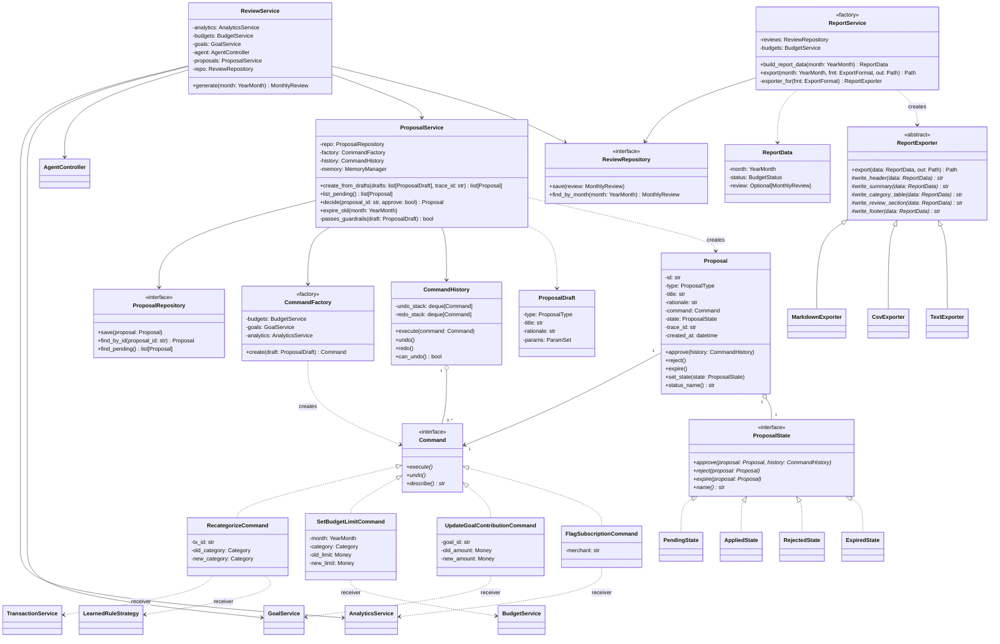
```mermaid
classDiagram
    direction TB
    class ProposalService {
        -repo: ProposalRepository
        -factory: CommandFactory
        -history: CommandHistory
        -memory: MemoryManager
        +create_from_drafts(drafts: list[ProposalDraft], trace_id: str) list[Proposal]
        +list_pending() list[Proposal]
        +decide(proposal_id: str, approve: bool) Proposal
        +expire_old(month: YearMonth)
        -passes_guardrails(draft: ProposalDraft) bool
    }
    class ProposalDraft {
        -type: ProposalType
        -title: str
        -rationale: str
        -params: ParamSet
    }
    class Proposal {
        -id: str
        -type: ProposalType
        -title: str
        -rationale: str
        -command: Command
        -state: ProposalState
        -trace_id: str
        -created_at: datetime
        +approve(history: CommandHistory)
        +reject()
        +expire()
        +set_state(state: ProposalState)
        +status_name() str
    }
    class ProposalState {
        <<interface>>
        +approve(proposal: Proposal, history: CommandHistory)*
        +reject(proposal: Proposal)*
        +expire(proposal: Proposal)*
        +name() str*
    }
    class PendingState
    class AppliedState
    class RejectedState
    class ExpiredState
    class ProposalRepository {
        <<interface>>
        +save(proposal: Proposal)
        +find_by_id(proposal_id: str) Proposal
        +find_pending() list[Proposal]
    }
    class CommandFactory {
        <<factory>>
        -budgets: BudgetService
        -goals: GoalService
        -analytics: AnalyticsService
        +create(draft: ProposalDraft) Command
    }
    class Command {
        <<interface>>
        +execute()*
        +undo()*
        +describe() str*
    }
    class CommandHistory {
        -undo_stack: deque[Command]
        -redo_stack: deque[Command]
        +execute(command: Command)
        +undo()
        +redo()
        +can_undo() bool
    }
    class RecategorizeCommand {
        -tx_id: str
        -old_category: Category
        -new_category: Category
    }
    class SetBudgetLimitCommand {
        -month: YearMonth
        -category: Category
        -old_limit: Money
        -new_limit: Money
    }
    class UpdateGoalContributionCommand {
        -goal_id: str
        -old_amount: Money
        -new_amount: Money
    }
    class FlagSubscriptionCommand {
        -merchant: str
    }
    class ReviewService {
        -analytics: AnalyticsService
        -budgets: BudgetService
        -goals: GoalService
        -agent: AgentController
        -proposals: ProposalService
        -repo: ReviewRepository
        +generate(month: YearMonth) MonthlyReview
    }
    class ReviewRepository {
        <<interface>>
        +save(review: MonthlyReview)
        +find_by_month(month: YearMonth) MonthlyReview
    }
    class ReportService {
        <<factory>>
        -reviews: ReviewRepository
        -budgets: BudgetService
        +build_report_data(month: YearMonth) ReportData
        +export(month: YearMonth, fmt: ExportFormat, out: Path) Path
        -exporter_for(fmt: ExportFormat) ReportExporter
    }
    class ReportData {
        -month: YearMonth
        -status: BudgetStatus
        -review: Optional[MonthlyReview]
    }
    class ReportExporter {
        <<abstract>>
        +export(data: ReportData, out: Path) Path
        #write_header(data: ReportData)* str
        #write_summary(data: ReportData)* str
        #write_category_table(data: ReportData)* str
        #write_review_section(data: ReportData)* str
        #write_footer(data: ReportData)* str
    }
    class MarkdownExporter
    class CsvExporter
    class TextExporter

    ProposalService --> ProposalRepository
    ProposalService --> CommandFactory
    ProposalService --> CommandHistory
    ProposalService ..> ProposalDraft
    ProposalService ..> Proposal : creates
    Proposal "1" --> "1" Command
    Proposal "1" o-- "1" ProposalState
    ProposalState <|.. PendingState
    ProposalState <|.. AppliedState
    ProposalState <|.. RejectedState
    ProposalState <|.. ExpiredState
    CommandFactory ..> Command : creates
    CommandHistory "1" o-- "0..*" Command
    Command <|.. RecategorizeCommand
    Command <|.. SetBudgetLimitCommand
    Command <|.. UpdateGoalContributionCommand
    Command <|.. FlagSubscriptionCommand
    RecategorizeCommand ..> TransactionService : receiver
    RecategorizeCommand ..> LearnedRuleStrategy : receiver
    SetBudgetLimitCommand ..> BudgetService : receiver
    UpdateGoalContributionCommand ..> GoalService : receiver
    FlagSubscriptionCommand ..> AnalyticsService : receiver
    ReviewService --> AnalyticsService
    ReviewService --> GoalService
    ReviewService --> AgentController
    ReviewService --> ProposalService
    ReviewService --> ReviewRepository
    ReportService --> ReviewRepository
    ReportService ..> ReportData
    ReportService ..> ReportExporter : creates
    ReportExporter <|-- MarkdownExporter
    ReportExporter <|-- CsvExporter
    ReportExporter <|-- TextExporter
```

### Fig 3.7 — Domain model (conceptual)

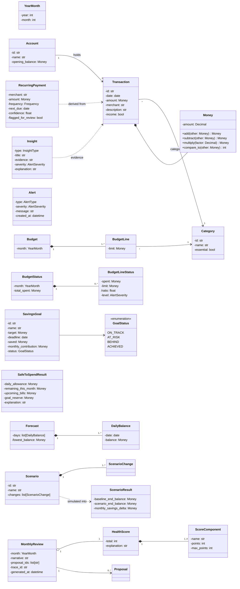
```mermaid
classDiagram
    direction LR
    class Money {
        -amount: Decimal
        +add(other: Money) Money
        +subtract(other: Money) Money
        +multiply(factor: Decimal) Money
        +compare_to(other: Money) int
    }
    class YearMonth {
        -year: int
        -month: int
    }
    class Category {
        -id: str
        -name: str
        -essential: bool
    }
    class Account {
        -id: str
        -name: str
        -opening_balance: Money
    }
    class Transaction {
        -id: str
        -date: date
        -amount: Money
        -merchant: str
        -description: str
        -income: bool
    }
    class Budget {
        -month: YearMonth
    }
    class BudgetLine {
        -limit: Money
    }
    class BudgetStatus {
        -month: YearMonth
        -total_spent: Money
    }
    class BudgetLineStatus {
        -spent: Money
        -limit: Money
        /ratio: float
        -level: AlertSeverity
    }
    class Alert {
        -type: AlertType
        -severity: AlertSeverity
        -message: str
        -created_at: datetime
    }
    class RecurringPayment {
        -merchant: str
        -amount: Money
        -frequency: Frequency
        -next_due: date
        -confidence: float
        -flagged_for_review: bool
    }
    class SavingsGoal {
        -id: str
        -name: str
        -target: Money
        -deadline: date
        -saved: Money
        -monthly_contribution: Money
        -status: GoalStatus
    }
    class GoalStatus {
        <<enumeration>>
        ON_TRACK
        AT_RISK
        BEHIND
        ACHIEVED
    }
    class Forecast {
        -days: list[DailyBalance]
        /lowest_balance: Money
    }
    class DailyBalance {
        -date: date
        -balance: Money
    }
    class SafeToSpendResult {
        -daily_allowance: Money
        -remaining_this_month: Money
        -upcoming_bills: Money
        -goal_reserve: Money
        -explanation: str
    }
    class Insight {
        -type: InsightType
        -title: str
        -evidence: str
        -severity: AlertSeverity
        -explanation: str
    }
    class HealthScore {
        -total: int
        -explanation: str
    }
    class ScoreComponent {
        -name: str
        -points: int
        -max_points: int
    }
    class Scenario {
        -id: str
        -name: str
        -changes: list[ScenarioChange]
    }
    class ScenarioResult {
        -baseline_end_balance: Money
        -scenario_end_balance: Money
        -monthly_savings_delta: Money
    }
    class MonthlyReview {
        -month: YearMonth
        -narrative: str
        -proposal_ids: list[str]
        -trace_id: str
        -generated_at: datetime
    }

    Account "1" --> "0..*" Transaction : holds
    Transaction "*" --> "1" Category : categorized as
    Transaction *-- Money
    Budget "1" *-- "1..*" BudgetLine
    BudgetLine "*" --> "1" Category
    BudgetStatus "1" *-- "0..*" BudgetLineStatus
    Forecast "1" *-- "1..*" DailyBalance
    HealthScore "1" *-- "1..4" ScoreComponent
    SavingsGoal --> GoalStatus
    RecurringPayment ..> Transaction : derived from
    Scenario "1" *-- "1..*" ScenarioChange
    Scenario ..> ScenarioResult : simulated into
    MonthlyReview "1" o-- "1" HealthScore
    MonthlyReview "1" --> "0..*" Proposal
    Insight ..> Transaction : evidence
```

**Supporting value objects and enums** (Python `@dataclass(frozen=True)` or `Enum`; not drawn to keep the figures readable):

| Name | Kind | Fields / values |
|---|---|---|
| `ImportResult` | dataclass | `imported: int`, `duplicates: int`, `rejected: list[str]` |
| `ParseResult` | dataclass | `transactions: list[Transaction]`, `rejected_rows: list[str]` |
| `TxFilter` | dataclass | `start: date`, `end: date`, `category: Optional[Category]`, `merchant: Optional[str]` |
| `BudgetLimits` | type alias | `dict[Category, Money]` |
| `LearnedRule` | dataclass | `merchant: str`, `category: Category` |
| `GoalRequest` | dataclass | `name: str`, `target: Money`, `deadline: date`, `saved: Money` |
| `FeasibilityReport` | dataclass | `required_monthly: Money`, `monthly_surplus: Money`, `feasible: bool`, `options: list[GoalOption]` |
| `GoalOption` | dataclass | `kind: str`, `description: str`, `impact: Money` |
| `AnalysisFacts` | dataclass | `kind: str`, `facts_json: str` |
| `Message` | dataclass | `role: str`, `content: str`, `timestamp: datetime` |
| `TaskParams`, `ToolArgs`, `ParamSet`, `ParamSpec` | dataclasses | key/value parameter holders and their declared types |
| `ExportFormat` | Enum | `MARKDOWN`, `CSV`, `TEXT` |
| `ProposalType` | Enum | `BUDGET_ADJUSTMENT`, `GOAL_ADJUSTMENT`, `FLAG_SUBSCRIPTION`, `RECATEGORIZE` |
| `AlertType` / `AlertSeverity` | Enum | `BUDGET`, `LOW_BALANCE`, `GOAL_RISK` / `INFO`, `WARNING`, `OVER` |
| `Frequency` / `InsightType` | Enum | `WEEKLY`, `MONTHLY`, `YEARLY` / `WEEKEND_SPIKE`, `PAYDAY_SPLURGE`, `MONTH_END_CRUNCH`, `SMALL_PURCHASE_LEAK`, `UNUSUAL_EXPENSE` |

### 3.8 Design principles applied

- **Separation of concerns / layering:** UI → Facade → services → repositories. Services never reference UI classes; UI reaches alerts only through the `AlertListener` interface.
- **Dependency inversion:** services depend on repository interfaces and on `LLMProvider` (abstract base classes), never on `sqlite3` or the `anthropic` SDK directly. Dependencies are injected from a single composition root, so there is no global state and tests can substitute fakes.
- **Deterministic core vs agent split:** money arithmetic lives in `Money` and the calculator classes; the agent subsystem only orchestrates tools. This makes the deterministic half unit-testable and the agent half behaviour-testable (Appendix A).
- **Encapsulation and immutability:** `Money` wraps `decimal.Decimal` and is immutable; result objects (`BudgetStatus`, `Forecast`, `HealthScore`) are frozen dataclasses.
- **Polymorphism and open/closed:** new tools, categorization strategies, CSV layouts, export formats, scenario changes, or proposal commands are added by implementing an interface, without editing existing classes.
- **High cohesion, low coupling:** each calculator has one job; tools are thin wrappers that delegate to services.

---

## 4. Design Pattern Explanations

Nine patterns are used. Each is described with the four elements from the lecture (**name, problem, solution, consequences**) plus the assignment's extra questions (participants and roles, why appropriate, what would be harder without it). Every pattern solves a specific problem in WealthSei; none is added only to reach a count.

### P1 — Facade

| Element | Description |
|---|---|
| **Problem** | GUI and CLI both need about 20 operations that each span several services and possibly the agent. |
| **Solution (participants and roles)** | `WealthSeiFacade` (Facade); the six Tkinter views and `CliApp` (clients); `TransactionService`, `BudgetService`, `AnalyticsService`, `GoalService`, `ProposalService`, `ReviewService`, `ReportService`, `AgentController` (subsystem classes). |
| **Why appropriate** | One higher-level interface guarantees GUI/CLI feature parity and keeps orchestration (e.g., "after import, refresh alerts and evaluate goals") in one place. This matches the lecture intent: *provide a unified interface to a set of subsystem interfaces*. |
| **Harder without it** | Each UI would know every service and repeat orchestration; any service change would break both UIs. |
| **Consequences** | + Decouples clients from the subsystem and layers the system. + Tests can drive the whole app through one API. − As the lecture notes, a facade does not have to hide low-level functionality completely: tests and advanced code may still call services directly. − Risk of a "god object", mitigated by making the facade only delegate (no business logic). |

### P2 — Strategy

| Element | Description |
|---|---|
| **Problem** | Categorization has several interchangeable algorithms (learned rules, keywords, LLM) that must be ordered, combined, disabled (offline), or replaced in tests. |
| **Solution** | `Categorizer` (Context) holds an ordered list of `CategorizationStrategy` (Strategy); `LearnedRuleStrategy`, `KeywordRuleStrategy`, `LLMCategorizationStrategy` (ConcreteStrategies). |
| **Why appropriate** | The priority chain is data (a list), so the LLM strategy can be dropped or reordered without code changes, and each strategy is testable alone. |
| **Harder without it** | One large if/elif method; the LLM path could not be mocked or disabled; adding a strategy would mean editing `Categorizer`. |
| **Consequences** | + Open/closed: new strategies need no changes elsewhere. − More small classes. − The order of the chain matters and must be configured deliberately (cheap deterministic strategies first, LLM last). |

### P3 — Adapter (object adapter, as defined in the lecture)

| Element | Description |
|---|---|
| **Problem** | (a) Banks export CSV files with different column layouts. (b) The vendor LLM SDK has an interface unlike the one our code wants. In both cases we need unrelated interfaces to work together. |
| **Solution** | (a) `BankCsvAdapter` (Target) with `SignedAmountCsvAdapter` and `DebitCreditCsvAdapter` (Adapters) that each *hold a `csv.DictReader`* (Adaptee) and translate its bank-specific rows into `Transaction`; `CsvImporter` (Client). (b) `LLMProvider` (Target); `ClaudeProvider` (Adapter) holds an `anthropic.Anthropic` client (Adaptee) and translates `complete(request)` into the SDK call; `Planner` (Client). |
| **Why appropriate** | These are *object adapters* (composition, not multiple inheritance): the client and the adaptee are completely decoupled and only the adapter knows both. The rest of the system sees only `Transaction` and `LLMResponse`. |
| **Harder without it** | Layout-specific parsing would leak into `TransactionService`; changing LLM vendor would touch the planner and every LLM-using class. |
| **Consequences** | + Client code is unchanged when a new bank layout or LLM vendor appears. − One extra class per source and one extra indirection per call. |

### P4 — Observer

| Element | Description |
|---|---|
| **Problem** | Budget, low-balance, and goal alerts must reach the GUI and CLI, but services must not depend on UI classes. |
| **Solution** | `AlertMonitor` (Subject); `AlertListener` (Observer); `DashboardView`, `CliApp` (ConcreteObservers); `Alert` (event payload). `BudgetService`, `AnalyticsService`, and `GoalService` publish through the monitor. |
| **Why appropriate** | Alerts are event-driven and may have zero, one, or many receivers depending on which interface is running. |
| **Harder without it** | Services would call UI code directly (layer violation); a new receiver (e.g., a log file) would require editing services; alerts could not be unit-tested without a UI. |
| **Consequences** | + Loose coupling between publishers and receivers. − Notification order is unspecified. − A misbehaving listener must not break the publisher, so `AlertMonitor` catches and logs listener errors; listeners must be detached when their window closes. |

### P5 — Command

| Element | Description |
|---|---|
| **Problem** | Category corrections and approved agent proposals modify user data and must be **undoable**, and a proposed change must exist as an object *before* it is applied. |
| **Solution** | `Command` (Command); `RecategorizeCommand`, `SetBudgetLimitCommand`, `UpdateGoalContributionCommand`, `FlagSubscriptionCommand` (ConcreteCommands); `CommandHistory` (Invoker with undo/redo stacks); `TransactionService`, `BudgetService`, `GoalService`, `AnalyticsService`, `LearnedRuleStrategy` (Receivers). |
| **Why appropriate** | The human-in-the-loop design (F13) needs "a change waiting for approval"; a Command is exactly that, and gives undo/redo (F02) for free. |
| **Harder without it** | No undo; each proposal type would need custom apply code; proposals could not be stored and executed later. |
| **Consequences** | + Decouples the requester from the receiver; supports undo, redo, and logging. − One class per operation. − The undo stack must be bounded to avoid unbounded growth. |

### P6 — State

| Element | Description |
|---|---|
| **Problem** | A proposal's allowed actions depend on its lifecycle: only *Pending* proposals can be approved, rejected, or expired. |
| **Solution** | `Proposal` (Context); `ProposalState` (State); `PendingState`, `AppliedState`, `RejectedState`, `ExpiredState` (ConcreteStates). |
| **Why appropriate** | Each state class defines what is legal; illegal transitions raise `IllegalStateTransitionError`. Approval logic lives in `PendingState`, not scattered through services. |
| **Harder without it** | A status enum plus if-checks in `ProposalService`; easy to double-apply a proposal; transition rules harder to test in isolation. |
| **Consequences** | + Transition rules are localized and independently testable. − More classes for a small state machine; state objects carry no data, so one shared instance of each is enough. |

### P7 — Decorator

| Element | Description |
|---|---|
| **Problem** | Cross-cutting LLM behaviour (retry with back-off, logging and token counting, later caching) must be added without changing planners, strategies, or the provider itself, and must be combinable. Subclassing would give a class explosion (the lecture's TextView example needs 15 subclasses for 3 borders × 2 scrollbars, but only 5 decorators). |
| **Solution** | `LLMProvider` (Component); `ClaudeProvider`, `MockLLMProvider` (ConcreteComponents); `LLMProviderDecorator` (Decorator, same interface and wraps an inner provider); `RetryingLLMProvider`, `LoggingLLMProvider` (ConcreteDecorators). |
| **Why appropriate** | `Planner`, `LLMCategorizationStrategy`, and `ExplanationService` all get retry and logging for free, and the stack is assembled at run time. The lecture notes that Decorator suits *small* interfaces; `LLMProvider` has a single method. |
| **Harder without it** | Retry code duplicated in every LLM caller; improving failure recovery later (Stage 3) would touch many classes. |
| **Consequences** | + Behaviour can be added or removed without subclass explosion; decorators nest. − "Identity crisis": what the object finally does depends on the wrapping order (`Logging(Retrying(...))` logs one logical call, `Retrying(Logging(...))` logs every attempt). |

### P8 — Template Method

| Element | Description |
|---|---|
| **Problem** | Report export has one fixed structure (header → summary → category table → review → footer) but three output formats. |
| **Solution** | `ReportExporter` (AbstractClass; `export()` is the template method, marked `@final`); `MarkdownExporter`, `CsvExporter`, `TextExporter` (ConcreteClasses implementing the abstract `write_…` steps). |
| **Why appropriate** | The section order is defined once, so every format is consistent; a new format only supplies the formatting steps. |
| **Harder without it** | Three copies of the same sequence that can drift apart; adding a format means copying a whole exporter. |
| **Consequences** | + No duplicated skeleton. − Based on inheritance, so subclasses are tied to the base class and must implement every step. |

### P9 — Factory (as defined in the lecture: return one of several subclasses depending on the data given)

| Element | Description |
|---|---|
| **Problem** | Clients should not need to know which concrete class to create: which exporter for a format, and which `Command` for a proposal type. |
| **Solution** | (a) `ReportService.exporter_for(fmt)` returns a `MarkdownExporter`, `CsvExporter`, or `TextExporter` (all `ReportExporter`s). (b) `CommandFactory.create(draft)` returns a `SetBudgetLimitCommand`, `UpdateGoalContributionCommand`, or `FlagSubscriptionCommand` (all `Command`s) depending on `draft.type`. |
| **Why appropriate** | The knowledge of "which class gets created" is localized in one place (single responsibility), and callers depend only on the abstract product (`ReportExporter`, `Command`). |
| **Harder without it** | `ProposalService` and `ReportService` would contain construction `if`/`elif` chains mixed with their real logic; adding a proposal type or export format would change them. |
| **Consequences** | + Open/closed for new products; creation code in one place. − Extra classes; in Python the branching can be a small dictionary from type to class to keep the factory short. |

### Also considered

- **Prototype (used in a lightweight way).** `ScenarioSimulator` must evaluate several what-if variants of the same baseline. Building `ForecastInputs` is comparatively expensive (database queries plus recurring-payment detection), so the simulator builds it once and calls `ForecastInputs.clone()`, a **deep copy** (`copy.deepcopy`), for each variant. The lecture's shallow-versus-deep warning applies directly: a shallow copy would let a scenario change mutate the baseline, which is exactly the kind of bug the Stage 3 unit tests will target.
- **Singleton (deliberately not used).** `AlertMonitor` and the `LLMProvider` chain each exist once, but they are created once in a composition root and injected. A Singleton's global access point would make tests share state and would hide dependencies.

---
## 5. Use-Case Diagram

**Actors** (a role played with respect to the system; an actor is *not* part of the system): **User** (primary, human); **LLM Service** (Claude API, secondary system actor used by the agent and by hybrid features); **File System** (CSV inputs and exported reports). WealthSei has no administrator role; it is a single-user local application. The **system boundary** is the rectangle labelled *WealthSei*.

**Relationships, following the lecture:**

- **«include»**: the arrow goes from the *base* use case to the *included* one. The included behaviour is required, and the base is not complete without it. UC01 includes UC02 (categorization); UC10 includes UC06 (habits and score); UC08 and UC10 include UC14 (creating proposals).
- **«extend»**: the arrow goes from the *extending* use case to the *base*. The behaviour is optional and the base can stand on its own. UC14 extends UC07 and UC09; the extension point is *after result displayed* (the user chooses to save the suggestions as proposals).

_The diagram is drawn in Mermaid, which cannot draw stick figures or true ellipses, so actors are hexagons and use cases are rounded shapes. As the lecture's UML Tools slide says, consistent notation matters more than the tool._

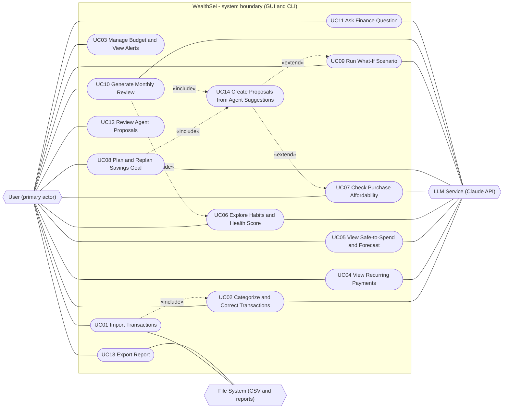
```mermaid
flowchart LR
    User{{"User (primary actor)"}}
    LLM{{"LLM Service (Claude API)"}}
    FS{{"File System (CSV and reports)"}}

    subgraph SYS["WealthSei - system boundary (GUI and CLI)"]
        UC01(["UC01 Import Transactions"])
        UC02(["UC02 Categorize and Correct Transactions"])
        UC03(["UC03 Manage Budget and View Alerts"])
        UC04(["UC04 View Recurring Payments"])
        UC05(["UC05 View Safe-to-Spend and Forecast"])
        UC06(["UC06 Explore Habits and Health Score"])
        UC07(["UC07 Check Purchase Affordability"])
        UC08(["UC08 Plan and Replan Savings Goal"])
        UC09(["UC09 Run What-If Scenario"])
        UC10(["UC10 Generate Monthly Review"])
        UC11(["UC11 Ask Finance Question"])
        UC12(["UC12 Review Agent Proposals"])
        UC13(["UC13 Export Report"])
        UC14(["UC14 Create Proposals from Agent Suggestions"])
    end

    User --- UC01
    User --- UC02
    User --- UC03
    User --- UC04
    User --- UC05
    User --- UC06
    User --- UC07
    User --- UC08
    User --- UC09
    User --- UC10
    User --- UC11
    User --- UC12
    User --- UC13

    UC01 -.->|"«include»"| UC02
    UC10 -.->|"«include»"| UC06
    UC08 -.->|"«include»"| UC14
    UC10 -.->|"«include»"| UC14
    UC14 -.->|"«extend»"| UC07
    UC14 -.->|"«extend»"| UC09

    UC01 --- FS
    UC13 --- FS
    UC02 --- LLM
    UC04 --- LLM
    UC05 --- LLM
    UC06 --- LLM
    UC07 --- LLM
    UC08 --- LLM
    UC09 --- LLM
    UC10 --- LLM
    UC11 --- LLM
```

**Coverage:** F01→UC01 · F02→UC02 · F03→UC03 · F04→UC04 · F05→UC05 · F06, F07→UC06 · F08→UC07 · F09→UC08 · F10→UC09 · F11→UC10 · F12→UC11 · F13→UC12, UC14 · F14→UC13.

---

## 6. Use-Case Descriptions

Every use case can be performed from the GUI or from the CLI (Appendix B); steps below say "the UI" for either.

### UC01 — Import Transactions

| Field | Description |
|---|---|
| **ID / Name** | UC01 — Import Transactions |
| **Actors** | User (primary); File System |
| **Goal** | Load bank transactions into WealthSei, categorized and de-duplicated. |
| **Preconditions** | Application is running; user has a CSV export. |
| **Trigger** | User chooses **Import CSV** (or runs `import <file>`). |
| **Main success scenario** | 1. User selects a CSV file. 2. System reads the header and selects a matching adapter. 3. System converts each row to a `Transaction`. 4. System removes duplicates. 5. System categorizes new transactions (UC02). 6. System saves them. 7. System refreshes budget alerts and goal status. 8. System shows an import summary. |
| **Alternative / exception flows** | 2a. Unknown layout or unreadable file: show error, save nothing. 3a. Invalid row: skip it and list it in the summary. 4a. All rows are duplicates: report "0 new transactions". |
| **Postconditions** | New transactions are stored and categorized; alerts and goal statuses are up to date. |
| **Related features** | F01 (includes F02) |

### UC02 — Categorize and Correct Transactions

| Field | Description |
|---|---|
| **ID / Name** | UC02 — Categorize and Correct Transactions |
| **Actors** | User (primary); LLM Service (secondary, fallback only) |
| **Goal** | Ensure every transaction has the right category, and teach the system from corrections. |
| **Preconditions** | Transactions exist. |
| **Trigger** | Automatic during import, or user changes a category, or user clicks **Undo**. |
| **Main success scenario** | 1. System tries learned rules, then keyword rules, then the LLM. 2. System stores the category. 3. User selects a different category for a transaction. 4. System applies the change and stores a learned rule for that merchant. 5. User may click **Undo**; system restores the previous category and removes the rule. |
| **Alternative / exception flows** | 1a. LLM unavailable or invalid answer: mark `UNCATEGORIZED` for manual review. 3a. Unknown transaction id: show error. 5a. Nothing to undo: show message. |
| **Postconditions** | Categories are updated; learned rules reflect the latest correction. |
| **Related features** | F02 |

### UC03 — Manage Budget and View Alerts

| Field | Description |
|---|---|
| **ID / Name** | UC03 — Manage Budget and View Alerts |
| **Actors** | User (primary) |
| **Goal** | Set spending limits and be warned when approaching or exceeding them. |
| **Preconditions** | At least one category exists. |
| **Trigger** | User edits budget limits, or new transactions arrive. |
| **Main success scenario** | 1. User enters limits for a month. 2. System validates and saves them. 3. System computes spent/limit/percentage per category. 4. System publishes alerts for categories at 80% or over 100%. 5. UI shows progress bars and alerts. |
| **Alternative / exception flows** | 2a. Negative or non-numeric limit: reject with message. 3a. Spending in a category without a budget: show as "unbudgeted". |
| **Postconditions** | Budget saved; alerts delivered to all registered listeners. |
| **Related features** | F03 |

### UC04 — View Recurring Payments

| Field | Description |
|---|---|
| **ID / Name** | UC04 — View Recurring Payments |
| **Actors** | User (primary); LLM Service (summary text) |
| **Goal** | See subscriptions and other recurring costs. |
| **Preconditions** | Transaction history exists. |
| **Trigger** | User opens the Recurring panel (or runs `recurring`). |
| **Main success scenario** | 1. System detects recurring patterns. 2. System computes total monthly recurring cost. 3. System requests a plain-language summary. 4. UI shows the list and summary. 5. User may flag an item for review. |
| **Alternative / exception flows** | 1a. Fewer than 3 occurrences: "not enough history". 3a. LLM unavailable: use template text. |
| **Postconditions** | Recurring list displayed; flags stored. |
| **Related features** | F04 |

### UC05 — View Safe-to-Spend and Forecast

| Field | Description |
|---|---|
| **ID / Name** | UC05 — View Safe-to-Spend and Forecast |
| **Actors** | User (primary); LLM Service (explanation text) |
| **Goal** | Know how much can be spent today and whether the balance will dip too low. |
| **Preconditions** | Transactions and opening balance exist. |
| **Trigger** | User opens the dashboard or runs `safe`. |
| **Main success scenario** | 1. System detects recurring payments. 2. System projects 30 days of balance. 3. System calculates the daily allowance. 4. If the projection falls below the buffer, system raises a low-balance alert. 5. System adds an explanation. 6. UI shows the allowance card and chart. |
| **Alternative / exception flows** | 1a. No data: prompt to import. 3a. Negative result: show $0 and the over-commitment amount. 5a. LLM unavailable: template text. |
| **Postconditions** | Allowance and forecast displayed; alert published if needed. |
| **Related features** | F05 |

### UC06 — Explore Habits and Health Score

| Field | Description |
|---|---|
| **ID / Name** | UC06 — Explore Habits and Health Score |
| **Actors** | User (primary); LLM Service (explanations) |
| **Goal** | Understand behavioural spending patterns and overall financial health. |
| **Preconditions** | At least 30 days of transactions for habits; budget for a full score. |
| **Trigger** | User opens Habits or Score panel (or runs `habits` / `score`). |
| **Main success scenario** | 1. System analyzes transactions for patterns. 2. System computes the health score from its components. 3. System explains each result from the computed facts. 4. UI shows insight cards and the score gauge with breakdown. |
| **Alternative / exception flows** | 1a. Too little data: "need more data". 2a. Missing budget or goals: exclude component and re-normalize weights. 3a. LLM unavailable: show evidence only. |
| **Postconditions** | Insights and score displayed. |
| **Related features** | F06, F07 |

### UC07 — Check Purchase Affordability

| Field | Description |
|---|---|
| **ID / Name** | UC07 — Check Purchase Affordability |
| **Actors** | User (primary); LLM Service (secondary) |
| **Goal** | Get a reasoned yes/no verdict on a planned purchase. |
| **Preconditions** | Transactions and budget exist; LLM reachable. |
| **Trigger** | User submits item and price (or runs `afford`). |
| **Main success scenario** | 1. User enters item and price. 2. System validates input and starts an agent task. 3. Agent decides which data it needs and calls tools (budget, forecast, goals, transactions). 4. Agent forms a verdict with reasoning. 5. System verifies that every figure came from tool results. 6. UI shows verdict, evidence, and a **Why?** trace link. 7. *Extension point "after result displayed":* the user may save a suggested plan as a proposal (UC14). |
| **Alternative / exception flows** | 2a. Invalid price: ask for a valid one. 3a. Tool fails: agent states what was unavailable and qualifies the answer. 3b. Malformed LLM output: one repair retry, then error. 5a. Ungrounded figure: answer corrected before display. |
| **Postconditions** | Trace saved; optional proposals pending. |
| **Related features** | F08 (optionally extended by UC14; results can then be reviewed in UC12) |

### UC08 — Plan and Replan Savings Goal

| Field | Description |
|---|---|
| **ID / Name** | UC08 — Plan and Replan Savings Goal |
| **Actors** | User (primary); LLM Service (secondary) |
| **Goal** | Create a savings goal and get a realistic, adjustable plan. |
| **Preconditions** | Transaction history or budget exists. |
| **Trigger** | User creates a goal or clicks **Replan** (also suggested after a goal-risk alert). |
| **Main success scenario** | 1. User enters name, target, and deadline. 2. System validates and saves the goal. 3. Agent calls the goal tool to check feasibility and options. 4. Agent writes a plan. 5. System creates pending proposals from the suggestions (included UC14). 6. UI shows the plan and proposals. |
| **Alternative / exception flows** | 2a. Deadline in the past or target ≤ 0: validation error. 3a. Infeasible: agent proposes only a deadline extension. 3b. Little history: lower-confidence note. |
| **Postconditions** | Goal saved; plan shown; proposals pending. |
| **Related features** | F09 (includes UC14; proposals are reviewed in UC12) |

### UC09 — Run What-If Scenario

| Field | Description |
|---|---|
| **ID / Name** | UC09 — Run What-If Scenario |
| **Actors** | User (primary); LLM Service (secondary) |
| **Goal** | Compare the future with and without hypothetical changes. |
| **Preconditions** | Transactions exist. |
| **Trigger** | User submits a scenario in plain English (or runs `whatif`). |
| **Main success scenario** | 1. User types the scenario. 2. Agent converts it into structured changes. 3. System validates the changes and simulates baseline and scenario. 4. Agent explains differences (savings, end balance, goal dates). 5. UI shows a comparison. 6. *Extension point "after result displayed":* the user may turn the scenario into proposals (UC14). |
| **Alternative / exception flows** | 2a. Ambiguous text: agent asks a clarifying question. 3a. Unknown subscription or category, or invalid value: tool reports it and agent tells the user. 3b. More than 5 changes: agent asks to split. |
| **Postconditions** | Result displayed; optional proposals pending. |
| **Related features** | F10 (optionally extended by UC14; results can then be reviewed in UC12) |

### UC10 — Generate Monthly Review

| Field | Description |
|---|---|
| **ID / Name** | UC10 — Generate Monthly Review |
| **Actors** | User (primary); LLM Service (secondary) |
| **Goal** | Get an AI summary of the month with concrete fixes. |
| **Preconditions** | The month has transactions. |
| **Trigger** | User clicks **Generate Review** (or runs `review <month>`). |
| **Main success scenario** | 1. System gathers metrics, habits, score, and goal status (UC06). 2. Agent reads the previous review from memory and writes a narrative. 3. Agent drafts up to 3 fix suggestions. 4. System creates pending proposals from the suggestions (included UC14). 5. System saves and displays the review. |
| **Alternative / exception flows** | 1a. No transactions: refuse with message. 2a. Agent fails: save a metrics-only review. 4a. Suggestion touches a protected category: discard it. |
| **Postconditions** | `MonthlyReview` saved; proposals pending. |
| **Related features** | F11 (includes UC06 and UC14; proposals are reviewed in UC12) |

### UC11 — Ask Finance Question

| Field | Description |
|---|---|
| **ID / Name** | UC11 — Ask Finance Question |
| **Actors** | User (primary); LLM Service (secondary) |
| **Goal** | Get grounded answers to free-form questions and see how they were derived. |
| **Preconditions** | Data exists; LLM reachable. |
| **Trigger** | User submits a question (or runs `ask`). |
| **Main success scenario** | 1. User types a question. 2. System adds recent conversation and stored preferences. 3. Agent calls tools as needed. 4. System verifies figures against tool results. 5. UI shows the answer. 6. User opens **How did you get this?** to see the trace. |
| **Alternative / exception flows** | 2a. Off-topic: polite redirect. 3a. Vague time range: agent states its assumption or asks. 3b. LLM unavailable: offline message with dashboard/CLI hints. |
| **Postconditions** | Turn stored in memory; trace saved. |
| **Related features** | F12 |

### UC12 — Review Agent Proposals

| Field | Description |
|---|---|
| **ID / Name** | UC12 — Review Agent Proposals |
| **Actors** | User (primary) |
| **Goal** | Decide which agent-suggested changes to apply. |
| **Preconditions** | At least one pending proposal exists (created by UC14). |
| **Trigger** | User opens the Proposals view (or runs `proposals list`). |
| **Main success scenario** | 1. System lists pending proposals with rationale. 2. User opens **Why?** to inspect the trace (optional). 3. User clicks **Approve**. 4. System executes the underlying command. 5. Proposal becomes Applied; affected views refresh. |
| **Alternative / exception flows** | 3a. User clicks **Reject**: proposal becomes Rejected. 4a. Command fails: proposal stays Pending, error shown. 3b. Proposal is not pending: error message. *. Old proposals expire automatically at month change. |
| **Postconditions** | Budget or goal reflects approved changes; the change is undoable. |
| **Related features** | F13 |

### UC13 — Export Report

| Field | Description |
|---|---|
| **ID / Name** | UC13 — Export Report |
| **Actors** | User (primary); File System |
| **Goal** | Save a monthly report as a file. |
| **Preconditions** | The month has data. |
| **Trigger** | User clicks **Export** (or runs `export`). |
| **Main success scenario** | 1. User picks month, format, and location. 2. System gathers report data. 3. System writes the file in the chosen format. 4. System confirms the path. |
| **Alternative / exception flows** | 2a. No data: error. 2b. Review not generated: export metrics only, with a note. 3a. Path not writable: error. |
| **Postconditions** | Report file exists at the chosen path. |
| **Related features** | F14 |

### UC14 — Create Proposals from Agent Suggestions

| Field | Description |
|---|---|
| **ID / Name** | UC14 — Create Proposals from Agent Suggestions |
| **Actors** | User (indirectly; the use case is included by UC08 and UC10 and extends UC07 and UC09) |
| **Goal** | Turn agent suggestions into safe, reviewable, pending proposals; the agent never changes data itself. |
| **Preconditions** | An agent result contains at least one suggested change (`ProposalDraft`). |
| **Trigger** | Automatic at the end of UC08 and UC10; in UC07 and UC09, the user clicks **Save as proposal(s)**. |
| **Main success scenario** | 1. System receives the drafts and the trace id. 2. For each draft, system checks the guardrails (e.g., protected categories). 3. System builds the matching command for the draft. 4. System stores a proposal in the Pending state linked to the trace. 5. System returns the created proposals. |
| **Alternative / exception flows** | 1a. No drafts: nothing is created. 2a. Draft touches a protected category: discarded, and the number discarded is reported. 3a. Unknown draft type: discarded and logged. |
| **Postconditions** | Zero or more pending proposals exist, ready for UC12. |
| **Related features** | F13 (supports F08–F11) |

---

## 7. Sequence Diagrams

Eleven diagrams cover all fourteen use cases (UC14 is shown inside SD06, SD07 and SD08). Following the lecture notation, solid arrows are messages (method calls), dashed arrows are return messages, self-arrows are reflexive messages, `loop` and `alt`/`opt` frames show iteration and conditions, and `create participant` marks object creation. Class and method names match Section 3. Every diagram works identically from the CLI: replace the view (e.g., `TransactionsView`) with `CliApp`; everything from `WealthSeiFacade` onward is unchanged.

| Diagram | Use case | Features |
|---|---|---|
| SD01 | UC01 Import Transactions | F01 |
| SD02 | UC02 Categorize and Correct | F02 |
| SD03 | UC03 Budget and Alerts | F03 |
| SD04 | UC04, UC05, UC06 Analytics with explanation | F04, F05, F06, F07 |
| SD05 | UC07 Affordability (full agent loop) | F08 |
| SD06 | UC08 Goal Planning and Replanning (also shows UC14 Create Proposals) | F09, F13 |
| SD07 | UC09 What-If Scenario (UC14 is an optional extension) | F10 |
| SD08 | UC10 Monthly Review (includes UC14) | F11 |
| SD09 | UC11 Chat with Memory and Trace | F12 |
| SD10 | UC12 Proposal Approval | F13 |
| SD11 | UC13 Export Report | F14 |

### SD01 — Import Transactions (UC01, F01)

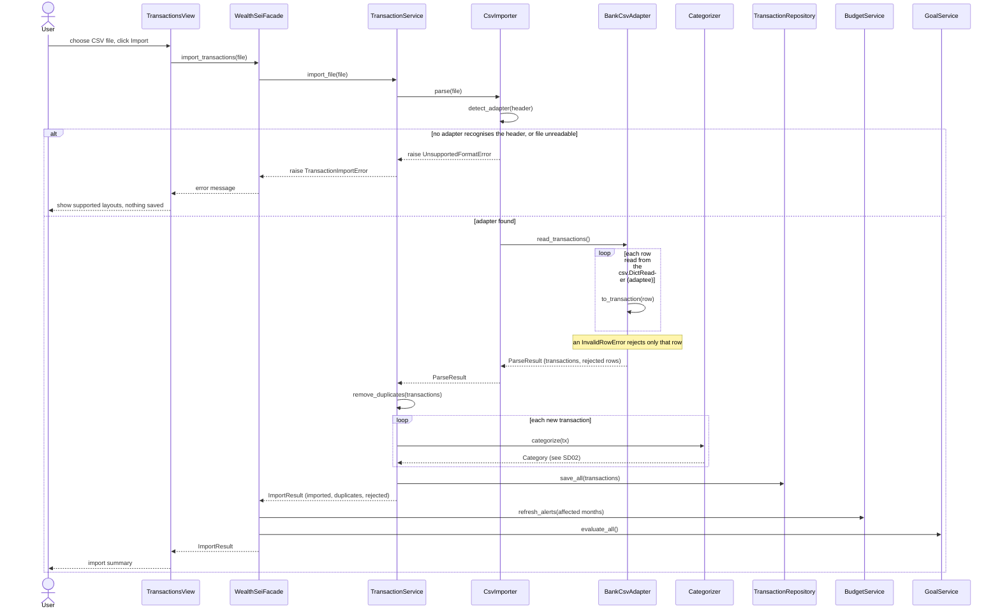
```mermaid
sequenceDiagram
    actor User
    participant TV as TransactionsView
    participant F as WealthSeiFacade
    participant TS as TransactionService
    participant CI as CsvImporter
    participant AD as BankCsvAdapter
    participant CAT as Categorizer
    participant TR as TransactionRepository
    participant BS as BudgetService
    participant GS as GoalService

    User->>TV: choose CSV file, click Import
    TV->>F: import_transactions(file)
    F->>TS: import_file(file)
    TS->>CI: parse(file)
    CI->>CI: detect_adapter(header)
    alt no adapter recognises the header, or file unreadable
        CI-->>TS: raise UnsupportedFormatError
        TS-->>F: raise TransactionImportError
        F-->>TV: error message
        TV-->>User: show supported layouts, nothing saved
    else adapter found
        CI->>AD: read_transactions()
        loop each row read from the csv.DictReader (adaptee)
            AD->>AD: to_transaction(row)
        end
        Note over AD: an InvalidRowError rejects only that row
        AD-->>CI: ParseResult (transactions, rejected rows)
        CI-->>TS: ParseResult
        TS->>TS: remove_duplicates(transactions)
        loop each new transaction
            TS->>CAT: categorize(tx)
            CAT-->>TS: Category (see SD02)
        end
        TS->>TR: save_all(transactions)
        TS-->>F: ImportResult (imported, duplicates, rejected)
        F->>BS: refresh_alerts(affected months)
        F->>GS: evaluate_all()
        F-->>TV: ImportResult
        TV-->>User: import summary
    end
```

### SD02 — Categorize and Correct Transactions (UC02, F02)

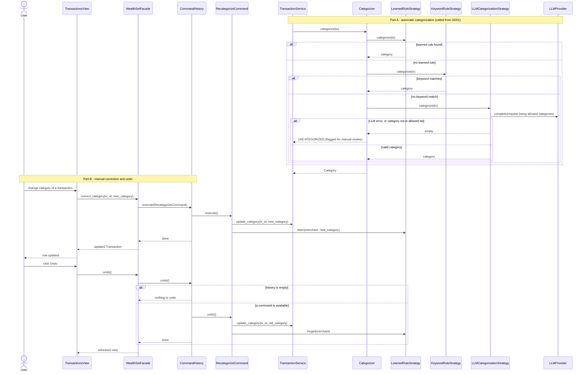
```mermaid
sequenceDiagram
    actor User
    participant TV as TransactionsView
    participant F as WealthSeiFacade
    participant CH as CommandHistory
    participant RC as RecategorizeCommand
    participant TS as TransactionService
    participant CAT as Categorizer
    participant LR as LearnedRuleStrategy
    participant KR as KeywordRuleStrategy
    participant LS as LLMCategorizationStrategy
    participant LLM as LLMProvider

    Note over TS,LLM: Part A - automatic categorization (called from SD01)
    TS->>CAT: categorize(tx)
    CAT->>LR: categorize(tx)
    alt learned rule found
        LR-->>CAT: category
    else no learned rule
        CAT->>KR: categorize(tx)
        alt keyword matches
            KR-->>CAT: category
        else no keyword match
            CAT->>LS: categorize(tx)
            LS->>LLM: complete(request listing allowed categories)
            alt LLM error, or category not in allowed list
                LS-->>CAT: empty
                CAT-->>TS: UNCATEGORIZED (flagged for manual review)
            else valid category
                LS-->>CAT: category
            end
        end
    end
    CAT-->>TS: Category

    Note over User,CH: Part B - manual correction and undo
    User->>TV: change category of a transaction
    TV->>F: correct_category(tx_id, new_category)
    F->>CH: execute(RecategorizeCommand)
    CH->>RC: execute()
    RC->>TS: update_category(tx_id, new_category)
    RC->>LR: learn(merchant, new_category)
    CH-->>F: done
    F-->>TV: updated Transaction
    TV-->>User: row updated
    User->>TV: click Undo
    TV->>F: undo()
    F->>CH: undo()
    alt history is empty
        CH-->>F: nothing to undo
    else a command is available
        CH->>RC: undo()
        RC->>TS: update_category(tx_id, old_category)
        RC->>LR: forget(merchant)
        CH-->>F: done
    end
    F-->>TV: refreshed view
```

### SD03 — Budget Setup, Tracking and Alerts (UC03, F03)

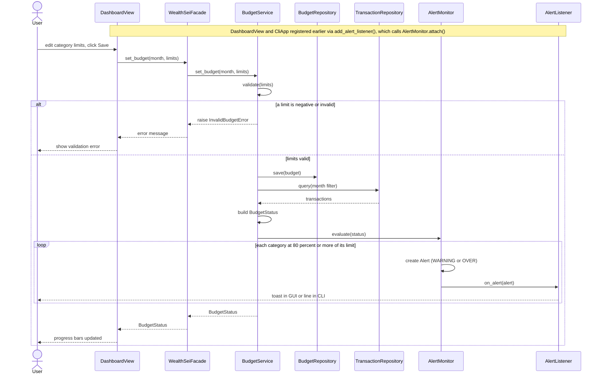
```mermaid
sequenceDiagram
    actor User
    participant DV as DashboardView
    participant F as WealthSeiFacade
    participant BS as BudgetService
    participant BR as BudgetRepository
    participant TR as TransactionRepository
    participant AM as AlertMonitor
    participant L as AlertListener

    Note over DV,L: DashboardView and CliApp registered earlier via add_alert_listener(), which calls AlertMonitor.attach()
    User->>DV: edit category limits, click Save
    DV->>F: set_budget(month, limits)
    F->>BS: set_budget(month, limits)
    BS->>BS: validate(limits)
    alt a limit is negative or invalid
        BS-->>F: raise InvalidBudgetError
        F-->>DV: error message
        DV-->>User: show validation error
    else limits valid
        BS->>BR: save(budget)
        BS->>TR: query(month filter)
        TR-->>BS: transactions
        BS->>BS: build BudgetStatus
        BS->>AM: evaluate(status)
        loop each category at 80 percent or more of its limit
            AM->>AM: create Alert (WARNING or OVER)
            AM->>L: on_alert(alert)
            L-->>User: toast in GUI or line in CLI
        end
        BS-->>F: BudgetStatus
        F-->>DV: BudgetStatus
        DV-->>User: progress bars updated
    end
```

### SD04 — Analytics with Explanation: Recurring, Safe-to-Spend, Habits, Score (UC04–UC06, F04–F07)

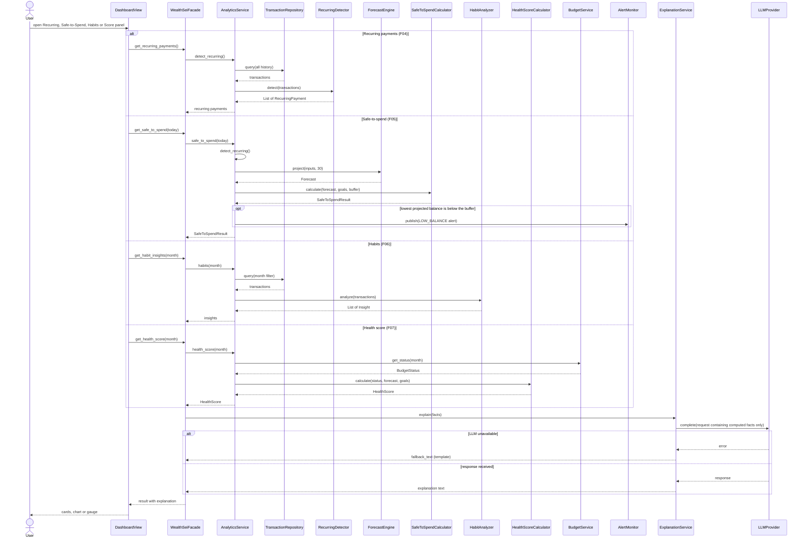
```mermaid
sequenceDiagram
    actor User
    participant DV as DashboardView
    participant F as WealthSeiFacade
    participant AS as AnalyticsService
    participant TR as TransactionRepository
    participant RD as RecurringDetector
    participant FE as ForecastEngine
    participant SC as SafeToSpendCalculator
    participant HA as HabitAnalyzer
    participant HS as HealthScoreCalculator
    participant BS as BudgetService
    participant AM as AlertMonitor
    participant EX as ExplanationService
    participant LLM as LLMProvider

    User->>DV: open Recurring, Safe-to-Spend, Habits or Score panel
    alt Recurring payments (F04)
        DV->>F: get_recurring_payments()
        F->>AS: detect_recurring()
        AS->>TR: query(all history)
        TR-->>AS: transactions
        AS->>RD: detect(transactions)
        RD-->>AS: List of RecurringPayment
        AS-->>F: recurring payments
    else Safe-to-spend (F05)
        DV->>F: get_safe_to_spend(today)
        F->>AS: safe_to_spend(today)
        AS->>AS: detect_recurring()
        AS->>FE: project(inputs, 30)
        FE-->>AS: Forecast
        AS->>SC: calculate(forecast, goals, buffer)
        SC-->>AS: SafeToSpendResult
        opt lowest projected balance is below the buffer
            AS->>AM: publish(LOW_BALANCE alert)
        end
        AS-->>F: SafeToSpendResult
    else Habits (F06)
        DV->>F: get_habit_insights(month)
        F->>AS: habits(month)
        AS->>TR: query(month filter)
        TR-->>AS: transactions
        AS->>HA: analyze(transactions)
        HA-->>AS: List of Insight
        AS-->>F: insights
    else Health score (F07)
        DV->>F: get_health_score(month)
        F->>AS: health_score(month)
        AS->>BS: get_status(month)
        BS-->>AS: BudgetStatus
        AS->>HS: calculate(status, forecast, goals)
        HS-->>AS: HealthScore
        AS-->>F: HealthScore
    end
    F->>EX: explain(facts)
    EX->>LLM: complete(request containing computed facts only)
    alt LLM unavailable
        LLM-->>EX: error
        EX-->>F: fallback_text (template)
    else response received
        LLM-->>EX: response
        EX-->>F: explanation text
    end
    F-->>DV: result with explanation
    DV-->>User: cards, chart or gauge
```

### SD05 — Purchase Affordability: the full agent loop (UC07, F08)

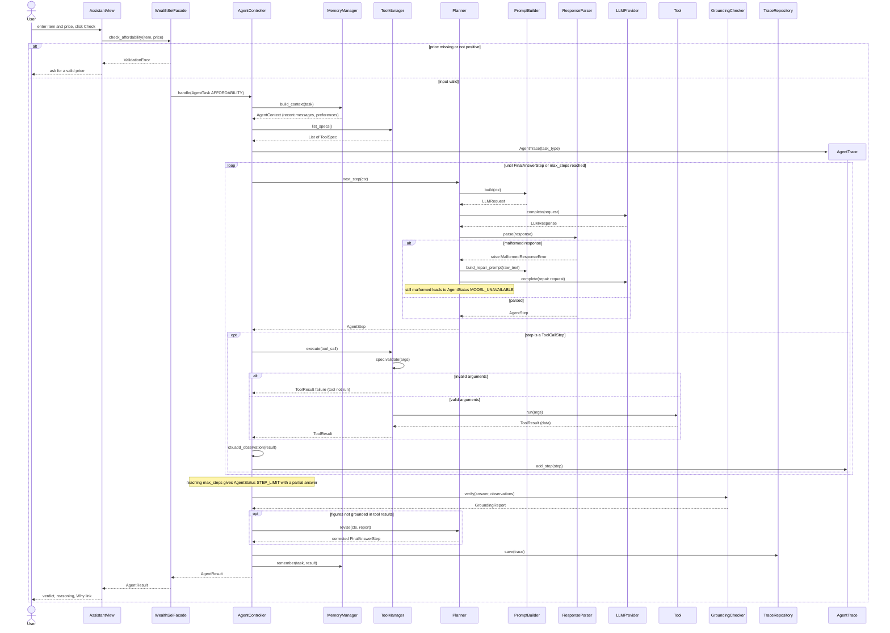
```mermaid
sequenceDiagram
    actor User
    participant AV as AssistantView
    participant F as WealthSeiFacade
    participant AC as AgentController
    participant MM as MemoryManager
    participant TM as ToolManager
    participant PL as Planner
    participant PB as PromptBuilder
    participant RP as ResponseParser
    participant LLM as LLMProvider
    participant T as Tool
    participant GC as GroundingChecker
    participant TR as TraceRepository

    User->>AV: enter item and price, click Check
    AV->>F: check_affordability(item, price)
    alt price missing or not positive
        F-->>AV: ValidationError
        AV-->>User: ask for a valid price
    else input valid
        F->>AC: handle(AgentTask AFFORDABILITY)
        AC->>MM: build_context(task)
        MM-->>AC: AgentContext (recent messages, preferences)
        AC->>TM: list_specs()
        TM-->>AC: List of ToolSpec
        create participant TRC as AgentTrace
        AC->>TRC: AgentTrace(task_type)
        loop until FinalAnswerStep or max_steps reached
            AC->>PL: next_step(ctx)
            PL->>PB: build(ctx)
            PB-->>PL: LLMRequest
            PL->>LLM: complete(request)
            LLM-->>PL: LLMResponse
            PL->>RP: parse(response)
            alt malformed response
                RP-->>PL: raise MalformedResponseError
                PL->>PB: build_repair_prompt(raw_text)
                PL->>LLM: complete(repair request)
                Note over PL: still malformed leads to AgentStatus MODEL_UNAVAILABLE
            else parsed
                RP-->>PL: AgentStep
            end
            PL-->>AC: AgentStep
            opt step is a ToolCallStep
                AC->>TM: execute(tool_call)
                TM->>TM: spec.validate(args)
                alt invalid arguments
                    TM-->>AC: ToolResult failure (tool not run)
                else valid arguments
                    TM->>T: run(args)
                    T-->>TM: ToolResult (data)
                    TM-->>AC: ToolResult
                end
                AC->>AC: ctx.add_observation(result)
                AC->>TRC: add_step(step)
            end
        end
        Note over AC: reaching max_steps gives AgentStatus STEP_LIMIT with a partial answer
        AC->>GC: verify(answer, observations)
        GC-->>AC: GroundingReport
        opt figures not grounded in tool results
            AC->>PL: revise(ctx, report)
            PL-->>AC: corrected FinalAnswerStep
        end
        AC->>TR: save(trace)
        AC->>MM: remember(task, result)
        AC-->>F: AgentResult
        F-->>AV: AgentResult
        AV-->>User: verdict, reasoning, Why link
    end
```

_Tools used in this scenario:_ `BudgetStatusTool`, `ForecastTool`, `GoalTool`, `TransactionQueryTool`. Saving a suggested plan calls `WealthSeiFacade.create_proposals(drafts, trace_id)`.

### SD06 — Savings Goal Planning and Replanning (UC08, F09)

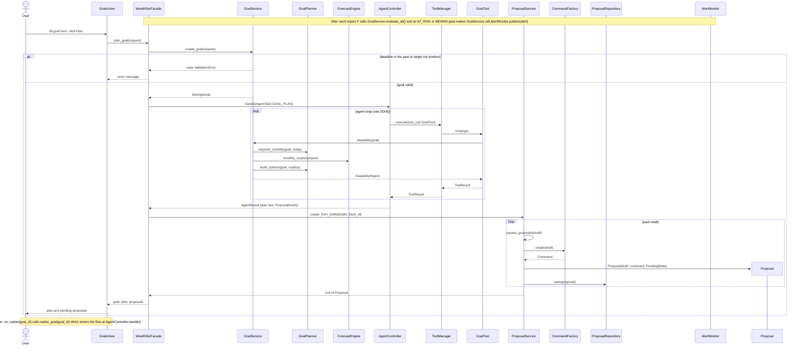
```mermaid
sequenceDiagram
    actor User
    participant GV as GoalsView
    participant F as WealthSeiFacade
    participant GS as GoalService
    participant GP as GoalPlanner
    participant FE as ForecastEngine
    participant AC as AgentController
    participant TM as ToolManager
    participant GT as GoalTool
    participant PS as ProposalService
    participant CF as CommandFactory
    participant PR as ProposalRepository
    participant AM as AlertMonitor

    Note over F,AM: After each import F calls GoalService.evaluate_all() and an AT_RISK or BEHIND goal makes GoalService call AlertMonitor.publish(alert)
    User->>GV: fill goal form, click Plan
    GV->>F: plan_goal(request)
    F->>GS: create_goal(request)
    alt deadline in the past or target not positive
        GS-->>F: raise ValidationError
        F-->>GV: error message
    else goal valid
        GS-->>F: SavingsGoal
        F->>AC: handle(AgentTask GOAL_PLAN)
        loop agent loop (see SD05)
            AC->>TM: execute(tool_call GoalTool)
            TM->>GT: run(args)
            GT->>GS: feasibility(goal)
            GS->>GP: required_monthly(goal, today)
            GS->>FE: monthly_surplus(inputs)
            GS->>GP: build_options(goal, surplus)
            GS-->>GT: FeasibilityReport
            GT-->>TM: ToolResult
            TM-->>AC: ToolResult
        end
        AC-->>F: AgentResult (plan text, ProposalDrafts)
        F->>PS: create_from_drafts(drafts, trace_id)
        loop each draft
            PS->>PS: passes_guardrails(draft)
            PS->>CF: create(draft)
            CF-->>PS: Command
            create participant P as Proposal
            PS->>P: Proposal(draft, command, PendingState)
            PS->>PR: save(proposal)
        end
        PS-->>F: List of Proposal
        F-->>GV: goal, plan, proposals
        GV-->>User: plan and pending proposals
    end
    Note over User,GV: Replan: on_replan(goal_id) calls replan_goal(goal_id) which enters the flow at AgentController.handle()
```

### SD07 — What-If Scenario (UC09, F10)

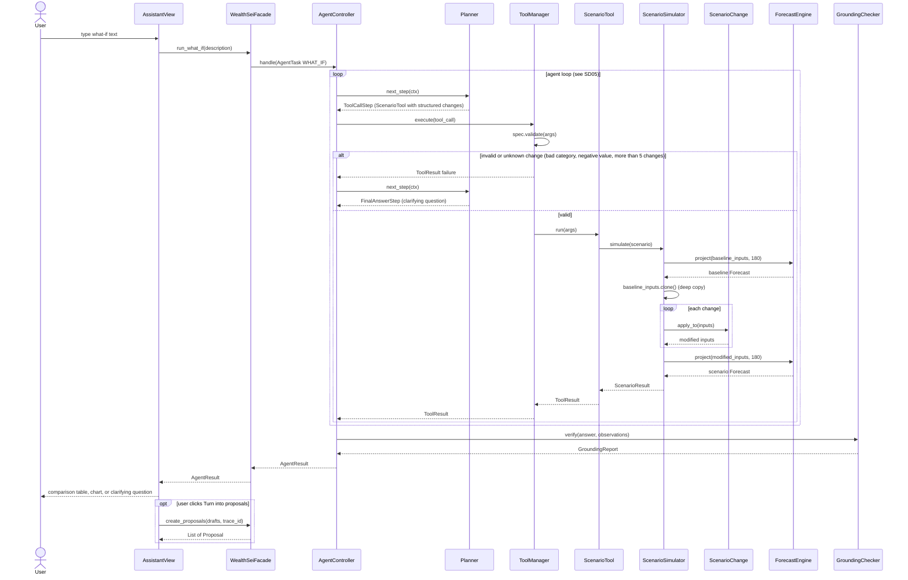
```mermaid
sequenceDiagram
    actor User
    participant AV as AssistantView
    participant F as WealthSeiFacade
    participant AC as AgentController
    participant PL as Planner
    participant TM as ToolManager
    participant ST as ScenarioTool
    participant SS as ScenarioSimulator
    participant SCH as ScenarioChange
    participant FE as ForecastEngine
    participant GC as GroundingChecker

    User->>AV: type what-if text
    AV->>F: run_what_if(description)
    F->>AC: handle(AgentTask WHAT_IF)
    loop agent loop (see SD05)
        AC->>PL: next_step(ctx)
        PL-->>AC: ToolCallStep (ScenarioTool with structured changes)
        AC->>TM: execute(tool_call)
        TM->>TM: spec.validate(args)
        alt invalid or unknown change (bad category, negative value, more than 5 changes)
            TM-->>AC: ToolResult failure
            AC->>PL: next_step(ctx)
            PL-->>AC: FinalAnswerStep (clarifying question)
        else valid
            TM->>ST: run(args)
            ST->>SS: simulate(scenario)
            SS->>FE: project(baseline_inputs, 180)
            FE-->>SS: baseline Forecast
            SS->>SS: baseline_inputs.clone() (deep copy)
            loop each change
                SS->>SCH: apply_to(inputs)
                SCH-->>SS: modified inputs
            end
            SS->>FE: project(modified_inputs, 180)
            FE-->>SS: scenario Forecast
            SS-->>ST: ScenarioResult
            ST-->>TM: ToolResult
            TM-->>AC: ToolResult
        end
    end
    AC->>GC: verify(answer, observations)
    GC-->>AC: GroundingReport
    AC-->>F: AgentResult
    F-->>AV: AgentResult
    AV-->>User: comparison table, chart, or clarifying question
    opt user clicks Turn into proposals
        AV->>F: create_proposals(drafts, trace_id)
        F-->>AV: List of Proposal
    end
```

### SD08 — Monthly AI Review (UC10, F11)

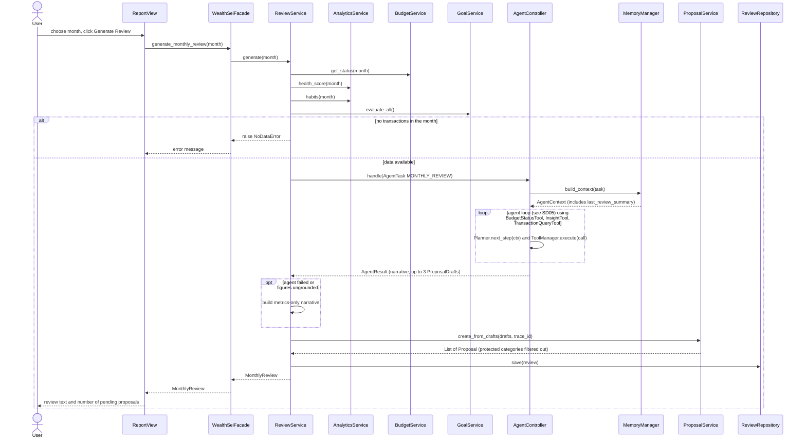
```mermaid
sequenceDiagram
    actor User
    participant RV as ReportView
    participant F as WealthSeiFacade
    participant RS as ReviewService
    participant AS as AnalyticsService
    participant BS as BudgetService
    participant GS as GoalService
    participant AC as AgentController
    participant MM as MemoryManager
    participant PS as ProposalService
    participant RR as ReviewRepository

    User->>RV: choose month, click Generate Review
    RV->>F: generate_monthly_review(month)
    F->>RS: generate(month)
    RS->>BS: get_status(month)
    RS->>AS: health_score(month)
    RS->>AS: habits(month)
    RS->>GS: evaluate_all()
    alt no transactions in the month
        RS-->>F: raise NoDataError
        F-->>RV: error message
    else data available
        RS->>AC: handle(AgentTask MONTHLY_REVIEW)
        AC->>MM: build_context(task)
        MM-->>AC: AgentContext (includes last_review_summary)
        loop agent loop (see SD05) using BudgetStatusTool, InsightTool, TransactionQueryTool
            AC->>AC: Planner.next_step(ctx) and ToolManager.execute(call)
        end
        AC-->>RS: AgentResult (narrative, up to 3 ProposalDrafts)
        opt agent failed or figures ungrounded
            RS->>RS: build metrics-only narrative
        end
        RS->>PS: create_from_drafts(drafts, trace_id)
        PS-->>RS: List of Proposal (protected categories filtered out)
        RS->>RR: save(review)
        RS-->>F: MonthlyReview
        F-->>RV: MonthlyReview
        RV-->>User: review text and number of pending proposals
    end
```

### SD09 — Finance Chat with Memory and Trace (UC11, F12)

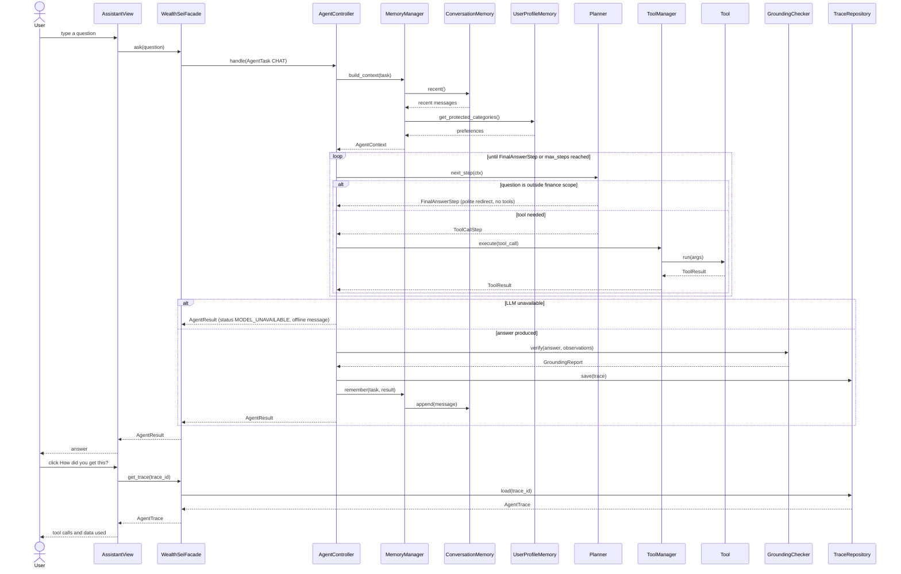
```mermaid
sequenceDiagram
    actor User
    participant AV as AssistantView
    participant F as WealthSeiFacade
    participant AC as AgentController
    participant MM as MemoryManager
    participant CM as ConversationMemory
    participant UM as UserProfileMemory
    participant PL as Planner
    participant TM as ToolManager
    participant T as Tool
    participant GC as GroundingChecker
    participant TRP as TraceRepository

    User->>AV: type a question
    AV->>F: ask(question)
    F->>AC: handle(AgentTask CHAT)
    AC->>MM: build_context(task)
    MM->>CM: recent()
    CM-->>MM: recent messages
    MM->>UM: get_protected_categories()
    UM-->>MM: preferences
    MM-->>AC: AgentContext
    loop until FinalAnswerStep or max_steps reached
        AC->>PL: next_step(ctx)
        alt question is outside finance scope
            PL-->>AC: FinalAnswerStep (polite redirect, no tools)
        else tool needed
            PL-->>AC: ToolCallStep
            AC->>TM: execute(tool_call)
            TM->>T: run(args)
            T-->>TM: ToolResult
            TM-->>AC: ToolResult
        end
    end
    alt LLM unavailable
        AC-->>F: AgentResult (status MODEL_UNAVAILABLE, offline message)
    else answer produced
        AC->>GC: verify(answer, observations)
        GC-->>AC: GroundingReport
        AC->>TRP: save(trace)
        AC->>MM: remember(task, result)
        MM->>CM: append(message)
        AC-->>F: AgentResult
    end
    F-->>AV: AgentResult
    AV-->>User: answer
    User->>AV: click How did you get this?
    AV->>F: get_trace(trace_id)
    F->>TRP: load(trace_id)
    TRP-->>F: AgentTrace
    F-->>AV: AgentTrace
    AV-->>User: tool calls and data used
```

### SD10 — Proposal Approval (UC12, F13)

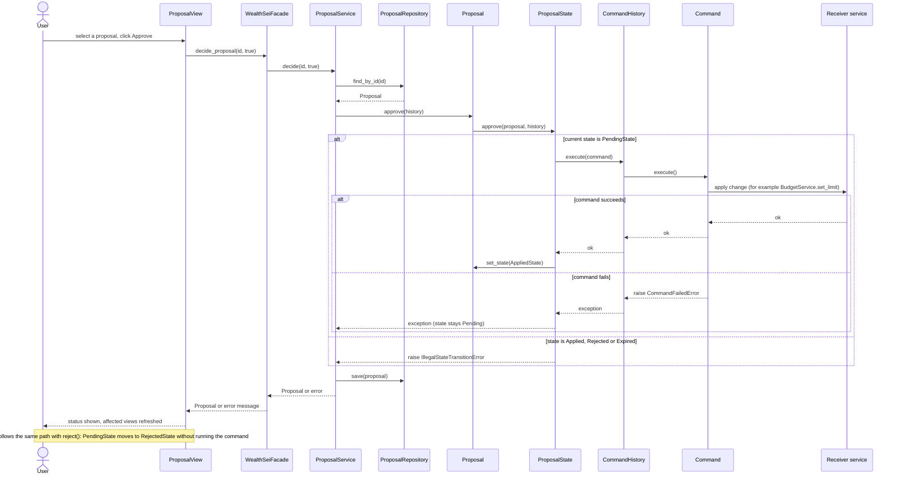
```mermaid
sequenceDiagram
    actor User
    participant PV as ProposalView
    participant F as WealthSeiFacade
    participant PS as ProposalService
    participant PR as ProposalRepository
    participant P as Proposal
    participant ST as ProposalState
    participant CH as CommandHistory
    participant CMD as Command
    participant RCV as Receiver service

    User->>PV: select a proposal, click Approve
    PV->>F: decide_proposal(id, true)
    F->>PS: decide(id, true)
    PS->>PR: find_by_id(id)
    PR-->>PS: Proposal
    PS->>P: approve(history)
    P->>ST: approve(proposal, history)
    alt current state is PendingState
        ST->>CH: execute(command)
        CH->>CMD: execute()
        CMD->>RCV: apply change (for example BudgetService.set_limit)
        alt command succeeds
            RCV-->>CMD: ok
            CMD-->>CH: ok
            CH-->>ST: ok
            ST->>P: set_state(AppliedState)
        else command fails
            CMD-->>CH: raise CommandFailedError
            CH-->>ST: exception
            ST-->>PS: exception (state stays Pending)
        end
    else state is Applied, Rejected or Expired
        ST-->>PS: raise IllegalStateTransitionError
    end
    PS->>PR: save(proposal)
    PS-->>F: Proposal or error
    F-->>PV: Proposal or error message
    PV-->>User: status shown, affected views refreshed
    Note over User,PV: Reject follows the same path with reject(): PendingState moves to RejectedState without running the command
```

### SD11 — Export Report (UC13, F14)

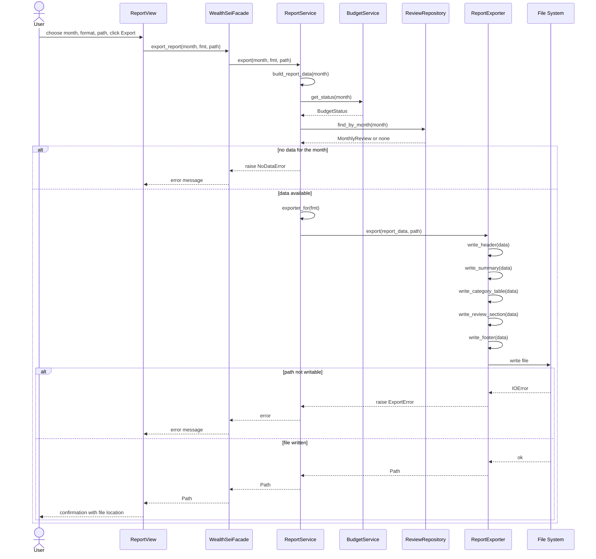
```mermaid
sequenceDiagram
    actor User
    participant RV as ReportView
    participant F as WealthSeiFacade
    participant RS as ReportService
    participant BS as BudgetService
    participant RR as ReviewRepository
    participant EX as ReportExporter
    participant FS as File System

    User->>RV: choose month, format, path, click Export
    RV->>F: export_report(month, fmt, path)
    F->>RS: export(month, fmt, path)
    RS->>RS: build_report_data(month)
    RS->>BS: get_status(month)
    BS-->>RS: BudgetStatus
    RS->>RR: find_by_month(month)
    RR-->>RS: MonthlyReview or none
    alt no data for the month
        RS-->>F: raise NoDataError
        F-->>RV: error message
    else data available
        RS->>RS: exporter_for(fmt)
        RS->>EX: export(report_data, path)
        EX->>EX: write_header(data)
        EX->>EX: write_summary(data)
        EX->>EX: write_category_table(data)
        EX->>EX: write_review_section(data)
        EX->>EX: write_footer(data)
        EX->>FS: write file
        alt path not writable
            FS-->>EX: IOError
            EX-->>RS: raise ExportError
            RS-->>F: error
            F-->>RV: error message
        else file written
            FS-->>EX: ok
            EX-->>RS: Path
            RS-->>F: Path
            F-->>RV: Path
            RV-->>User: confirmation with file location
        end
    end
```

---

## 8. Feature-to-Design Traceability Table

| Feature | Description | Type | Related Use Case | Classes | Key Methods | Sequence Diagram | Design Pattern(s) |
|---|---|---|---|---|---|---|---|
| F01 | Import CSV, auto-detect layout, skip duplicates | Deterministic | UC01 | `TransactionsView`, `WealthSeiFacade`, `TransactionService`, `CsvImporter`, `BankCsvAdapter`, `SignedAmountCsvAdapter`, `DebitCreditCsvAdapter`, `TransactionRepository` | `on_import_clicked()`, `import_transactions()`, `import_file()`, `parse()`, `detect_adapter()`, `read_transactions()`, `to_transaction()`, `remove_duplicates()`, `save_all()` | SD01 | Adapter, Facade |
| F02 | Categorize (rules → LLM) and correct with undo | Hybrid | UC02 | `TransactionsView`, `Categorizer`, `CategorizationStrategy`, `LearnedRuleStrategy`, `KeywordRuleStrategy`, `LLMCategorizationStrategy`, `LLMProvider`, `CommandHistory`, `RecategorizeCommand`, `TransactionService` | `categorize()`, `correct_category()`, `execute()`, `undo()`, `learn()`, `forget()`, `update_category()` | SD02 | Strategy, Command, Decorator |
| F03 | Budget limits, tracking, alerts | Deterministic | UC03 | `DashboardView`, `BudgetService`, `BudgetRepository`, `AlertMonitor`, `AlertListener`, `CliApp` | `set_budget()`, `get_status()`, `refresh_alerts()`, `evaluate()`, `attach()`, `on_alert()` | SD03 | Observer, Facade |
| F04 | Recurring payment and subscription detection | Hybrid | UC04 | `DashboardView`, `AnalyticsService`, `RecurringDetector`, `ExplanationService` | `get_recurring_payments()`, `detect_recurring()`, `detect()`, `explain()` | SD04 | Facade, Decorator |
| F05 | Safe-to-Spend Coach and 30-day forecast | Hybrid | UC05 | `DashboardView`, `AnalyticsService`, `ForecastEngine`, `SafeToSpendCalculator`, `AlertMonitor`, `ExplanationService` | `get_safe_to_spend()`, `safe_to_spend()`, `project()`, `calculate()`, `publish()`, `explain()` | SD04 | Observer, Facade, Decorator |
| F06 | Spending Habit Detective | Hybrid | UC06 | `DashboardView`, `AnalyticsService`, `HabitAnalyzer`, `ExplanationService` | `get_habit_insights()`, `habits()`, `analyze()`, `explain()` | SD04 | Facade, Decorator |
| F07 | Financial Health Score | Hybrid | UC06 | `DashboardView`, `AnalyticsService`, `HealthScoreCalculator`, `BudgetService`, `ExplanationService` | `get_health_score()`, `health_score()`, `calculate()`, `get_status()`, `explain()` | SD04 | Facade, Decorator |
| F08 | Purchase affordability verdict via tool-using agent | AI (agent) | UC07 | `AssistantView`, `WealthSeiFacade`, `AgentController`, `MemoryManager`, `Planner`, `PromptBuilder`, `ResponseParser`, `ToolManager`, `BudgetStatusTool`, `ForecastTool`, `GoalTool`, `TransactionQueryTool`, `GroundingChecker`, `AgentTrace` | `check_affordability()`, `handle()`, `build_context()`, `next_step()`, `execute()`, `run()`, `verify()`, `remember()` | SD05 | Facade, Decorator, Adapter |
| F09 | Goal planning with auto-replan | AI (agent) | UC08 | `GoalsView`, `AgentController`, `GoalTool`, `GoalService`, `GoalPlanner`, `ForecastEngine`, `ProposalService`, `CommandFactory`, `AlertMonitor` | `plan_goal()`, `replan_goal()`, `create_goal()`, `evaluate_all()`, `feasibility()`, `required_monthly()`, `build_options()`, `create_from_drafts()` | SD06 | Observer, Command, State |
| F10 | Natural-language what-if simulation | AI (agent) | UC09 | `AssistantView`, `AgentController`, `Planner`, `ScenarioTool`, `ScenarioSimulator`, `ScenarioChange`, `ForecastEngine`, `GroundingChecker` | `run_what_if()`, `handle()`, `simulate()`, `apply_to()`, `project()`, `create_proposals()` | SD07 | Facade, Decorator |
| F11 | Monthly AI review with fix proposals | AI (agent) | UC10 | `ReportView`, `ReviewService`, `AnalyticsService`, `BudgetService`, `GoalService`, `AgentController`, `MemoryManager`, `ProposalService`, `ReviewRepository` | `generate_monthly_review()`, `generate()`, `handle()`, `build_context()`, `create_from_drafts()`, `save()` | SD08 | Facade, State, Command |
| F12 | Chat with memory and agent trace | AI (agent) | UC11 | `AssistantView`, `AgentController`, `MemoryManager`, `ConversationMemory`, `UserProfileMemory`, `ToolManager`, `Tool` (all six), `GroundingChecker`, `TraceRepository` | `ask()`, `get_trace()`, `handle()`, `build_context()`, `remember()`, `append()`, `verify()`, `load()` | SD09 | Facade, Decorator, Adapter |
| F13 | Proposal approval queue (human-in-the-loop) | Hybrid | UC12, UC14 | `ProposalView`, `ProposalService`, `Proposal`, `ProposalState`, `PendingState`, `AppliedState`, `RejectedState`, `ExpiredState`, `CommandHistory`, `Command`, `CommandFactory` | `decide_proposal()`, `decide()`, `approve()`, `reject()`, `execute()`, `create()` | SD10, SD06 | State, Command, Factory |
| F14 | Report export (Markdown, CSV, text) | Deterministic | UC13 | `ReportView`, `ReportService`, `ReportExporter`, `MarkdownExporter`, `CsvExporter`, `TextExporter` | `export_report()`, `export()`, `build_report_data()`, `exporter_for()`, `write_header()`, `write_footer()` | SD11 | Template Method, Factory, Facade |

**Pattern coverage check:** Facade (F01–F14), Strategy (F02), Adapter (F01 CSV adapters; F02, F04–F12 via `ClaudeProvider`), Observer (F03, F05, F09), Command (F02, F09, F11, F13), State (F09, F11, F13), Decorator (F02, F04–F08, F10, F12), Template Method (F14), Factory (F13 `CommandFactory`, F14 `exporter_for`). Lightweight Prototype (deep-copied `ForecastInputs`) supports F10.

**Use-case relationships:** UC01 includes UC02; UC10 includes UC06; UC08 and UC10 include UC14; UC14 extends UC07 and UC09. UC14 (creating proposals) is realized by `ProposalService.create_from_drafts()` and is drawn in SD06, SD07 and SD08.

---

## 9. Feature Implementation Explanations

### F01 — Import Transactions
**Use case:** UC01 · **Sequence diagram:** SD01
**Classes:** `TransactionsView` (file chooser, shows summary); `WealthSeiFacade` (entry point, refreshes alerts and goals after import); `TransactionService` (orchestrates import, removes duplicates); `CsvImporter` (reads header, chooses adapter); `BankCsvAdapter` with `SignedAmountCsvAdapter` / `DebitCreditCsvAdapter` (object adapters: each wraps a `csv.DictReader` and converts its rows to `Transaction`); `Categorizer` (assigns categories); `TransactionRepository` (persists).
**Important methods:** `TransactionsView.on_import_clicked()`, `WealthSeiFacade.import_transactions()`, `TransactionService.import_file()`, `CsvImporter.parse()`, `CsvImporter.detect_adapter()`, `BankCsvAdapter.read_transactions()`, `BankCsvAdapter.to_transaction()`.
**Execution:** When the user clicks Import, the view calls the facade, which calls `import_file()`. `parse()` opens a `csv.DictReader`, asks each adapter class `can_handle(header)`, and wraps the reader in the first match; `read_transactions()` converts every row with `to_transaction()`, and bad rows are collected as rejected. `remove_duplicates()` drops rows that match an existing date+amount+merchant. Each remaining transaction is categorized (F02), all are saved with `save_all()`, and the facade then calls `BudgetService.refresh_alerts()` and `GoalService.evaluate_all()` before returning an `ImportResult` to the view.

### F02 — Smart Categorization and Correction
**Use case:** UC02 · **Sequence diagram:** SD02
**Classes:** `Categorizer` (runs the chain); `CategorizationStrategy` implemented by `LearnedRuleStrategy` (user-taught rules), `KeywordRuleStrategy` (static keywords), `LLMCategorizationStrategy` (last resort, restricted to allowed categories); `LLMProvider` (model access); `CommandHistory` and `RecategorizeCommand` (undoable correction); `TransactionService` (updates the row).
**Important methods:** `Categorizer.categorize()`, `CategorizationStrategy.categorize()`, `WealthSeiFacade.correct_category()`, `CommandHistory.execute()/undo()`, `RecategorizeCommand.execute()/undo()`, `LearnedRuleStrategy.learn()/forget()`.
**Execution:** `categorize()` calls each strategy in priority order until one returns a category. If the LLM strategy answers with an unknown category or fails, the result is `UNCATEGORIZED`. When the user corrects a row, the facade wraps the change in a `RecategorizeCommand`; `execute()` updates the transaction and calls `learn(merchant, category)`. `undo()` restores the old category and calls `forget(merchant)`.

### F03 — Budget Setup, Tracking and Alerts
**Use case:** UC03 · **Sequence diagram:** SD03
**Classes:** `DashboardView` (edit limits, show progress, receives alerts); `BudgetService` (validates, saves, computes `BudgetStatus`); `BudgetRepository` (persistence); `AlertMonitor` (Subject); `AlertListener` (Observer, implemented by `DashboardView` and `CliApp`).
**Important methods:** `BudgetService.set_budget()`, `BudgetService.get_status()`, `BudgetService.refresh_alerts()`, `AlertMonitor.evaluate()`, `AlertMonitor.attach()`, `AlertListener.on_alert()`.
**Execution:** `set_budget()` validates limits, saves the `Budget`, builds a `BudgetStatus` from transactions, and passes it to `AlertMonitor.evaluate()`. For each category at 80% or more the monitor creates an `Alert` and notifies every attached listener, so GUI and CLI both show it.

### F04 — Recurring Payment and Subscription Detector
**Use case:** UC04 · **Sequence diagram:** SD04
**Classes:** `DashboardView`; `AnalyticsService` (coordinates); `RecurringDetector` (interval and amount regularity); `RecurringRepository` (stores flags); `ExplanationService` (plain-language summary via `LLMProvider`).
**Important methods:** `WealthSeiFacade.get_recurring_payments()`, `AnalyticsService.detect_recurring()`, `RecurringDetector.detect()`, `ExplanationService.explain()`.
**Execution:** `detect_recurring()` loads history and passes it to `detect()`, which groups by merchant, checks that intervals are regular and amounts similar (at least 3 occurrences), and returns `RecurringPayment` objects with a confidence. The facade sends the computed facts to `explain()`; if the LLM fails, `fallback_text()` supplies a template.

### F05 — Safe-to-Spend Coach
**Use case:** UC05 · **Sequence diagram:** SD04
**Classes:** `DashboardView`; `AnalyticsService`; `ForecastEngine` (30-day projection); `SafeToSpendCalculator` (allowance formula); `AlertMonitor` (low-balance alert); `ExplanationService`.
**Important methods:** `AnalyticsService.safe_to_spend()`, `ForecastEngine.project()`, `SafeToSpendCalculator.calculate()`, `AlertMonitor.publish()`.
**Execution:** `safe_to_spend(date)` builds `ForecastInputs` (transactions, recurring payments), calls `project(inputs, 30)`, then `calculate()` applies *(balance + expected income − upcoming bills − goal reserve − buffer) ÷ days left*, floored at zero. If the lowest projected balance is below the buffer, the service publishes a `LOW_BALANCE` alert. The facade adds an explanation.

### F06 — Spending Habit Detective
**Use case:** UC06 · **Sequence diagram:** SD04
**Classes:** `DashboardView`; `AnalyticsService`; `HabitAnalyzer` (statistical rules); `ExplanationService`.
**Important methods:** `AnalyticsService.habits()`, `HabitAnalyzer.analyze()`, `ExplanationService.explain()`.
**Execution:** `habits(month)` loads transactions; `analyze()` applies rules (weekend vs weekday averages, spending share in the days after payday, last-week-of-month share, many small purchases with the same merchant type, amounts above mean + 2σ) and returns `Insight` objects with evidence. The facade asks `explain()` to turn each into a friendly tip.

### F07 — Financial Health Score
**Use case:** UC06 · **Sequence diagram:** SD04
**Classes:** `DashboardView`; `AnalyticsService`; `BudgetService` (supplies `BudgetStatus`); `HealthScoreCalculator`; `ExplanationService`.
**Important methods:** `AnalyticsService.health_score()`, `BudgetService.get_status()`, `HealthScoreCalculator.calculate()`.
**Execution:** `health_score(month)` obtains the budget status and forecast, then `calculate()` scores four components (budget adherence 30, savings rate 25, emergency buffer 25, goal progress 20). Components lacking data are excluded and weights re-normalized. The result is a `HealthScore` with `ScoreComponent` breakdown, explained by `ExplanationService`.

### F08 — Purchase Affordability Check
**Use case:** UC07 · **Sequence diagram:** SD05
**Classes:** `AssistantView` (form and result card); `WealthSeiFacade` (validates input, builds `AgentTask`); `AgentController` (runs the loop); `MemoryManager` (context); `Planner` with `PromptBuilder` and `ResponseParser` (ask the LLM for the next step and parse it); `LLMProvider` chain (retry and logging decorators around `ClaudeProvider`); `ToolManager` and `Tool`s (`BudgetStatusTool`, `ForecastTool`, `GoalTool`, `TransactionQueryTool`); `GroundingChecker`; `AgentTrace`.
**Important methods:** `WealthSeiFacade.check_affordability()`, `AgentController.handle()`, `Planner.next_step()`, `ToolManager.execute()`, `Tool.run()`, `GroundingChecker.verify()`.
**Execution:** The facade rejects invalid prices, then calls `handle()`. The controller builds context and asks `Planner.next_step()` repeatedly. Each `ToolCallStep` is validated and executed by `ToolManager`, and its result becomes an observation. When the planner returns a `FinalAnswerStep`, `GroundingChecker.verify()` confirms every figure appears in tool results (otherwise `Planner.revise()` runs once). The trace is saved and the `AgentResult` is returned.

### F09 — Savings Goal Planner with Auto-Replan
**Use case:** UC08 · **Sequence diagram:** SD06
**Classes:** `GoalsView`; `GoalService` (validate, evaluate status, feasibility); `GoalPlanner` (required monthly amount, options); `ForecastEngine` (monthly surplus); `GoalTool` (agent access); `AgentController`; `ProposalService` and `CommandFactory` (turn suggestions into pending proposals); `AlertMonitor` (goal-risk alerts).
**Important methods:** `WealthSeiFacade.plan_goal()/replan_goal()`, `GoalService.create_goal()/evaluate_all()/feasibility()`, `GoalPlanner.required_monthly()/build_options()`, `ProposalService.create_from_drafts()`.
**Execution:** `create_goal()` validates and saves the goal. The agent calls `GoalTool`, which invokes `feasibility()`: `required_monthly()` versus `monthly_surplus()`, then `build_options()` (raise contribution, extend deadline, trim categories). The agent explains the plan and returns drafts; `create_from_drafts()` filters protected categories and stores pending proposals. After each import `evaluate_all()` recomputes status and publishes an alert for AT_RISK/BEHIND goals, prompting **Replan**.

### F10 — What-If Scenario Simulator
**Use case:** UC09 · **Sequence diagram:** SD07
**Classes:** `AssistantView`; `AgentController`; `Planner` (NL → structured tool call); `ToolManager` (validates arguments); `ScenarioTool`; `ScenarioSimulator`; `ScenarioChange` and its four implementations (`CancelRecurringChange`, `CapCategoryChange`, `IncomeChange`, `OneTimeExpenseChange`); `ForecastEngine`; `GroundingChecker`.
**Important methods:** `WealthSeiFacade.run_what_if()`, `ScenarioSimulator.simulate()`, `ScenarioChange.apply_to()`, `ForecastEngine.project()`, `ForecastInputs.clone()`, `WealthSeiFacade.create_proposals()`.
**Execution:** The planner turns the text into a `ScenarioTool` call with structured changes; invalid values are rejected by validation and the agent asks a clarifying question instead. `simulate()` projects the baseline, takes a **deep copy** of the baseline `ForecastInputs` with `clone()` (so a scenario can never mutate the baseline), applies each `ScenarioChange` to the copy, projects again, and returns a `ScenarioResult`. The agent narrates the comparison using only these figures.

### F11 — Monthly AI Review and Fix Plan
**Use case:** UC10 · **Sequence diagram:** SD08
**Classes:** `ReportView`; `ReviewService` (orchestrates); `AnalyticsService`, `BudgetService`, `GoalService` (deterministic metrics); `AgentController` and `MemoryManager` (narrative with previous-review context); `ProposalService`; `ReviewRepository`.
**Important methods:** `WealthSeiFacade.generate_monthly_review()`, `ReviewService.generate()`, `AgentController.handle()`, `ProposalService.create_from_drafts()`, `ReviewRepository.save()`.
**Execution:** `generate()` gathers the metrics, then runs the agent with task `MONTHLY_REVIEW`. The agent calls tools to verify each claim and returns a narrative plus up to three drafts. If the agent fails, a metrics-only narrative is built deterministically. Drafts become pending proposals, and the `MonthlyReview` is saved and returned.

### F12 — Natural-Language Finance Chat with Agent Trace
**Use case:** UC11 · **Sequence diagram:** SD09
**Classes:** `AssistantView` (chat and trace toggle); `AgentController`; `MemoryManager` with `ConversationMemory` (bounded recent turns) and `UserProfileMemory` (preferences); `Planner`; `ToolManager` with all six tools; `GroundingChecker`; `TraceRepository` and `AgentTrace`.
**Important methods:** `WealthSeiFacade.ask()/get_trace()`, `MemoryManager.build_context()/remember()`, `ConversationMemory.recent()/append()`, `GroundingChecker.verify()`, `TraceRepository.save()/load()`.
**Execution:** `build_context()` merges recent messages and preferences so follow-ups such as "and last month?" resolve. The planner chooses tools per question; off-topic questions get a polite redirect without tools. After grounding verification, the trace is saved and the turn stored. `get_trace(id)` reloads the steps for the "How did you get this?" view.

### F13 — Proposal Approval Queue
**Use cases:** UC12 (review) and UC14 (creation) · **Sequence diagrams:** SD10 (approval), SD06 (creation)
**Classes:** `ProposalView`; `ProposalService` (create, list, decide, expire, guardrails); `Proposal` (context) with `ProposalState` and its four implementations; `CommandFactory`; `Command` implementations (`SetBudgetLimitCommand`, `UpdateGoalContributionCommand`, `FlagSubscriptionCommand`); `CommandHistory`; `ProposalRepository`.
**Important methods:** `WealthSeiFacade.decide_proposal()`, `ProposalService.decide()/create_from_drafts()/passes_guardrails()`, `Proposal.approve()/reject()`, `ProposalState.approve()`, `CommandHistory.execute()`, `CommandFactory.create()`.
**Execution:** At creation, `passes_guardrails()` discards drafts that touch protected categories and `CommandFactory.create()` builds the command. On approval, `Proposal.approve()` delegates to the current state: `PendingState` executes the command via `CommandHistory` and switches to `AppliedState`; other states raise `IllegalStateTransitionError`. A failing command leaves the proposal Pending.

### F14 — Report Export
**Use case:** UC13 · **Sequence diagram:** SD11
**Classes:** `ReportView`; `ReportService` (collects data, chooses exporter); `ReportExporter` (template method `export()`); `MarkdownExporter`, `CsvExporter`, `TextExporter`.
**Important methods:** `WealthSeiFacade.export_report()`, `ReportService.build_report_data()/exporter_for()`, `ReportExporter.export()`, `write_header()/write_summary()/write_category_table()/write_review_section()/write_footer()`.
**Execution:** `build_report_data()` combines `BudgetStatus` and the saved `MonthlyReview` (if any). `exporter_for(fmt)` (a Factory) returns the right subclass; its inherited `export()` calls the five `write…` steps in fixed order and writes the file. If no review exists, the report contains metrics only, with a note.

---

## 10. Appendices

### Appendix A — Testability map (preparing for Stage 3)

| Deterministic components (`pytest` tests) | Agent components (behavioural tests) |
|---|---|
| `Money` (Decimal arithmetic and rounding), `ForecastInputs.clone()` (deep copy), `CsvImporter` and adapters, `Categorizer` with rule strategies, `BudgetService`, `AlertMonitor`, `RecurringDetector`, `ForecastEngine`, `SafeToSpendCalculator`, `HabitAnalyzer`, `HealthScoreCalculator`, `GoalPlanner`, `ScenarioSimulator`, `CommandHistory` and commands, `Proposal` states, `ProposalService.passes_guardrails()`, `ToolManager` argument validation, `ResponseParser`, `GroundingChecker`, `ReportExporter`s | `AgentController` loop, `Planner` and `PromptBuilder`, tool selection, use of tool results, recovery from tool or LLM failure, memory use, clarifying questions, proposal quality |

Agent behaviours planned for behavioural testing: (1) selects the forecast/budget tools before answering an affordability question; (2) never states a monetary figure absent from tool results; (3) does not execute a tool with invalid arguments; (4) reports tool failure instead of guessing; (5) respects protected categories in proposals; (6) asks for clarification on ambiguous what-if requests.

### Appendix B — CLI command map (GUI/CLI parity)

| CLI command | Facade method | Feature |
|---|---|---|
| `wealthsei import <file>` | `import_transactions()` | F01 |
| `wealthsei categorize <tx_id> <category>` · `undo` · `redo` | `correct_category()`, `undo()`, `redo()` | F02 |
| `wealthsei budget set <month> <category> <amount>` · `budget status <month>` | `set_budget()`, `get_budget_status()` | F03 |
| `wealthsei recurring` | `get_recurring_payments()` | F04 |
| `wealthsei safe [date]` | `get_safe_to_spend()` | F05 |
| `wealthsei habits <month>` | `get_habit_insights()` | F06 |
| `wealthsei score <month>` | `get_health_score()` | F07 |
| `wealthsei afford "<item>" <price>` | `check_affordability()` | F08 |
| `wealthsei goal add "<name>" <target> <deadline>` · `goal replan <id>` | `plan_goal()`, `replan_goal()` | F09 |
| `wealthsei whatif "<text>"` | `run_what_if()` | F10 |
| `wealthsei review <month>` | `generate_monthly_review()` | F11 |
| `wealthsei ask "<question>"` · `trace <id>` | `ask()`, `get_trace()` | F12 |
| `wealthsei proposals list` · `approve <id>` · `reject <id>` | `list_pending_proposals()`, `decide_proposal()` | F13 |
| `wealthsei export <month> --format md --out <file>` | `export_report()` | F14 |
| `wealthsei prefs protect <category>` | `set_protected_category()` | supports F09, F11, F13 |
