# WealthSei — Stage 1 Project Design Report
### An AI Personal Finance Agent

**Course:** EECS3311 Software Design, Fall 2026 · **Stage:** 1 (Design)
**Student:** Rishit Shah, _[219773050]_ · **Repository:** [github.com/Rishit-Shah/EECS-3311-Project---WealthSei](https://github.com/Rishit-Shah/EECS-3311-Project---WealthSei)

> **Notice:** WealthSei provides informational guidance only. It is not professional financial advice. This notice is shown in the GUI footer and in the CLI banner.

## Contents

1. Project Overview
2. Detailed Feature Specifications (F01–F14)
3. UML Class Diagrams
4. Design Pattern Explanations
5. Use-Case Diagram
6. Use-Case Descriptions
7. Sequence Diagrams
8. Feature-to-Design Traceability Table
9. Feature Implementation Explanations
10. Appendices (testing map, CLI command map, diagram files, requirements checklist)

---

## 1. Project Overview

### 1.1 Problem and motivation

Most people can see *what* they spent (bank apps and spreadsheets show that), but not what it *means* for decisions they face every week: *Can I afford this laptop? How much can I safely spend today without missing rent? Am I still on track for my vacation fund? What would change if I cancelled two subscriptions?* Answering these questions means combining several data sources (transaction history, budgets, upcoming bills, savings goals) and reasoning across several steps. Existing budgeting tools mostly categorize and chart; they stop before the decision.

### 1.2 Target users

Individuals who manage a personal budget without financial expertise: university students, early-career workers, and freelancers with irregular income.

### 1.3 What the agent can do

- Import bank CSV exports (two layouts, auto-detected) or add a transaction by hand, and categorize transactions, learning from the user's corrections.
- Take the user's **plan** (income, current balance, fixed bills, planned expenses) and track monthly budgets, pushing alerts to both the GUI and the CLI.
- Compute a **daily Safe-to-Spend allowance**, forecast the next 30 days of cash flow from the plan (income, bills, planned expenses) and recent spending, and warn before the balance drops below a safety buffer.
- Detect recurring payments and subscriptions, spending habits, and a transparent **Financial Health Score**.
- **Plan multi-step answers with tools:** "Can I afford $600 for a laptop?", savings-goal planning and automatic re-planning, and natural-language **what-if simulations**.
- Write a **monthly review** with concrete "fix" suggestions.
- Answer free-form finance questions with memory of the conversation and a **"How did you get this?" trace**.
- Never change the user's data on its own: every suggested change goes to an **approval queue**.

### 1.4 Why an AI agent is appropriate

| Need | Why plain code or a single prompt is not enough | Agent behaviour used |
|---|---|---|
| "Can I afford X?" | Which data matters depends on the item, price, date, and the user's goals; 3–4 lookups must be chosen and combined | **Planning, tool use, multi-step execution, decision-making** (verdict) |
| Goal replanning | Requires checking feasibility, generating alternatives, then choosing which to propose | **Multi-step reasoning** over deterministic goal tools |
| What-if in plain English | Free text must become structured changes; ambiguity must be detected and clarified | **Reasoning, tool use, clarification** |
| Follow-up questions ("and last month?") | Needs context from earlier turns and stored user preferences | **Memory** (short-term and long-term) |
| Trustworthy numbers | LLMs are unreliable at arithmetic | **Retrieval via tools + grounding check**: the LLM never computes money values |

**Design rule:** *the LLM decides what to look up and how to explain; deterministic code computes every number.*

### 1.5 AI/LLM models

| Role | Model | Used by |
|---|---|---|
| Agent reasoning, planning, monthly review | Claude Sonnet 5 (`claude-sonnet-5`) | `Planner` (via `LLMProvider`) |
| Lightweight tasks: categorization fallback, explanations | Claude Haiku 4.5 (`claude-haiku-4-5-20251001`) | `LLMCategorizationStrategy`, `ExplanationService` |
| Offline development and automated tests | `MockLLMProvider` (scripted replies) | Unit and integration tests |

All models sit behind one interface, `LLMProvider`, and are reached through **LangChain4j** (its `langchain4j-anthropic` module), wrapped by `ClaudeProvider` (see the Adapter pattern in Section 4 and the LangChain4j table in Section 1.6). Model names are read from `config.properties`, so any other provider can be substituted without changing agent code.

### 1.6 How the AI interacts with the rest of the software

1. **The LLM never touches the database or the UI.** `Planner` asks it for one step at a time: either a native tool-call request (becomes a `ToolCallStep`) or a final answer (a `FinalAnswerStep`).
2. **Tools are a whitelist.** `ToolManager` validates arguments against each `ToolSpec` before running a `Tool`; invalid calls are never executed.
3. **Numbers come from tools only.** `GroundingChecker` compares figures in the final answer with tool results and triggers a correction if any are unsupported.
4. **Changes go through proposals.** Agent suggestions become `Proposal` objects that the user approves; approval runs an undoable `Command`.
5. **Memory is explicit.** `MemoryManager` supplies bounded recent messages and stored preferences (e.g., protected categories such as Groceries).
6. **Graceful degradation.** If the LLM is unavailable, deterministic fallbacks are used (template explanations, "Uncategorized" flag, metrics-only review).

**Where the LLM is used.** There are three kinds of use, and nowhere else:

| Kind of use | Features | Model | What the LLM does | Without the LLM |
|---|---|---|---|---|
| **1. Classify** | F02 | Claude Haiku 4.5 | Picks a category for a merchant that no learned rule or keyword recognizes | The transaction is marked `UNCATEGORIZED` for the user to fix |
| **2. Explain** | F04, F05, F06, F07 | Claude Haiku 4.5 | Turns numbers already computed by code into plain-language text and tips | A template sentence built from the same numbers |
| **3. Plan and reason with tools (the agent)** | F08, F09, F10, F11, F12 | Claude Sonnet 5 | Decides which tools to call, turns a what-if sentence into structured changes, and writes the verdicts, plans, reviews, answers and suggestions | The agent reports that the model is unavailable; F11 falls back to a metrics-only review |

**No LLM at all:** F01 (import or add), F03 (plan, budgets, alerts), F13 (the approval workflow itself; the proposals it holds were written by the agent) and F14 (export). In every feature the LLM never computes a number: amounts, forecasts, scores and totals always come from plain code.

**How LangChain4j is used.** LangChain4j offers a low-level tool API (`ChatModel` plus `ToolSpecification`) and a high-level one (AI Services with `@Tool` methods). WealthSei deliberately uses the low-level API and keeps the agent loop in its own classes.

| LangChain4j piece | Used? | Where and why |
|---|---|---|
| `ChatModel` (concretely `AnthropicChatModel`) | Yes | The *adaptee* inside `ClaudeProvider` (Adapter pattern) |
| `ChatRequest`, `ChatResponse` and the message types (`SystemMessage`, `UserMessage`, `AiMessage`, `ToolExecutionResultMessage`) | Yes | Translated to and from our `LLMRequest` / `LLMResponse` inside `ClaudeProvider` |
| `ToolSpecification`, `ToolExecutionRequest` | Yes | Our `ToolSpec` is translated into a `ToolSpecification`; the model's tool requests come back as our `ToolCall`s |
| `ChatMemory` (`MessageWindowChatMemory`) | Yes | Inside `ConversationMemory`, to keep a bounded window of recent messages |
| AI Services (`AiServices`, `@Tool` methods) | **No** | They would run the tool loop for us. We keep the loop in `AgentController`, `Planner` and `ToolManager` so argument validation, grounding checks, tracing and failure recovery are visible in the design and testable in Stage 3 |
| RAG, embeddings | No | Not needed: data comes from deterministic tools |

### 1.7 Overall architecture

**Planned stack:** Java 17; **Maven**; **JavaFX** for the GUI; **picocli** for the CLI; **SQLite** via JDBC; **LangChain4j** (`langchain4j-anthropic`) for LLM access; **Apache Commons CSV** for CSV parsing; **Jackson** for JSON; `java.math.BigDecimal` for money; Java `record`s for value objects; **JUnit 5** for tests.

**Fig 1 — Layered architecture**

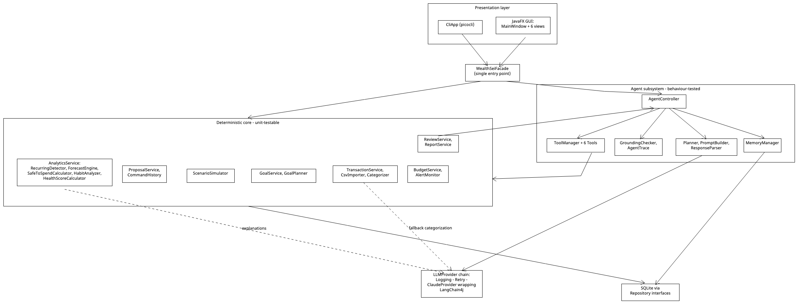

*Image:* [`Fig_1_Layered_Architecture.png`](https://github.com/Rishit-Shah/EECS-3311-Project---WealthSei/blob/main/docs/diagrams/png/Fig_1_Layered_Architecture.png) 

**Planned Maven/Java package layout** (each UML class maps to one Java class; Stage 2 will trace to these):

| Package (`src/main/java/wealthsei/…`) | Contents |
|---|---|
| `presentation` | `MainWindow`, the six JavaFX views, `CliApp` |
| `facade` | `WealthSeiFacade` |
| `service` | `TransactionService`, `PlanService`, `BudgetService`, `AnalyticsService`, `GoalService`, `ProposalService`, `ReviewService`, `ReportService`, `ExplanationService` |
| `analytics` | `RecurringDetector`, `ForecastEngine`, `ForecastInputs`, `SafeToSpendCalculator`, `HabitAnalyzer`, `HealthScoreCalculator`, `GoalPlanner`, `ScenarioSimulator`, `ScenarioChange` and its four implementations |
| `importing` | `CsvImporter`, `BankCsvAdapter` and implementations, `Categorizer`, `CategorizationStrategy` and implementations |
| `agent` | `AgentController`, `Planner`, `PromptBuilder`, `ResponseParser`, `ToolManager`, `Tool` and the six tools, `MemoryManager`, `GroundingChecker`, `AgentTrace` |
| `llm` | `LLMProvider`, `ClaudeProvider`, `MockLLMProvider`, the decorators |
| `command` | `Command`, `CommandHistory`, `CommandFactory`, the four concrete commands, `Proposal` and the proposal states |
| `report` | `ReportExporter` and the three exporters |
| `domain` | `Money` (wraps `BigDecimal`) and records such as `Transaction`, `Budget`, `SavingsGoal`, `FinancialPlan`, `IncomeSource`, `FixedBill`, `PlannedExpense`; the standard `java.time.YearMonth`, `LocalDate` and `Instant` are used directly |
| `repository` | repository interfaces and their `Sqlite…` implementations |
| `src/test/java` | JUnit 5 tests (Stage 3) |

### 1.8 Example scenario: a first-time user

Alex is a student. The numbers are made up.

| Step | What Alex does | What WealthSei does | Features |
|---|---|---|---|
| 1 | Opens the app for the first time | Empty dashboard: each panel says "no data yet" and suggests "1. Set up your plan, 2. Import a CSV or add transactions, 3. Check categories" | none |
| 2 | Enters the plan: $2,400 monthly income (next pay day Oct 1), balance $1,150 as of Sep 28, rent $900 due Oct 1, a $150 textbook on Oct 5, a $200 buffer, and limits Groceries $300, Dining $150, Transport $80 | Validates and saves the plan and budget | F03 |
| 3 | Imports three months of bank CSV | Detects the bank layout, skips duplicates, categorizes rows (rules first, the LLM only for unknown merchants), shows a summary | F01, F02 |
| 4 | Adds a $12 cash coffee by hand | Validates, categorizes, saves, refreshes alerts | F01 |
| 5 | Looks at the dashboard | Shows budget bars and alerts, subscriptions, Safe-to-Spend today, the 30-day forecast, health score and habit tips. Plain code computes every number; the LLM only explains them | F03–F07 |
| 6 | Moves "Uber Eats" from Transport to Dining | Applies the change, learns the rule, offers Undo | F02 |
| 7 | Asks "Can I afford a $600 laptop?" | The agent calls its budget, forecast and goal tools and answers with a verdict and reasoning; "How did you get this?" shows the tool calls | F08, F12 |
| 8 | Creates a goal: $1,000 by January | The agent checks feasibility against the plan and suggests changes, which go to the approval queue | F09, F13 |
| 9 | Approves one suggestion | The budget changes; the change can be undone | F13 |
| 10 | At month-end, generates the AI review and exports it | Compares plan with actual, writes the review and fix proposals, saves a report file | F11, F14 |

---

## 2. Detailed Feature Specifications

| ID | Feature | Type |
|---|---|---|
| F01 | Import or Add Transactions | Deterministic |
| F02 | Smart Categorization and Correction (with Undo) | Hybrid |
| F03 | Budget and Plan Setup, Tracking and Alerts | Deterministic |
| F04 | Recurring Payment and Subscription Detector | Hybrid |
| F05 | Safe-to-Spend Coach | Hybrid |
| F06 | Spending Habit Detective | Hybrid |
| F07 | Financial Health Score | Hybrid |
| F08 | Purchase Affordability Check | AI (agent) |
| F09 | Savings Goal Planner with Auto-Replan | AI (agent) |
| F10 | What-If Scenario Simulator | AI (agent) |
| F11 | Monthly AI Review and Fix Plan | AI (agent) |
| F12 | Natural-Language Finance Chat with Agent Trace | AI (agent) |
| F13 | Proposal Approval Queue | Hybrid |
| F14 | Report Export | Deterministic |
 

_Type meanings: **Deterministic** = no LLM. **Hybrid** = deterministic core, LLM used for a bounded sub-task. **AI (agent)** = LLM plans and calls tools; all numbers still come from deterministic tools._

### F01 — Import or Add Transactions · Deterministic

| Field | Details |
|---|---|
| **Description** | Gets transactions into the app in two ways. (a) **Import** a bank or credit-card CSV export: one of two supported layouts (single signed-amount column, or separate debit/credit columns) is auto-detected by a matching adapter that wraps an Apache Commons CSV `CSVParser`; records become `Transaction` objects, duplicates are skipped, and new rows are auto-categorized (F02). (b) **Add a single transaction by hand** (date, amount, merchant, optional category, income or expense), useful for cash spending, for a missing row, and for demos without a CSV. |
| **User interaction** | `TransactionsView` → **Import CSV** (file chooser, then a summary dialog) or **Add Transaction** (small form). CLI: `wealthsei import <file.csv>`, `wealthsei add-tx --date <d> --amount <a> --merchant <m> [--category <c>] [--income]`. |
| **Input** | A CSV file path, or a `NewTransaction` (date, amount, merchant, description, optional category, income flag). |
| **Output** | `ImportResult` (imported count, duplicates skipped, rejected rows with reasons), or the newly added `Transaction`; rows appear in the table. |
| **AI involvement** | Deterministic parsing, validation and de-duplication. Categorization of new rows is F02 (hybrid). |
| **Expected workflow** | *Import:* 1) User picks a file. 2) `CsvImporter` reads the header and picks a matching `BankCsvAdapter`. 3) The adapter's `readTransactions()` turns each record into a `Transaction`. 4) Duplicates (same date, amount, merchant) are removed. 5) `Categorizer` assigns categories. 6) Rows are saved. 7) Budget alerts and goal status are refreshed. 8) A summary is shown. *Manual add:* 1) User fills in the form. 2) `TransactionService.addTransaction()` validates it. 3) `Categorizer` assigns a category if none was chosen. 4) The row is saved and alerts and goals are refreshed. |
| **Error / alternative cases** | Unreadable or non-CSV file → error, nothing saved. Unknown header → "unsupported format" listing supported layouts. Invalid record (bad date or amount) → skipped and listed. All rows duplicates → "0 new transactions". Manual entry with a zero amount, an empty merchant, or a future date → validation error. A manual entry matching an existing row (same date, amount, merchant) → warns of a possible duplicate and asks to confirm. |

### F02 - Smart Categorization and Correction (with Undo) · Hybrid

| Field | Details |
|---|---|
| **Description** | Each transaction is categorized by a priority chain: learned user rules → keyword rules → LLM fallback (only for merchants nothing else recognizes). The user can correct a category; the correction is stored as a learned rule so the same merchant is categorized correctly next time. Corrections can be undone and redone. |
| **User interaction** | `TransactionsView`: category drop-down per row; **Undo / Redo** buttons. CLI: `wealthsei categorize <txId> <category>`, `wealthsei undo`, `wealthsei redo`. |
| **Input** | New transactions (automatic), or `(txId, newCategory)` (manual). |
| **Output** | Categorized transactions; updated row; new learned rule. |
| **AI involvement** | **Hybrid.** Rules are deterministic. The LLM is called only as the last strategy, and must answer with one category from the allowed list. |
| **Expected workflow** | Auto: `Categorizer` tries each `CategorizationStrategy` in order until one returns a category. Manual: Facade wraps the change in a `RecategorizeCommand`; `CommandHistory` executes it (update transaction + learn rule); Undo restores the old category and forgets the rule. |
| **Error / alternative cases** | LLM unavailable or times out → `UNCATEGORIZED`, flagged for manual review. LLM returns a category not in the list → rejected, `UNCATEGORIZED`. Unknown `txId` → error. Undo with empty history → "nothing to undo". |

### F03 — Budget and Plan Setup, Tracking and Alerts · Deterministic

| Field | Details |
|---|---|
| **Description** | The user describes their money **plan** once and keeps it up to date: **income sources** (amount, frequency, next pay date), **current balance** (with the date it is accurate), **fixed bills** (rent, phone, subscriptions: amount, frequency, next due date), **planned one-off expenses** (description, amount, date) and a **safety buffer**. The user also sets monthly spending limits per category. The app tracks spent / limit / percentage live and raises alerts at 80% (warning) and 100% (over budget), delivered to whichever interfaces are listening (GUI toast, CLI console). The plan is what makes forecasting (F05, F08–F10) simple and accurate. |
| **User interaction** | `DashboardView`: a **Plan** panel (income, balance, bills, planned expenses), editable category limits with progress bars, and alert toasts. CLI: `wealthsei plan show`, `plan set-income <name> <amount> <frequency> <nextPayDate>`, `plan add-bill <name> <amount> <frequency> <nextDueDate>`, `plan add-expense <description> <amount> <date>`, `plan set-balance <amount> <asOfDate>`, `budget set <month> <category> <amount>`, `budget status <month>`. |
| **Input** | Plan items (amounts ≥ 0, valid dates and frequencies); a month and category limits (≥ 0). |
| **Output** | The saved `FinancialPlan`; `BudgetStatus` (per-category spent, limit, ratio, level); `Alert` events. |
| **AI involvement** | None (deterministic). |
| **Expected workflow** | *Plan:* 1) User edits the plan. 2) `PlanService` validates and saves it. 3) Forecasts and Safe-to-Spend use the new plan the next time they run. *Budget:* 1) Limits are validated. 2) `BudgetService` saves the `Budget`. 3) Status is computed from transactions. 4) `AlertMonitor.evaluate()` publishes an `Alert` for each line at or above 80%. 5) Listeners display it. |
| **Error / alternative cases** | A negative or non-numeric amount, a missing pay date, an unknown frequency, or a balance date in the future → rejected with a message. Spending in a category with no budget → shown as "unbudgeted". No transactions → all usage 0%. No plan yet → the app still works from imported history and shows a "set up your plan for better forecasts" hint. |

### F04 — Recurring Payment and Subscription Detector · Hybrid

| Field | Details |
|---|---|
| **Description** | Finds payments that repeat at a regular interval (weekly, monthly, yearly) with similar amounts; lists subscriptions, total monthly cost, next due dates, and price increases. Users can flag an item for review. It also detects recurring **income**, and detected items that match a fixed bill in the plan (F03) are not counted twice. |
| **User interaction** | `DashboardView` → **Recurring** panel. CLI: `wealthsei recurring`. |
| **Input** | Transaction history (≥ 3 occurrences per pattern). |
| **Output** | List of `RecurringPayment` (merchant, amount, frequency, next due, confidence), total monthly cost, plain-language summary. |
| **AI involvement** | **Hybrid.** Detection is deterministic (interval regularity + amount tolerance). The LLM only phrases the summary from the computed facts. |
| **Expected workflow** | 1) `AnalyticsService.detectRecurring()` loads history. 2) `RecurringDetector.detect()` groups by merchant and tests regularity. 3) `ExplanationService.explain()` writes the summary. 4) Panel is displayed. |
| **Error / alternative cases** | Fewer than 3 occurrences → "not enough history". Irregular amounts → shown as "possible" with lower confidence. LLM failure → template summary. |

### F05 — Safe-to-Spend Coach  · Hybrid

| Field | Details |
|---|---|
| **Description** | Computes a **daily discretionary allowance** for the rest of the month: *(balance now + income still due − bills still due − planned expenses still due − goal contributions − safety buffer) ÷ days left*, floored at zero. The **balance now** is the plan's current balance plus every transaction dated after the balance date. **Income, bills and planned expenses still due** come from the plan's dated events; recurring payments detected in history fill in anything the plan does not cover. It also projects the next 30 days of balance and raises a low-balance alert if the projection falls below the buffer. |
| **User interaction** | `DashboardView` **Safe to Spend Today** card and 30-day balance chart. CLI: `wealthsei safe [date]`. |
| **Input** | Date (default today); the plan (F03: income, balance, fixed bills, planned expenses, buffer); transactions; detected recurring payments; goals. |
| **Output** | `SafeToSpendResult` (daily allowance, remaining this month, upcoming bills, goal reserve), `Forecast`, explanation, optional `LOW_BALANCE` alert. |
| **AI involvement** | **Hybrid.** All figures deterministic; the LLM only explains and gives tips from those figures. |
| **Expected workflow** | 1) `AnalyticsService.safeToSpend()` loads the plan and the transactions. 2) Recurring payments are detected for items the plan does not cover. 3) `ForecastEngine.project()` builds the 30-day forecast day by day: start balance, plus income on pay dates, minus bills and planned expenses on their dates, minus expected everyday spending (the recent average, or the budget limits when history is short). 4) `SafeToSpendCalculator.calculate()` computes the allowance. 5) If the lowest projected balance is below the buffer → `AlertMonitor.publish()`. 6) `ExplanationService.explain()` adds text. |
| **Error / alternative cases** | No plan and no transactions → prompt to set up a plan or import. Result would be negative → show $0 and "over-committed by $X" with an alert. Balance date older than the newest transaction → the balance is rolled forward using the newer transactions. Transactions do not reach today → "data may be out of date" notice. LLM unavailable → template text. |

### F06 — Spending Habit Detective · Hybrid

| Field | Details |
|---|---|
| **Description** | Detects behavioural patterns: weekend-vs-weekday spikes, post-payday splurges, end-of-month crunches, **small-purchase leaks** (many small purchases that add up), and unusual one-off expenses (amount > mean + 2σ for the category). Each `Insight` includes its evidence. |
| **User interaction** | `DashboardView` → **Habits** panel with insight cards. CLI: `wealthsei habits <month>`. |
| **Input** | Month (default current); transaction history. |
| **Output** | List of `Insight` (type, title, evidence, severity, friendly explanation). |
| **AI involvement** | **Hybrid.** Statistical rules find the patterns; the LLM turns evidence into a friendly tip. |
| **Expected workflow** | 1) `AnalyticsService.habits()` loads transactions. 2) `HabitAnalyzer.analyze()` applies rules. 3) `ExplanationService.explain()` adds text. 4) Cards displayed. |
| **Error / alternative cases** | Less than 30 days of data → "need more data". No pattern found → "no notable patterns". LLM failure → evidence-only cards. |

### F07 — Financial Health Score · Hybrid

| Field | Details |
|---|---|
| **Description** | Computes a 0–100 score from transparent components: budget adherence (30), savings rate (25), emergency buffer in months of expenses (25), goal progress (20). Shows a breakdown, the change from last month, and what would improve it most. |
| **User interaction** | `DashboardView` gauge with expandable breakdown. CLI: `wealthsei score <month>`. |
| **Input** | Month; `BudgetStatus`; forecast; goals. |
| **Output** | `HealthScore` (total, `ScoreComponent` list, explanation). |
| **AI involvement** | **Hybrid.** Score is a deterministic formula; the LLM explains it. |
| **Expected workflow** | 1) `AnalyticsService.healthScore()` gets `BudgetStatus` from `BudgetService`. 2) `HealthScoreCalculator.calculate()` scores each component. 3) `ExplanationService.explain()` adds text. |
| **Error / alternative cases** | No budget or no goals → that component is excluded and weights re-normalized (noted in the UI). No data → "N/A". |

### F08 — Purchase Affordability Check · AI (agent)

| Field | Details |
|---|---|
| **Description** | The user asks "Can I afford a $600 laptop?". The agent **plans**: checks budget headroom for the relevant category, safe-to-spend and the 30-day forecast *with* the purchase, impact on active goals, and recent related spending. It returns a verdict (**Yes / Yes-but / Wait / No**) with reasoning, and may suggest a better timing as a proposal. |
| **User interaction** | `AssistantView` → **Can I afford it?** form (item, price) or chat. Result card with verdict, evidence, and **Why?** trace link. CLI: `wealthsei afford "<item>" <price>`. |
| **Input** | Item description, price, optional target date. |
| **Output** | `AgentResult` (verdict, reasoning with tool figures, optional `ProposalDraft`s, trace id). |
| **AI involvement** | **AI agent** (multi-step tool use). Numbers only from tools. |
| **Expected workflow** | 1) Input validated. 2) `AgentController.handle()` builds context. 3) Loop: `Planner.nextStep()` → tool calls (`BudgetStatusTool`, `ForecastTool`, `GoalTool`, `TransactionQueryTool`) → observations. 4) Final answer → `GroundingChecker.verify()`. 5) Trace saved; result shown. |
| **Error / alternative cases** | Missing or non-positive price → validation error, agent not called. Tool failure → agent states which data was unavailable and qualifies its answer (no guessing). Malformed LLM output → one repair retry, then error message. Step limit reached → partial answer flagged. Ungrounded figures → answer revised or blocked. |

### F09 — Savings Goal Planner with Auto-Replan · AI (agent)

| Field | Details |
|---|---|
| **Description** | User defines a goal (name, target, deadline). The agent checks feasibility using `GoalTool` (required monthly amount vs projected surplus) and proposes a plan with options: raise contribution, extend deadline, or trim named categories. After every import, goals are re-evaluated; if a goal becomes **AT_RISK** or **BEHIND**, an alert fires and the user can click **Replan**. |
| **User interaction** | `GoalsView`: goal cards with progress bar and status chip; **Plan** and **Replan** buttons. CLI: `wealthsei goal add "<name>" <target> <deadline>`, `wealthsei goal replan <id>`. |
| **Input** | Name, target amount (> 0), deadline (in the future), amount saved so far. |
| **Output** | `SavingsGoal`, plan explanation, `Proposal`s (contribution change, budget trims). |
| **AI involvement** | **AI agent** over deterministic goal tools. |
| **Expected workflow** | 1) `GoalService.createGoal()` validates and saves. 2) `AgentController.handle()` runs the loop; `GoalTool` → `GoalService.feasibility()` → `GoalPlanner`. 3) Drafts pass guardrails (protected categories) and become pending proposals. 4) Plan and proposals shown. |
| **Error / alternative cases** | Deadline in the past or target ≤ 0 → validation error. Infeasible even if all discretionary spending is cut → agent says so and proposes only a deadline extension. Little history → uses budget totals with a "lower confidence" note. |

### F10 — What-If Scenario Simulator · AI (agent)

| Field | Details |
|---|---|
| **Description** | User types a scenario ("What if I cancel Spotify, cap dining at $150 and get a $200/month raise?"). The agent converts it to structured changes, `ScenarioTool` simulates baseline vs scenario over 6 months, and the agent explains differences in monthly savings, end balance, and goal completion dates. The scenario can be turned into proposals. |
| **User interaction** | `AssistantView` → **What-If** tab: text box; result as side-by-side table and chart. CLI: `wealthsei whatif "<text>"`. |
| **Input** | Natural-language scenario description. |
| **Output** | `ScenarioResult` comparison plus explanation; optional proposals. |
| **AI involvement** | **AI agent:** NL → structured changes (LLM), simulation (deterministic). |
| **Expected workflow** | 1) `AgentController.handle()` starts the loop. 2) `Planner` emits `ToolCallStep` for `ScenarioTool` with structured changes. 3) `ScenarioSimulator.simulate()` runs baseline and modified forecasts. 4) Agent explains; grounding verified. 5) Optional: user clicks **Turn into proposals**. |
| **Error / alternative cases** | Ambiguous request ("cut my expenses") → agent asks a clarifying question. Refers to a nonexistent subscription or category → tool reports "not found". More than 5 changes → agent asks to split. Negative values → rejected by `ToolManager` validation. |

### F11 — Monthly AI Review and Fix Plan · AI (agent)

| Field | Details |
|---|---|
| **Description** | At month-end (or on demand), produces a review: deterministic metrics (income, spending, savings rate, **plan versus actual**, over-budget categories, habits, score, goal status) plus an agent-written narrative (*what happened, what went well, what to fix*) and up to **3 concrete fix proposals** (e.g., "lower Dining limit by $60", "flag Subscription X for review"). The agent compares against the previous review from memory. |
| **User interaction** | `ReportView` → **Generate Review**; **See proposals** button. CLI: `wealthsei review <month>`. |
| **Input** | Month with transactions. |
| **Output** | `MonthlyReview` (saved) and pending `Proposal`s. |
| **AI involvement** | **AI agent** plus deterministic metrics. |
| **Expected workflow** | 1) `ReviewService.generate()` gathers score, habits, budget status, goal status. 2) `AgentController.handle()` writes narrative and drafts using tools. 3) `ProposalService.createFromDrafts()` filters and stores proposals. 4) Review saved and shown. |
| **Error / alternative cases** | No transactions in month → refused with message. Review exists → offer to regenerate. Agent fails → metrics-only review saved (no narrative). Proposals touching protected categories are filtered out. |

### F12 — Natural-Language Finance Chat with Agent Trace · AI (agent)

| Field | Details |
|---|---|
| **Description** | Free-form questions ("How much did I spend on coffee in July?", "Am I on track for my vacation?"). The agent selects tools, uses conversation memory for follow-ups ("and last month?") and stored preferences. Each answer has **How did you get this?** showing the tool calls and data used (`AgentTrace`); the grounding check flags figures not found in tool output. |
| **User interaction** | `AssistantView` chat panel with trace toggle. CLI: `wealthsei ask "<question>"`, `wealthsei trace <id>`. |
| **Input** | Question text. |
| **Output** | Answer, trace id, grounding status. |
| **AI involvement** | **AI agent.** |
| **Expected workflow** | 1) `MemoryManager.buildContext()` adds recent messages and preferences. 2) Loop of `Planner.nextStep()` → tool calls. 3) `GroundingChecker.verify()`. 4) Trace saved; `MemoryManager.remember()` stores the turn. 5) Answer displayed; trace available on demand. |
| **Error / alternative cases** | Off-topic question → polite redirect, no tools. No data → says none available. Vague time ("recently") → assumes last 30 days and states it, or asks. LLM unavailable → offline message suggesting dashboard/CLI commands. History over the window → oldest messages dropped. |

### F13 — Proposal Approval Queue · Hybrid

| Field | Details |
|---|---|
| **Description** | The agent **never edits budgets or goals directly**. Every suggested change (from F08–F11) is stored as a `Proposal` (title, rationale, source trace) with a lifecycle **Pending → Applied / Rejected / Expired**. Approving runs the underlying undoable `Command`. Proposals that touch a *protected category* are blocked. |
| **User interaction** | `ProposalView`: list with **Approve / Reject** and **Why?** (trace). CLI: `wealthsei proposals list`, `wealthsei proposals approve <id>`, `wealthsei proposals reject <id>`. |
| **Input** | Proposal id and decision. |
| **Output** | Updated `Proposal`; the applied change is visible in budget or goal views. |
| **AI involvement** | **Hybrid:** AI-generated content inside a deterministic workflow. |
| **Expected workflow** | 1) `ProposalService.decide()` loads the `Proposal`. 2) `Proposal.approve()` delegates to its current `ProposalState`. 3) `PendingState` executes the `Command` through `CommandHistory` and switches to `AppliedState`. 4) Proposal saved; UI refreshed. |
| **Error / alternative cases** | Approving a non-pending proposal → `IllegalStateTransitionException`, message shown. Command fails (e.g., category deleted) → proposal stays Pending with error. Proposals from a past month auto-expire. |

### F14 — Report Export · Deterministic

| Field | Details |
|---|---|
| **Description** | Exports the monthly report (summary, category-vs-budget table, review narrative, goal status) as Markdown, CSV, or plain text. |
| **User interaction** | `ReportView` → **Export** → format drop-down → save dialog. CLI: `wealthsei export <month> --format md --out report.md`. |
| **Input** | Month, format, output path. |
| **Output** | A file at the given path. |
| **AI involvement** | None (deterministic). |
| **Expected workflow** | 1) `ReportService.buildReportData()` collects data. 2) `exporterFor(format)` picks the exporter. 3) `ReportExporter.export()` runs header → summary → category table → review → footer. 4) File written. |
| **Error / alternative cases** | No data for month → error. Path not writable → `ExportException`. Review not generated → metrics-only report with a note. File exists → confirm overwrite. |

---

## 3. UML Class Diagrams

The class diagrams are split into seven figures so each stays readable. Every figure is a PNG exported from UMLet; the editable `.uxf` file is linked under it and all files are listed in Appendix C. A class that appears in several figures is the same class, and a relationship to a class drawn in another figure is not repeated (each figure carries a note naming those links). Simple value objects and enums are listed in the table after Fig 3.7.

### Fig 3.1 — Presentation layer and Facade

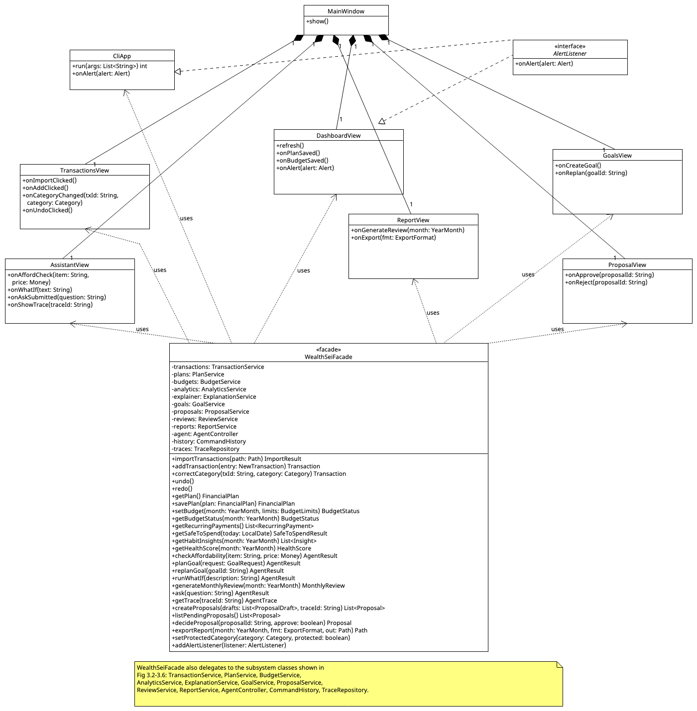

*Image:* [`Fig_3_1_Presentation_and_Facade.png`](https://github.com/Rishit-Shah/EECS-3311-Project---WealthSei/blob/main/docs/diagrams/png/Fig_3_1_Presentation_and_Facade.png) 

### Fig 3.2 — Import, categorization, plan, budgets and alerts

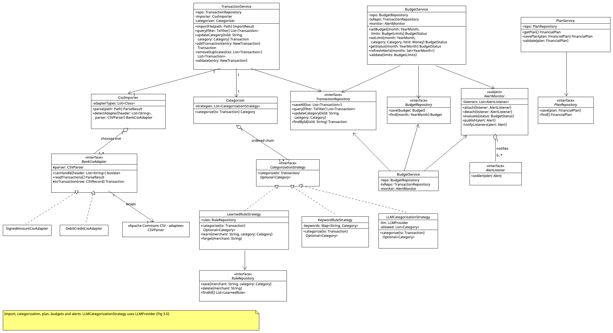

*Image:* [`Fig_3_2_Import_Categorization_Plan_Budgets.png`](https://github.com/Rishit-Shah/EECS-3311-Project---WealthSei/blob/main/docs/diagrams/png/Fig_3_2_Import_Categorization_Plan_Budgets.png) 

### Fig 3.3 — Analytics, goals and scenario simulation (all deterministic)

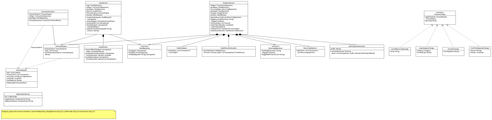

*Image:* [`Fig_3_3_Analytics_Goals_Scenario.png`](https://github.com/Rishit-Shah/EECS-3311-Project---WealthSei/blob/main/docs/diagrams/png/Fig_3_3_Analytics_Goals_Scenario.png) 

### Fig 3.4 — Agent subsystem

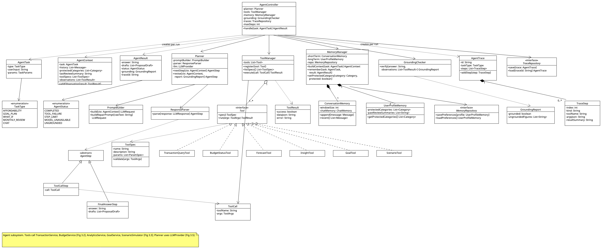

*Image:* [`Fig_3_4_Agent_Subsystem.png`](https://github.com/Rishit-Shah/EECS-3311-Project---WealthSei/blob/main/docs/diagrams/png/Fig_3_4_Agent_Subsystem.png) 
### Fig 3.5 — LLM provider layer (Adapter + Decorator)

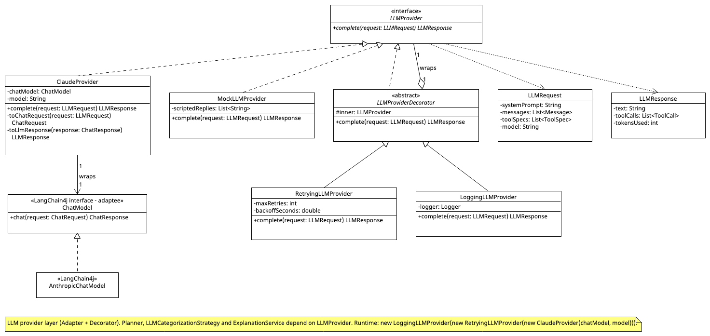

*Image:* [`Fig_3_5_LLM_Provider_Layer.png`](https://github.com/Rishit-Shah/EECS-3311-Project---WealthSei/blob/main/docs/diagrams/png/Fig_3_5_LLM_Provider_Layer.png)

_Runtime composition (lecture style, `vc = new 3D(vc)`):_ `LLMProvider provider = new LoggingLLMProvider(new RetryingLLMProvider(new ClaudeProvider(chatModel, model)))`.

### Fig 3.6 — Proposals, commands, reviews and reports

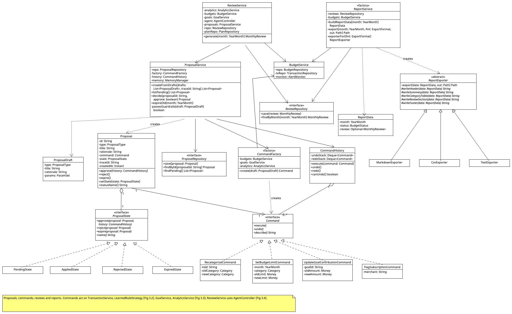

*Image:* [`Fig_3_6_Proposals_Commands_Reviews_Reports.png`](https://github.com/Rishit-Shah/EECS-3311-Project---WealthSei/blob/main/docs/diagrams/png/Fig_3_6_Proposals_Commands_Reviews_Reports.png) 

### Fig 3.7 — Domain model (conceptual)

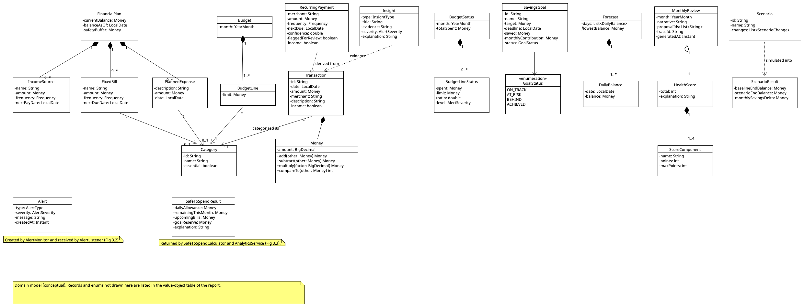

*Image:* [`Fig_3_7_Domain_Model.png`](https://github.com/Rishit-Shah/EECS-3311-Project---WealthSei/blob/main/docs/diagrams/png/Fig_3_7_Domain_Model.png) 

**Supporting value objects and enums** (Java `record` or `enum`; not drawn to keep the figures readable). `YearMonth`, `LocalDate` and `Instant` are the standard `java.time` classes:

| Name | Kind | Fields / values |
|---|---|---|
| `ImportResult` | record | `imported: int`, `duplicates: int`, `rejected: List<String>` |
| `NewTransaction` | record | `date: LocalDate`, `amount: Money`, `merchant: String`, `description: String`, `category: Optional<Category>`, `income: boolean` |
| `ParseResult` | record | `transactions: List<Transaction>`, `rejectedRows: List<String>` |
| `TxFilter` | record | `start: LocalDate`, `end: LocalDate`, `category: Optional<Category>`, `merchant: Optional<String>` |
| `BudgetLimits` | record | `limits: Map<Category, Money>` |
| `LearnedRule` | record | `merchant: String`, `category: Category` |
| `GoalRequest` | record | `name: String`, `target: Money`, `deadline: LocalDate`, `saved: Money` |
| `FeasibilityReport` | record | `requiredMonthly: Money`, `monthlySurplus: Money`, `feasible: boolean`, `options: List<GoalOption>` |
| `GoalOption` | record | `kind: String`, `description: String`, `impact: Money` |
| `AnalysisFacts` | record | `kind: String`, `factsJson: String` |
| `Message` | record | `role: String`, `content: String`, `timestamp: Instant` |
| `TaskParams`, `ToolArgs`, `ParamSet`, `ParamSpec` | records | key/value parameter holders and their declared types |
| `ExportFormat` | Enum | `MARKDOWN`, `CSV`, `TEXT` |
| `ProposalType` | Enum | `BUDGET_ADJUSTMENT`, `GOAL_ADJUSTMENT`, `FLAG_SUBSCRIPTION`, `RECATEGORIZE` |
| `AlertType` / `AlertSeverity` | Enum | `BUDGET`, `LOW_BALANCE`, `GOAL_RISK` / `INFO`, `WARNING`, `OVER` |
| `Frequency` / `InsightType` | Enum | `WEEKLY`, `BIWEEKLY`, `MONTHLY`, `YEARLY` / `WEEKEND_SPIKE`, `PAYDAY_SPLURGE`, `MONTH_END_CRUNCH`, `SMALL_PURCHASE_LEAK`, `UNUSUAL_EXPENSE` |

### 3.8 Design principles applied

- **Separation of concerns / layering:** UI → Facade → services → repositories. Services never reference UI classes; UI reaches alerts only through the `AlertListener` interface.
- **Dependency inversion:** services depend on repository interfaces and on `LLMProvider` (Java interfaces), never on JDBC or LangChain4j directly. Dependencies are passed in through constructors from a single composition root (`Main`), so there is no global state and tests can substitute fakes.
- **Deterministic core vs agent split:** money arithmetic lives in `Money` and the calculator classes; the agent subsystem only orchestrates tools. This makes the deterministic half unit-testable and the agent half behaviour-testable (Appendix A).
- **Encapsulation and immutability:** `Money` wraps `BigDecimal` and is immutable; result objects (`BudgetStatus`, `Forecast`, `HealthScore`) are Java `record`s.
- **Polymorphism and open/closed:** new tools, categorization strategies, CSV layouts, export formats, scenario changes, or proposal commands are added by implementing an interface, without editing existing classes.
- **High cohesion, low coupling:** each calculator has one job; tools are thin wrappers that delegate to services.

---

## 4. Design Pattern Explanations

Nine patterns are used. Each is described with the four elements from the lecture (**name, problem, solution, consequences**) plus the assignment's extra questions (participants and roles, why appropriate, what would be harder without it). Every pattern solves a specific problem in WealthSei; none is added only to reach a count.

### P1 — Facade

| Element | Description |
|---|---|
| **Problem** | GUI and CLI both need about 20 operations that each span several services and possibly the agent. |
| **Solution (participants and roles)** | `WealthSeiFacade` (Facade); the six JavaFX views and `CliApp` (clients); `TransactionService`, `BudgetService`, `AnalyticsService`, `GoalService`, `ProposalService`, `ReviewService`, `ReportService`, `AgentController` (subsystem classes). |
| **Why appropriate** | One higher-level interface guarantees GUI/CLI feature parity and keeps orchestration (e.g., "after import, refresh alerts and evaluate goals") in one place. This matches the lecture intent: *provide a unified interface to a set of subsystem interfaces*. |
| **Harder without it** | Each UI would know every service and repeat orchestration; any service change would break both UIs. |
| **Consequences** | + Decouples clients from the subsystem and layers the system. + Tests can drive the whole app through one API. − As the lecture notes, a facade does not have to hide low-level functionality completely: tests and advanced code may still call services directly. − Risk of a "god object", mitigated by making the facade only delegate (no business logic). |

### P2 — Strategy

| Element | Description |
|---|---|
| **Problem** | Categorization has several interchangeable algorithms (learned rules, keywords, LLM) that must be ordered, combined, disabled (offline), or replaced in tests. |
| **Solution** | `Categorizer` (Context) holds an ordered list of `CategorizationStrategy` (Strategy); `LearnedRuleStrategy`, `KeywordRuleStrategy`, `LLMCategorizationStrategy` (ConcreteStrategies). |
| **Why appropriate** | The priority chain is data (a list), so the LLM strategy can be dropped or reordered without code changes, and each strategy is testable alone. |
| **Harder without it** | One large if/elif method; the LLM path could not be mocked or disabled; adding a strategy would mean editing `Categorizer`. |
| **Consequences** | + Open/closed: new strategies need no changes elsewhere. − More small classes. − The order of the chain matters and must be configured deliberately (cheap deterministic strategies first, LLM last). |

### P3 — Adapter (object adapter, as defined in the lecture)

| Element | Description |
|---|---|
| **Problem** | (a) Banks export CSV files with different column layouts. (b) LangChain4j's `ChatModel` API is a framework interface, not the small, easily faked interface our agent code wants. In both cases we need unrelated interfaces to work together. |
| **Solution** | (a) `BankCsvAdapter` (Target) with `SignedAmountCsvAdapter` and `DebitCreditCsvAdapter` (Adapters) that each *hold an Apache Commons CSV `CSVParser`* (Adaptee) and translate its bank-specific records into `Transaction`; `CsvImporter` (Client). (b) `LLMProvider` (Target); `ClaudeProvider` (Adapter) *holds a LangChain4j `ChatModel`* (concretely an `AnthropicChatModel`, the Adaptee) and translates our `LLMRequest` and `LLMResponse`, including tool specifications and tool calls, to and from LangChain4j's `ChatRequest`, `ChatResponse`, `ToolSpecification` and `ToolExecutionRequest`; `Planner` (Client). |
| **Why appropriate** | These are *object adapters* (composition, not multiple inheritance): the client and the adaptee are completely decoupled and only the adapter knows both. The rest of the system sees only `Transaction` and `LLMResponse`. |
| **Harder without it** | Layout-specific parsing would leak into `TransactionService`; changing the LLM library or vendor would touch the planner and every LLM-using class. |
| **Consequences** | + Client code is unchanged when a new bank layout or LLM vendor appears. − One extra class per source and one extra indirection per call. |

### P4 — Observer

| Element | Description |
|---|---|
| **Problem** | Budget, low-balance, and goal alerts must reach the GUI and CLI, but services must not depend on UI classes. |
| **Solution** | `AlertMonitor` (Subject); `AlertListener` (Observer); `DashboardView`, `CliApp` (ConcreteObservers); `Alert` (event payload). `BudgetService`, `AnalyticsService`, and `GoalService` publish through the monitor. |
| **Why appropriate** | Alerts are event-driven and may have zero, one, or many receivers depending on which interface is running. |
| **Harder without it** | Services would call UI code directly (layer violation); a new receiver (e.g., a log file) would require editing services; alerts could not be unit-tested without a UI. |
| **Consequences** | + Loose coupling between publishers and receivers. − Notification order is unspecified. − A misbehaving listener must not break the publisher, so `AlertMonitor` catches and logs listener errors; listeners must be detached when their window closes. |

### P5 — Command

| Element | Description |
|---|---|
| **Problem** | Category corrections and approved agent proposals modify user data and must be **undoable**, and a proposed change must exist as an object *before* it is applied. |
| **Solution** | `Command` (Command); `RecategorizeCommand`, `SetBudgetLimitCommand`, `UpdateGoalContributionCommand`, `FlagSubscriptionCommand` (ConcreteCommands); `CommandHistory` (Invoker with undo/redo stacks); `TransactionService`, `BudgetService`, `GoalService`, `AnalyticsService`, `LearnedRuleStrategy` (Receivers). |
| **Why appropriate** | The human-in-the-loop design (F13) needs "a change waiting for approval"; a Command is exactly that, and gives undo/redo (F02) for free. |
| **Harder without it** | No undo; each proposal type would need custom apply code; proposals could not be stored and executed later. |
| **Consequences** | + Decouples the requester from the receiver; supports undo, redo, and logging. − One class per operation. − The undo stack must be bounded to avoid unbounded growth. |

### P6 — State

| Element | Description |
|---|---|
| **Problem** | A proposal's allowed actions depend on its lifecycle: only *Pending* proposals can be approved, rejected, or expired. |
| **Solution** | `Proposal` (Context); `ProposalState` (State); `PendingState`, `AppliedState`, `RejectedState`, `ExpiredState` (ConcreteStates). |
| **Why appropriate** | Each state class defines what is legal; illegal transitions throw `IllegalStateTransitionException`. Approval logic lives in `PendingState`, not scattered through services. |
| **Harder without it** | A status enum plus if-checks in `ProposalService`; easy to double-apply a proposal; transition rules harder to test in isolation. |
| **Consequences** | + Transition rules are localized and independently testable. − More classes for a small state machine; state objects carry no data, so one shared instance of each is enough. |

### P7 — Decorator

| Element | Description |
|---|---|
| **Problem** | Cross-cutting LLM behaviour (retry with back-off, logging and token counting, later caching) must be added without changing planners, strategies, or the provider itself, and must be combinable. Subclassing would give a class explosion (the lecture's TextView example needs 15 subclasses for 3 borders × 2 scrollbars, but only 5 decorators). |
| **Solution** | `LLMProvider` (Component); `ClaudeProvider`, `MockLLMProvider` (ConcreteComponents); `LLMProviderDecorator` (Decorator, same interface and wraps an inner provider); `RetryingLLMProvider`, `LoggingLLMProvider` (ConcreteDecorators). |
| **Why appropriate** | `Planner`, `LLMCategorizationStrategy`, and `ExplanationService` all get retry and logging for free, and the stack is assembled at run time. The lecture notes that Decorator suits *small* interfaces; `LLMProvider` has a single method. |
| **Harder without it** | Retry code duplicated in every LLM caller; improving failure recovery later (Stage 3) would touch many classes. |
| **Consequences** | + Behaviour can be added or removed without subclass explosion; decorators nest. − "Identity crisis": what the object finally does depends on the wrapping order (`Logging(Retrying(...))` logs one logical call, `Retrying(Logging(...))` logs every attempt). − If the LangChain4j model has a built-in retry setting, it is set to a single attempt so retries happen only in `RetryingLLMProvider`. |

### P8 — Template Method

| Element | Description |
|---|---|
| **Problem** | Report export has one fixed structure (header → summary → category table → review → footer) but three output formats. |
| **Solution** | `ReportExporter` (AbstractClass; `export()` is the template method, declared `final`); `MarkdownExporter`, `CsvExporter`, `TextExporter` (ConcreteClasses implementing the abstract `write_…` steps). |
| **Why appropriate** | The section order is defined once, so every format is consistent; a new format only supplies the formatting steps. |
| **Harder without it** | Three copies of the same sequence that can drift apart; adding a format means copying a whole exporter. |
| **Consequences** | + No duplicated skeleton. − Based on inheritance, so subclasses are tied to the base class and must implement every step. |

### P9 — Factory (as defined in the lecture: return one of several subclasses depending on the data given)

| Element | Description |
|---|---|
| **Problem** | Clients should not need to know which concrete class to create: which exporter for a format, and which `Command` for a proposal type. |
| **Solution** | (a) `ReportService.exporterFor(fmt)` returns a `MarkdownExporter`, `CsvExporter`, or `TextExporter` (all `ReportExporter`s). (b) `CommandFactory.create(draft)` returns a `SetBudgetLimitCommand`, `UpdateGoalContributionCommand`, or `FlagSubscriptionCommand` (all `Command`s) depending on `draft.type`. |
| **Why appropriate** | The knowledge of "which class gets created" is localized in one place (single responsibility), and callers depend only on the abstract product (`ReportExporter`, `Command`). |
| **Harder without it** | `ProposalService` and `ReportService` would contain construction `if`/`elif` chains mixed with their real logic; adding a proposal type or export format would change them. |
| **Consequences** | + Open/closed for new products; creation code in one place. − Extra classes; in Java the branching can be a `switch` expression or a `Map` from type to constructor to keep the factory short. |

### Also considered

- **Prototype (used in a lightweight way).** `ScenarioSimulator` must evaluate several what-if variants of the same baseline. Building `ForecastInputs` is comparatively expensive (database queries plus recurring-payment detection), so the simulator builds it once and calls `ForecastInputs.deepCopy()`, a **deep copy** (a copy constructor that also copies the mutable lists), for each variant. The lecture's shallow-versus-deep warning applies directly: a shallow copy would let a scenario change mutate the baseline, which is exactly the kind of bug the Stage 3 unit tests will target.
- **Singleton (deliberately not used).** `AlertMonitor` and the `LLMProvider` chain each exist once, but they are created once in a composition root and injected. A Singleton's global access point would make tests share state and would hide dependencies.

---
## 5. Use-Case Diagram

**Actors** (a role played with respect to the system; an actor is *not* part of the system): **User** (primary, human); **LLM Service** (Claude API, secondary system actor used by the agent and by hybrid features); **File System** (CSV inputs and exported reports). WealthSei has no administrator role; it is a single-user local application. The **system boundary** is the rectangle labelled *WealthSei*.

**Relationships, following the lecture:**

- **«include»**: the arrow goes from the *base* use case to the *included* one. The included behaviour is required, and the base is not complete without it. UC01 includes UC02 (categorization); UC10 includes UC06 (habits and score); UC08 and UC10 include UC14 (creating proposals).
- **«extend»**: the arrow goes from the *extending* use case to the *base*. The behaviour is optional and the base can stand on its own. UC14 extends UC07 and UC09; the extension point is *after result displayed* (the user chooses to save the suggestions as proposals).

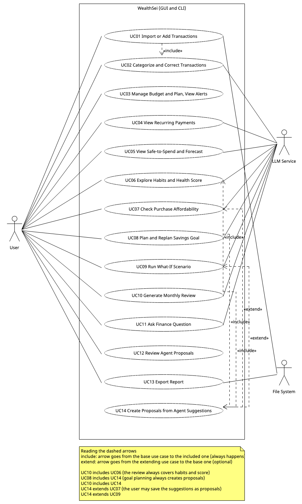

*Image:* [`Fig_5_Use_Case_Diagram.png`](https://github.com/Rishit-Shah/EECS-3311-Project---WealthSei/blob/main/docs/diagrams/png/Fig_5_Use_Case_Diagram.png) 

**Coverage:** F01→UC01 · F02→UC02 · F03→UC03 · F04→UC04 · F05→UC05 · F06, F07→UC06 · F08→UC07 · F09→UC08 · F10→UC09 · F11→UC10 · F12→UC11 · F13→UC12, UC14 · F14→UC13.

---

## 6. Use-Case Descriptions

Every use case can be performed from the GUI or from the CLI (Appendix B); steps below say "the UI" for either.

### UC01 — Import or Add Transactions

| Field | Description |
|---|---|
| **ID / Name** | UC01 — Import or Add Transactions |
| **Actors** | User (primary); File System |
| **Goal** | Get transactions into WealthSei, categorized and de-duplicated, from a bank CSV or by adding one by hand. |
| **Preconditions** | Application is running; the user has a CSV export or a transaction to enter. |
| **Trigger** | User chooses **Import CSV** (or runs `import <file>`), or chooses **Add Transaction** (or runs `add-tx`). |
| **Main success scenario** | 1. User selects a CSV file.<br>2. System reads the header and selects a matching adapter.<br>3. System converts each record to a `Transaction`.<br>4. System removes duplicates.<br>5. System categorizes new transactions (UC02).<br>6. System saves them.<br>7. System refreshes budget alerts and goal status.<br>8. System shows an import summary. |
| **Alternative / exception flows** | 2a. Unknown layout or unreadable file: show error, save nothing.<br>3a. Invalid record: skip it and list it in the summary.<br>4a. All rows are duplicates: report "0 new transactions".<br>*Alternative flow B (manual entry):* B1. User fills in date, amount, merchant, optional category and income or expense.<br>B2. System validates the entry.<br>B3. System categorizes it if no category was chosen (UC02).<br>B4. System saves it and refreshes alerts and goal status.<br>B2a. Invalid entry (zero amount, empty merchant, future date): show the error and save nothing. |
| **Postconditions** | New transactions are stored and categorized; alerts and goal statuses are up to date. |
| **Related features** | F01 (includes F02) |

### UC02 — Categorize and Correct Transactions

| Field | Description |
|---|---|
| **ID / Name** | UC02 — Categorize and Correct Transactions |
| **Actors** | User (primary); LLM Service (secondary, fallback only) |
| **Goal** | Ensure every transaction has the right category, and teach the system from corrections. |
| **Preconditions** | Transactions exist. |
| **Trigger** | Automatic during import, or user changes a category, or user clicks **Undo**. |
| **Main success scenario** | 1. System tries learned rules, then keyword rules, then the LLM.<br>2. System stores the category.<br>3. User selects a different category for a transaction.<br>4. System applies the change and stores a learned rule for that merchant.<br>5. User may click **Undo**; system restores the previous category and removes the rule. |
| **Alternative / exception flows** | 1a. LLM unavailable or invalid answer: mark `UNCATEGORIZED` for manual review.<br>3a. Unknown transaction id: show error.<br>5a. Nothing to undo: show message. |
| **Postconditions** | Categories are updated; learned rules reflect the latest correction. |
| **Related features** | F02 |

### UC03 — Manage Budget and Plan, and View Alerts

| Field | Description |
|---|---|
| **ID / Name** | UC03 — Manage Budget and Plan, and View Alerts |
| **Actors** | User (primary) |
| **Goal** | Describe income, balance, bills and planned expenses, set spending limits, and be warned when approaching or exceeding them. |
| **Preconditions** | At least one category exists. |
| **Trigger** | User edits the plan or budget limits, or new transactions arrive. |
| **Main success scenario** | 1. User enters or updates the plan: income sources, current balance, fixed bills, planned expenses and the safety buffer.<br>2. System validates and saves the plan.<br>3. User enters limits for a month.<br>4. System validates and saves them.<br>5. System computes spent, limit and percentage per category.<br>6. System publishes alerts for categories at 80% or over 100%.<br>7. UI shows the plan, progress bars and alerts. |
| **Alternative / exception flows** | 2a. Negative or non-numeric amount, missing pay date, unknown frequency, or balance date in the future: reject with a message.<br>4a. Negative or non-numeric limit: reject with a message.<br>5a. Spending in a category without a budget: show as "unbudgeted". |
| **Postconditions** | Plan and budget are saved; alerts are delivered to all registered listeners; forecasts use the new plan. |
| **Related features** | F03 |

### UC04 — View Recurring Payments

| Field | Description |
|---|---|
| **ID / Name** | UC04 — View Recurring Payments |
| **Actors** | User (primary); LLM Service (summary text) |
| **Goal** | See subscriptions and other recurring costs. |
| **Preconditions** | Transaction history exists. |
| **Trigger** | User opens the Recurring panel (or runs `recurring`). |
| **Main success scenario** | 1. System detects recurring patterns.<br>2. System computes total monthly recurring cost.<br>3. System requests a plain-language summary.<br>4. UI shows the list and summary.<br>5. User may flag an item for review. |
| **Alternative / exception flows** | 1a. Fewer than 3 occurrences: "not enough history".<br>3a. LLM unavailable: use template text. |
| **Postconditions** | Recurring list displayed; flags stored. |
| **Related features** | F04 |

### UC05 — View Safe-to-Spend and Forecast

| Field | Description |
|---|---|
| **ID / Name** | UC05 — View Safe-to-Spend and Forecast |
| **Actors** | User (primary); LLM Service (explanation text) |
| **Goal** | Know how much can be spent today and whether the balance will dip too low. |
| **Preconditions** | A plan (income and current balance) or imported transactions exist. |
| **Trigger** | User opens the dashboard or runs `safe`. |
| **Main success scenario** | 1. System loads the plan and the transactions.<br>2. System detects recurring payments for items the plan does not cover.<br>3. System projects 30 days of balance from income, bills, planned expenses and everyday spending.<br>4. System calculates the daily allowance.<br>5. If the projection falls below the buffer, system raises a low-balance alert.<br>6. System adds an explanation.<br>7. UI shows the allowance card and chart. |
| **Alternative / exception flows** | 1a. No plan and no data: prompt to set up a plan or import.<br>4a. Negative result: show $0 and the over-commitment amount.<br>4b. Transactions do not reach today: show a "data may be out of date" notice.<br>6a. LLM unavailable: template text. |
| **Postconditions** | Allowance and forecast displayed; alert published if needed. |
| **Related features** | F05 |

### UC06 — Explore Habits and Health Score

| Field | Description |
|---|---|
| **ID / Name** | UC06 — Explore Habits and Health Score |
| **Actors** | User (primary); LLM Service (explanations) |
| **Goal** | Understand behavioural spending patterns and overall financial health. |
| **Preconditions** | At least 30 days of transactions for habits; budget for a full score. |
| **Trigger** | User opens Habits or Score panel (or runs `habits` / `score`). |
| **Main success scenario** | 1. System analyzes transactions for patterns.<br>2. System computes the health score from its components.<br>3. System explains each result from the computed facts.<br>4. UI shows insight cards and the score gauge with breakdown. |
| **Alternative / exception flows** | 1a. Too little data: "need more data".<br>2a. Missing budget or goals: exclude component and re-normalize weights.<br>3a. LLM unavailable: show evidence only. |
| **Postconditions** | Insights and score displayed. |
| **Related features** | F06, F07 |

### UC07 — Check Purchase Affordability

| Field | Description |
|---|---|
| **ID / Name** | UC07 — Check Purchase Affordability |
| **Actors** | User (primary); LLM Service (secondary) |
| **Goal** | Get a reasoned yes/no verdict on a planned purchase. |
| **Preconditions** | Transactions and budget exist; LLM reachable. |
| **Trigger** | User submits item and price (or runs `afford`). |
| **Main success scenario** | 1. User enters item and price.<br>2. System validates input and starts an agent task.<br>3. Agent decides which data it needs and calls tools (budget, forecast, goals, transactions).<br>4. Agent forms a verdict with reasoning.<br>5. System verifies that every figure came from tool results.<br>6. UI shows verdict, evidence, and a **Why?** trace link.<br>7. *Extension point "after result displayed":* the user may save a suggested plan as a proposal (UC14). |
| **Alternative / exception flows** | 2a. Invalid price: ask for a valid one.<br>3a. Tool fails: agent states what was unavailable and qualifies the answer.<br>3b. Malformed LLM output: one repair retry, then error.<br>5a. Ungrounded figure: answer corrected before display. |
| **Postconditions** | Trace saved; optional proposals pending. |
| **Related features** | F08 (optionally extended by UC14; results can then be reviewed in UC12) |

### UC08 — Plan and Replan Savings Goal

| Field | Description |
|---|---|
| **ID / Name** | UC08 — Plan and Replan Savings Goal |
| **Actors** | User (primary); LLM Service (secondary) |
| **Goal** | Create a savings goal and get a realistic, adjustable plan. |
| **Preconditions** | Transaction history or budget exists. |
| **Trigger** | User creates a goal or clicks **Replan** (also suggested after a goal-risk alert). |
| **Main success scenario** | 1. User enters name, target, and deadline.<br>2. System validates and saves the goal.<br>3. Agent calls the goal tool to check feasibility and options.<br>4. Agent writes a plan.<br>5. System creates pending proposals from the suggestions (included UC14).<br>6. UI shows the plan and proposals. |
| **Alternative / exception flows** | 2a. Deadline in the past or target ≤ 0: validation error.<br>3a. Infeasible: agent proposes only a deadline extension.<br>3b. Little history: lower-confidence note. |
| **Postconditions** | Goal saved; plan shown; proposals pending. |
| **Related features** | F09 (includes UC14; proposals are reviewed in UC12) |

### UC09 — Run What-If Scenario

| Field | Description |
|---|---|
| **ID / Name** | UC09 — Run What-If Scenario |
| **Actors** | User (primary); LLM Service (secondary) |
| **Goal** | Compare the future with and without hypothetical changes. |
| **Preconditions** | Transactions exist. |
| **Trigger** | User submits a scenario in plain English (or runs `whatif`). |
| **Main success scenario** | 1. User types the scenario.<br>2. Agent converts it into structured changes.<br>3. System validates the changes and simulates baseline and scenario.<br>4. Agent explains differences (savings, end balance, goal dates).<br>5. UI shows a comparison.<br>6. *Extension point "after result displayed":* the user may turn the scenario into proposals (UC14). |
| **Alternative / exception flows** | 2a. Ambiguous text: agent asks a clarifying question.<br>3a. Unknown subscription or category, or invalid value: tool reports it and agent tells the user.<br>3b. More than 5 changes: agent asks to split. |
| **Postconditions** | Result displayed; optional proposals pending. |
| **Related features** | F10 (optionally extended by UC14; results can then be reviewed in UC12) |

### UC10 — Generate Monthly Review

| Field | Description |
|---|---|
| **ID / Name** | UC10 — Generate Monthly Review |
| **Actors** | User (primary); LLM Service (secondary) |
| **Goal** | Get an AI summary of the month with concrete fixes. |
| **Preconditions** | The month has transactions. |
| **Trigger** | User clicks **Generate Review** (or runs `review <month>`). |
| **Main success scenario** | 1. System gathers metrics, habits, score, and goal status (UC06).<br>2. Agent reads the previous review from memory and writes a narrative.<br>3. Agent drafts up to 3 fix suggestions.<br>4. System creates pending proposals from the suggestions (included UC14).<br>5. System saves and displays the review. |
| **Alternative / exception flows** | 1a. No transactions: refuse with message.<br>2a. Agent fails: save a metrics-only review.<br>4a. Suggestion touches a protected category: discard it. |
| **Postconditions** | `MonthlyReview` saved; proposals pending. |
| **Related features** | F11 (includes UC06 and UC14; proposals are reviewed in UC12) |

### UC11 — Ask Finance Question

| Field | Description |
|---|---|
| **ID / Name** | UC11 — Ask Finance Question |
| **Actors** | User (primary); LLM Service (secondary) |
| **Goal** | Get grounded answers to free-form questions and see how they were derived. |
| **Preconditions** | Data exists; LLM reachable. |
| **Trigger** | User submits a question (or runs `ask`). |
| **Main success scenario** | 1. User types a question.<br>2. System adds recent conversation and stored preferences.<br>3. Agent calls tools as needed.<br>4. System verifies figures against tool results.<br>5. UI shows the answer.<br>6. User opens **How did you get this?** to see the trace. |
| **Alternative / exception flows** | 2a. Off-topic: polite redirect.<br>3a. Vague time range: agent states its assumption or asks.<br>3b. LLM unavailable: offline message with dashboard/CLI hints. |
| **Postconditions** | Turn stored in memory; trace saved. |
| **Related features** | F12 |

### UC12 — Review Agent Proposals

| Field | Description |
|---|---|
| **ID / Name** | UC12 — Review Agent Proposals |
| **Actors** | User (primary) |
| **Goal** | Decide which agent-suggested changes to apply. |
| **Preconditions** | At least one pending proposal exists (created by UC14). |
| **Trigger** | User opens the Proposals view (or runs `proposals list`). |
| **Main success scenario** | 1. System lists pending proposals with rationale.<br>2. User opens **Why?** to inspect the trace (optional).<br>3. User clicks **Approve**.<br>4. System executes the underlying command.<br>5. Proposal becomes Applied; affected views refresh. |
| **Alternative / exception flows** | 3a. User clicks **Reject**: proposal becomes Rejected.<br>4a. Command fails: proposal stays Pending, error shown.<br>3b. Proposal is not pending: error message.<br>*. Old proposals expire automatically at month change. |
| **Postconditions** | Budget or goal reflects approved changes; the change is undoable. |
| **Related features** | F13 |

### UC13 — Export Report

| Field | Description |
|---|---|
| **ID / Name** | UC13 — Export Report |
| **Actors** | User (primary); File System |
| **Goal** | Save a monthly report as a file. |
| **Preconditions** | The month has data. |
| **Trigger** | User clicks **Export** (or runs `export`). |
| **Main success scenario** | 1. User picks month, format, and location.<br>2. System gathers report data.<br>3. System writes the file in the chosen format.<br>4. System confirms the path. |
| **Alternative / exception flows** | 2a. No data: error.<br>2b. Review not generated: export metrics only, with a note.<br>3a. Path not writable: error. |
| **Postconditions** | Report file exists at the chosen path. |
| **Related features** | F14 |

### UC14 — Create Proposals from Agent Suggestions

| Field | Description |
|---|---|
| **ID / Name** | UC14 — Create Proposals from Agent Suggestions |
| **Actors** | User (indirectly; the use case is included by UC08 and UC10 and extends UC07 and UC09) |
| **Goal** | Turn agent suggestions into safe, reviewable, pending proposals; the agent never changes data itself. |
| **Preconditions** | An agent result contains at least one suggested change (`ProposalDraft`). |
| **Trigger** | Automatic at the end of UC08 and UC10; in UC07 and UC09, the user clicks **Save as proposal(s)**. |
| **Main success scenario** | 1. System receives the drafts and the trace id.<br>2. For each draft, system checks the guardrails (e.g., protected categories).<br>3. System builds the matching command for the draft.<br>4. System stores a proposal in the Pending state linked to the trace.<br>5. System returns the created proposals. |
| **Alternative / exception flows** | 1a. No drafts: nothing is created.<br>2a. Draft touches a protected category: discarded, and the number discarded is reported.<br>3a. Unknown draft type: discarded and logged. |
| **Postconditions** | Zero or more pending proposals exist, ready for UC12. |
| **Related features** | F13 (supports F08–F11) |

---

## 7. Sequence Diagrams

Eleven diagrams cover all fourteen use cases (UC14 is shown inside SD06, SD07 and SD08). Following the lecture notation, solid arrows are messages (method calls), dashed arrows are return messages, self-arrows are reflexive messages, `loop` and `alt`/`opt` frames show iteration and conditions, and an arrow that ends on a box starting lower down marks object creation. Class and method names match Section 3. Every diagram works identically from the CLI: replace the view (e.g., `TransactionsView`) with `CliApp`; everything from `WealthSeiFacade` onward is unchanged.

| Diagram | Use case | Features |
|---|---|---|
| SD01 | UC01 Import or Add Transactions | F01 |
| SD02 | UC02 Categorize and Correct | F02 |
| SD03 | UC03 Budget and Plan Setup, Alerts | F03 |
| SD04 | UC04, UC05, UC06 Analytics with explanation | F04, F05, F06, F07 |
| SD05 | UC07 Affordability (full agent loop) | F08 |
| SD06 | UC08 Goal Planning and Replanning (also shows UC14 Create Proposals) | F09, F13 |
| SD07 | UC09 What-If Scenario (UC14 is an optional extension) | F10 |
| SD08 | UC10 Monthly Review (includes UC14) | F11 |
| SD09 | UC11 Chat with Memory and Trace | F12 |
| SD10 | UC12 Proposal Approval | F13 |
| SD11 | UC13 Export Report | F14 |

### SD01 — Import or Add Transactions (UC01, F01)

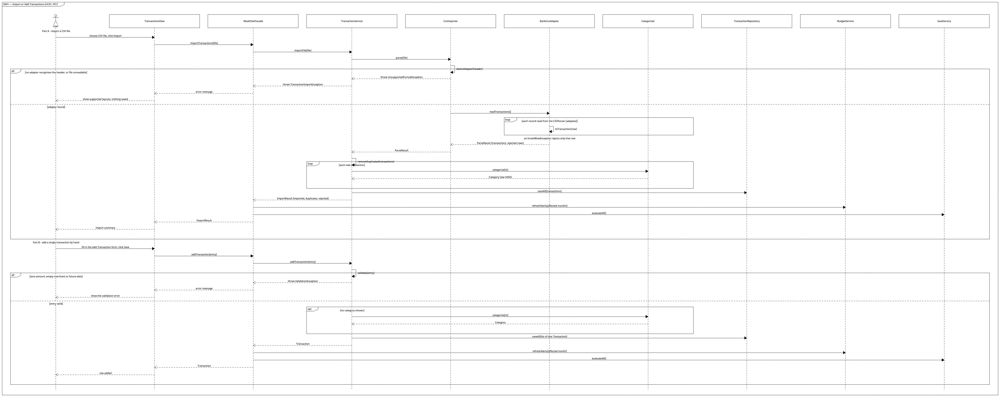

*Image:* [`SD01_Import_or_Add_Transactions.png`](https://github.com/Rishit-Shah/EECS-3311-Project---WealthSei/blob/main/docs/diagrams/png/SD01_Import_or_Add_Transactions.png) 

### SD02 — Categorize and Correct Transactions (UC02, F02)

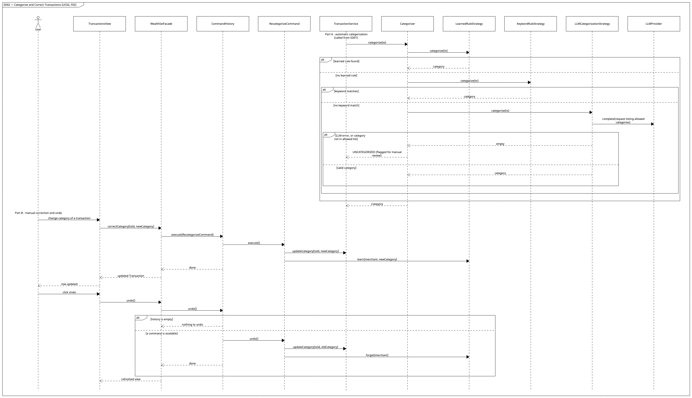

*Image:* [`SD02_Categorize_and_Correct_Transactions.png`](https://github.com/Rishit-Shah/EECS-3311-Project---WealthSei/blob/main/docs/diagrams/png/SD02_Categorize_and_Correct_Transactions.png) 

### SD03 — Budget and Plan Setup, Tracking and Alerts (UC03, F03)

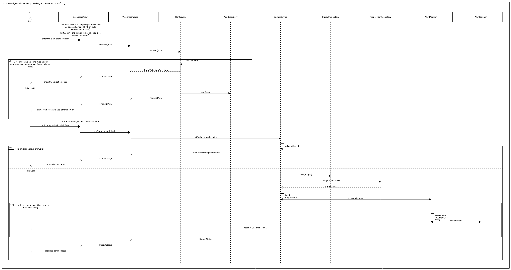

*Image:* [`SD03_Budget_and_Plan_Setup_Tracking_and_Alerts.png`](https://github.com/Rishit-Shah/EECS-3311-Project---WealthSei/blob/main/docs/diagrams/png/SD03_Budget_and_Plan_Setup_Tracking_and_Alerts.png) 

### SD04 — Analytics with Explanation: Recurring, Safe-to-Spend, Habits, Score (UC04–UC06, F04–F07)

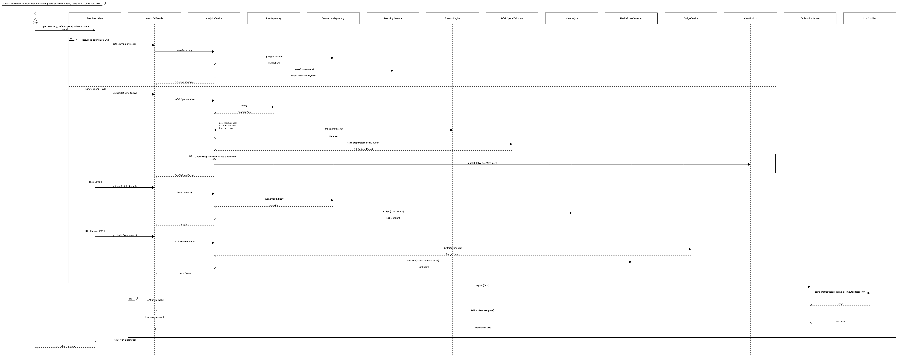

*Image:* [`SD04_Analytics_with_Explanation_Recurring_Safe_to_Spend_Habits_Score.png`](https://github.com/Rishit-Shah/EECS-3311-Project---WealthSei/blob/main/docs/diagrams/png/SD04_Analytics_with_Explanation_Recurring_Safe_to_Spend_Habits_Score.png) 

### SD05 — Purchase Affordability: the full agent loop (UC07, F08)

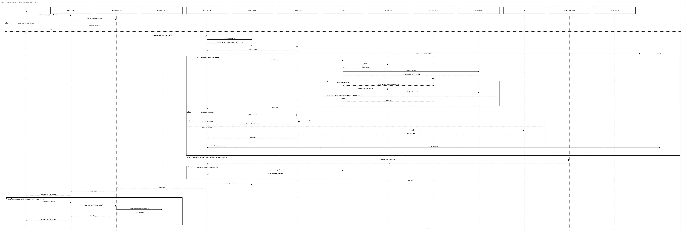

*Image:* [`SD05_Purchase_Affordability_the_full_agent_loop.png`](https://github.com/Rishit-Shah/EECS-3311-Project---WealthSei/blob/main/docs/diagrams/png/SD05_Purchase_Affordability_the_full_agent_loop.png) 

_Tools used in this scenario:_ `BudgetStatusTool`, `ForecastTool`, `GoalTool`, `TransactionQueryTool`. Saving a suggested plan calls `WealthSeiFacade.createProposals(drafts, traceId)`.

### SD06 — Savings Goal Planning and Replanning (UC08, F09)

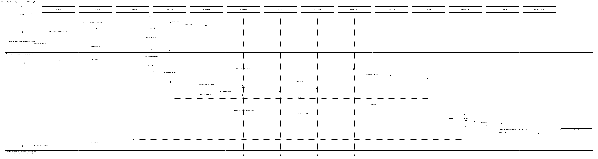

*Image:* [`SD06_Savings_Goal_Planning_and_Replanning.png`](https://github.com/Rishit-Shah/EECS-3311-Project---WealthSei/blob/main/docs/diagrams/png/SD06_Savings_Goal_Planning_and_Replanning.png) 

### SD07 — What-If Scenario (UC09, F10)

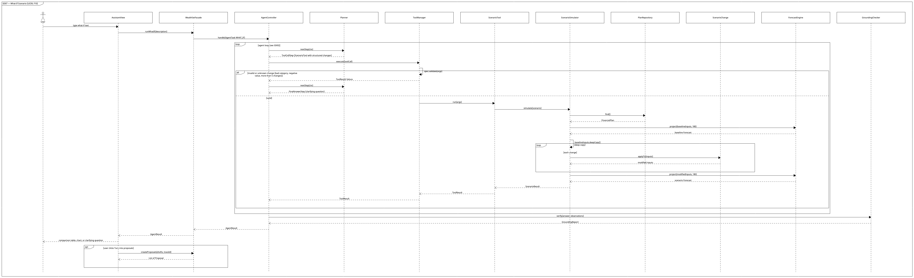

*Image:* [`SD07_What_If_Scenario.png`](https://github.com/Rishit-Shah/EECS-3311-Project---WealthSei/blob/main/docs/diagrams/png/SD07_What_If_Scenario.png) 

### SD08 — Monthly AI Review (UC10, F11)

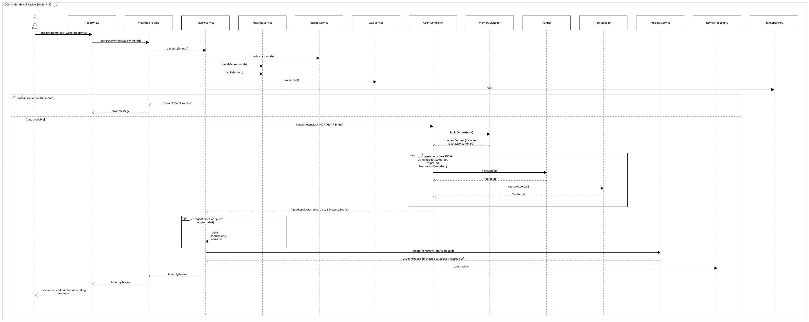

*Image:* [`SD08_Monthly_AI_Review.png`](https://github.com/Rishit-Shah/EECS-3311-Project---WealthSei/blob/main/docs/diagrams/png/SD08_Monthly_AI_Review.png) 

### SD09 — Finance Chat with Memory and Trace (UC11, F12)

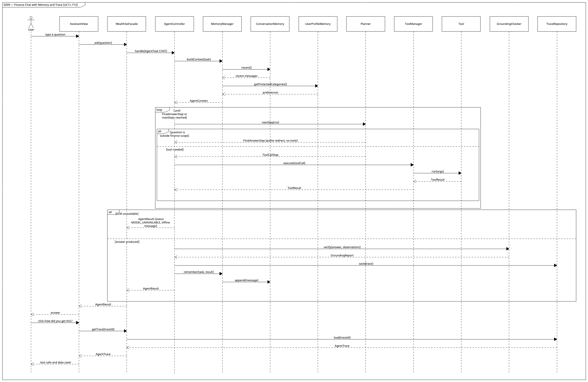

*Image:* [`SD09_Finance_Chat_with_Memory_and_Trace.png`](https://github.com/Rishit-Shah/EECS-3311-Project---WealthSei/blob/main/docs/diagrams/png/SD09_Finance_Chat_with_Memory_and_Trace.png) 

### SD10 — Proposal Approval (UC12, F13)

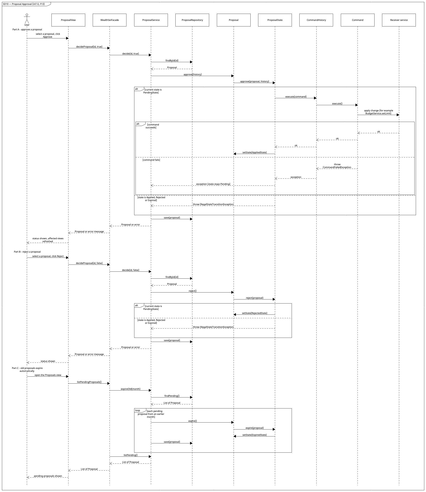

*Image:* [`SD10_Proposal_Approval.png`](https://github.com/Rishit-Shah/EECS-3311-Project---WealthSei/blob/main/docs/diagrams/png/SD10_Proposal_Approval.png) 

### SD11 — Export Report (UC13, F14)

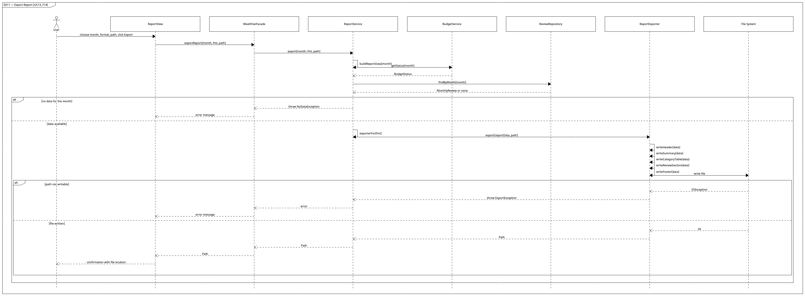

*Image:* [`SD11_Export_Report.png`](https://github.com/Rishit-Shah/EECS-3311-Project---WealthSei/blob/main/docs/diagrams/png/SD11_Export_Report.png) 

---

## 8. Feature-to-Design Traceability Table

| Feature | Description | Type | Related Use Case | Classes | Key Methods | Sequence Diagram | Design Pattern(s) |
|---|---|---|---|---|---|---|---|
| F01 | Import a CSV or add a transaction by hand; auto-detect layout, skip duplicates | Deterministic | UC01 | `TransactionsView`, `WealthSeiFacade`, `TransactionService`, `CsvImporter`, `BankCsvAdapter`, `SignedAmountCsvAdapter`, `DebitCreditCsvAdapter`, `TransactionRepository`, `Categorizer` | `onImportClicked()`, `onAddClicked()`, `importTransactions()`, `addTransaction()`, `importFile()`, `parse()`, `detectAdapter()`, `readTransactions()`, `toTransaction()`, `removeDuplicates()`, `validate()`, `saveAll()` | SD01 | Adapter, Facade |
| F02 | Categorize (rules → LLM) and correct with undo | Hybrid | UC02 | `TransactionsView`, `Categorizer`, `CategorizationStrategy`, `LearnedRuleStrategy`, `KeywordRuleStrategy`, `LLMCategorizationStrategy`, `LLMProvider`, `CommandHistory`, `RecategorizeCommand`, `TransactionService` | `categorize()`, `correctCategory()`, `execute()`, `undo()`, `learn()`, `forget()`, `updateCategory()` | SD02 | Strategy, Command, Decorator |
| F03 | Plan (income, balance, bills, planned expenses), budget limits, tracking, alerts | Deterministic | UC03 | `DashboardView`, `PlanService`, `PlanRepository`, `BudgetService`, `BudgetRepository`, `AlertMonitor`, `AlertListener`, `CliApp` | `onPlanSaved()`, `onBudgetSaved()`, `getPlan()`, `savePlan()`, `setBudget()`, `getStatus()`, `refreshAlerts()`, `evaluate()`, `attach()`, `onAlert()` | SD03 | Observer, Facade |
| F04 | Recurring payment and subscription detection | Hybrid | UC04 | `DashboardView`, `AnalyticsService`, `RecurringDetector`, `ExplanationService` | `getRecurringPayments()`, `detectRecurring()`, `detect()`, `explain()` | SD04 | Facade, Decorator |
| F05 | Safe-to-Spend Coach and 30-day forecast from the plan | Hybrid | UC05 | `DashboardView`, `AnalyticsService`, `PlanRepository`, `ForecastEngine`, `SafeToSpendCalculator`, `AlertMonitor`, `ExplanationService` | `getSafeToSpend()`, `safeToSpend()`, `find()`, `project()`, `calculate()`, `publish()`, `explain()` | SD04 | Observer, Facade, Decorator |
| F06 | Spending Habit Detective | Hybrid | UC06 | `DashboardView`, `AnalyticsService`, `HabitAnalyzer`, `ExplanationService` | `getHabitInsights()`, `habits()`, `analyze()`, `explain()` | SD04 | Facade, Decorator |
| F07 | Financial Health Score | Hybrid | UC06 | `DashboardView`, `AnalyticsService`, `HealthScoreCalculator`, `BudgetService`, `ExplanationService` | `getHealthScore()`, `healthScore()`, `calculate()`, `getStatus()`, `explain()` | SD04 | Facade, Decorator |
| F08 | Purchase affordability verdict via tool-using agent | AI (agent) | UC07 | `AssistantView`, `WealthSeiFacade`, `AgentController`, `MemoryManager`, `Planner`, `PromptBuilder`, `ResponseParser`, `ToolManager`, `BudgetStatusTool`, `ForecastTool`, `GoalTool`, `TransactionQueryTool`, `GroundingChecker`, `AgentTrace` | `checkAffordability()`, `handle()`, `buildContext()`, `nextStep()`, `execute()`, `run()`, `verify()`, `remember()` | SD05 | Facade, Decorator, Adapter |
| F09 | Goal planning with auto-replan | AI (agent) | UC08 | `GoalsView`, `AgentController`, `GoalTool`, `GoalService`, `GoalPlanner`, `ForecastEngine`, `ProposalService`, `CommandFactory`, `AlertMonitor` | `planGoal()`, `replanGoal()`, `createGoal()`, `evaluateAll()`, `feasibility()`, `requiredMonthly()`, `buildOptions()`, `createFromDrafts()` | SD06 | Observer, Command, State |
| F10 | Natural-language what-if simulation | AI (agent) | UC09 | `AssistantView`, `AgentController`, `Planner`, `ScenarioTool`, `ScenarioSimulator`, `ScenarioChange`, `ForecastEngine`, `GroundingChecker` | `runWhatIf()`, `handle()`, `simulate()`, `applyTo()`, `project()`, `createProposals()` | SD07 | Facade, Decorator |
| F11 | Monthly AI review with fix proposals | AI (agent) | UC10 | `ReportView`, `ReviewService`, `AnalyticsService`, `BudgetService`, `GoalService`, `AgentController`, `MemoryManager`, `ProposalService`, `ReviewRepository` | `generateMonthlyReview()`, `generate()`, `handle()`, `buildContext()`, `createFromDrafts()`, `save()` | SD08 | Facade, State, Command |
| F12 | Chat with memory and agent trace | AI (agent) | UC11 | `AssistantView`, `AgentController`, `MemoryManager`, `ConversationMemory`, `UserProfileMemory`, `ToolManager`, `Tool` (all six), `GroundingChecker`, `TraceRepository` | `ask()`, `getTrace()`, `handle()`, `buildContext()`, `remember()`, `append()`, `verify()`, `load()` | SD09 | Facade, Decorator, Adapter |
| F13 | Proposal approval queue (human-in-the-loop) | Hybrid | UC12, UC14 | `ProposalView`, `ProposalService`, `Proposal`, `ProposalState`, `PendingState`, `AppliedState`, `RejectedState`, `ExpiredState`, `CommandHistory`, `Command`, `CommandFactory` | `decideProposal()`, `decide()`, `approve()`, `reject()`, `execute()`, `create()` | SD10, SD06 | State, Command, Factory |
| F14 | Report export (Markdown, CSV, text) | Deterministic | UC13 | `ReportView`, `ReportService`, `ReportExporter`, `MarkdownExporter`, `CsvExporter`, `TextExporter` | `exportReport()`, `export()`, `buildReportData()`, `exporterFor()`, `writeHeader()`, `writeFooter()` | SD11 | Template Method, Factory, Facade |

**Pattern coverage check:** Facade (F01–F14), Strategy (F02), Adapter (F01 CSV adapters; F02, F04–F12 via `ClaudeProvider`), Observer (F03, F05, F09), Command (F02, F09, F11, F13), State (F09, F11, F13), Decorator (F02, F04–F08, F10, F12), Template Method (F14), Factory (F13 `CommandFactory`, F14 `exporterFor`). Lightweight Prototype (deep-copied `ForecastInputs`) supports F10.

**Use-case relationships:** UC01 includes UC02; UC10 includes UC06; UC08 and UC10 include UC14; UC14 extends UC07 and UC09. UC14 (creating proposals) is realized by `ProposalService.createFromDrafts()` and is drawn in SD06, SD07 and SD08.

---

## 9. Feature Implementation Explanations

### F01 — Import or Add Transactions
**Use case:** UC01 · **Sequence diagram:** SD01
**Classes:** `TransactionsView` (file chooser and Add Transaction form, shows results); `WealthSeiFacade` (entry point, refreshes alerts and goals afterwards); `TransactionService` (orchestrates import and manual add, validates, removes duplicates); `CsvImporter` (reads the header, chooses the adapter); `BankCsvAdapter` with `SignedAmountCsvAdapter` / `DebitCreditCsvAdapter` (object adapters: each wraps a Commons CSV `CSVParser` and converts its records to `Transaction`); `Categorizer` (assigns categories); `TransactionRepository` (persists).
**Important methods:** `TransactionsView.onImportClicked()`, `TransactionsView.onAddClicked()`, `WealthSeiFacade.importTransactions()`, `WealthSeiFacade.addTransaction()`, `TransactionService.importFile()`, `TransactionService.addTransaction()`, `CsvImporter.parse()`, `CsvImporter.detectAdapter()`, `BankCsvAdapter.readTransactions()`.
**Execution:** *Import:* when the user clicks Import, the view calls the facade, which calls `importFile()`. `parse()` opens a Commons CSV `CSVParser`, builds one candidate adapter per registered layout around it, asks each `canHandle(header)`, and keeps the first match; `readTransactions()` converts every record with `toTransaction()`, and bad records are collected as rejected. `removeDuplicates()` drops rows that match an existing date, amount and merchant. Each remaining transaction is categorized (F02), all are saved with `saveAll()`, and the facade then calls `BudgetService.refreshAlerts()` and `GoalService.evaluateAll()` before returning an `ImportResult`. *Manual add:* the form builds a `NewTransaction`; the facade calls `addTransaction()`, which validates it (non-zero amount, merchant present, date not in the future), asks `Categorizer` for a category if none was chosen, saves the row, and lets the facade refresh alerts and goal status.

### F02 — Smart Categorization and Correction
**Use case:** UC02 · **Sequence diagram:** SD02
**Classes:** `Categorizer` (runs the chain); `CategorizationStrategy` implemented by `LearnedRuleStrategy` (user-taught rules), `KeywordRuleStrategy` (static keywords), `LLMCategorizationStrategy` (last resort, restricted to allowed categories); `LLMProvider` (model access); `CommandHistory` and `RecategorizeCommand` (undoable correction); `TransactionService` (updates the row).
**Important methods:** `Categorizer.categorize()`, `CategorizationStrategy.categorize()`, `WealthSeiFacade.correctCategory()`, `CommandHistory.execute()/undo()`, `RecategorizeCommand.execute()/undo()`, `LearnedRuleStrategy.learn()/forget()`.
**Execution:** `categorize()` calls each strategy in priority order until one returns a category. If the LLM strategy answers with an unknown category or fails, the result is `UNCATEGORIZED`. When the user corrects a row, the facade wraps the change in a `RecategorizeCommand`; `execute()` updates the transaction and calls `learn(merchant, category)`. `undo()` restores the old category and calls `forget(merchant)`.

### F03 — Budget and Plan Setup, Tracking and Alerts
**Use case:** UC03 · **Sequence diagram:** SD03
**Classes:** `DashboardView` (plan panel, limits, progress and alert display); `PlanService` (validates and saves the `FinancialPlan`); `PlanRepository` (persistence); `BudgetService` (validates limits, saves the `Budget`, computes `BudgetStatus`); `BudgetRepository`; `AlertMonitor` (Subject); `AlertListener` (Observer, implemented by `DashboardView` and `CliApp`).
**Important methods:** `WealthSeiFacade.savePlan()`, `PlanService.savePlan()`, `BudgetService.setBudget()`, `BudgetService.getStatus()`, `BudgetService.refreshAlerts()`, `AlertMonitor.evaluate()`, `AlertMonitor.attach()`, `AlertListener.onAlert()`.
**Execution:** `savePlan()` validates the plan (amounts not negative, dates and frequencies present, balance date not in the future) and saves it; forecasts read the plan the next time they run. `setBudget()` validates limits, saves the `Budget`, builds a `BudgetStatus` from transactions, and passes it to `AlertMonitor.evaluate()`. For each category at 80% or more the monitor creates an `Alert` and notifies every attached listener, so the GUI and the CLI both show it.

### F04 — Recurring Payment and Subscription Detector
**Use case:** UC04 · **Sequence diagram:** SD04
**Classes:** `DashboardView`; `AnalyticsService` (coordinates); `RecurringDetector` (interval and amount regularity); `RecurringRepository` (stores flags); `ExplanationService` (plain-language summary via `LLMProvider`).
**Important methods:** `WealthSeiFacade.getRecurringPayments()`, `AnalyticsService.detectRecurring()`, `RecurringDetector.detect()`, `ExplanationService.explain()`.
**Execution:** `detectRecurring()` loads history and passes it to `detect()`, which groups by merchant, checks that intervals are regular and amounts similar (at least 3 occurrences), and returns `RecurringPayment` objects with a confidence. The facade sends the computed facts to `explain()`; if the LLM fails, `fallbackText()` supplies a template.

### F05 — Safe-to-Spend Coach
**Use case:** UC05 · **Sequence diagram:** SD04
**Classes:** `DashboardView`; `AnalyticsService`; `PlanRepository` (supplies the plan); `ForecastEngine` (30-day projection); `SafeToSpendCalculator` (allowance formula); `AlertMonitor` (low-balance alert); `ExplanationService`.
**Important methods:** `AnalyticsService.safeToSpend()`, `PlanRepository.find()`, `ForecastEngine.project()`, `SafeToSpendCalculator.calculate()`, `AlertMonitor.publish()`.
**Execution:** `safeToSpend(date)` loads the plan and builds `ForecastInputs` (the plan, the transactions, and recurring payments the plan does not cover). The balance now is the plan's current balance plus all transactions dated after the balance date. `project(inputs, 30)` walks day by day: it adds income on pay dates, subtracts fixed bills and planned expenses on their dates, and subtracts expected everyday spending (the recent average, or the budget limits when history is short). `calculate()` then applies *(balance now + income still due − bills still due − planned expenses still due − goal reserve − buffer) ÷ days left*, floored at zero. If the lowest projected balance is below the buffer, the service publishes a `LOW_BALANCE` alert. The facade adds an explanation.

### F06 — Spending Habit Detective
**Use case:** UC06 · **Sequence diagram:** SD04
**Classes:** `DashboardView`; `AnalyticsService`; `HabitAnalyzer` (statistical rules); `ExplanationService`.
**Important methods:** `AnalyticsService.habits()`, `HabitAnalyzer.analyze()`, `ExplanationService.explain()`.
**Execution:** `habits(month)` loads transactions; `analyze()` applies rules (weekend vs weekday averages, spending share in the days after payday, last-week-of-month share, many small purchases with the same merchant type, amounts above mean + 2σ) and returns `Insight` objects with evidence. The facade asks `explain()` to turn each into a friendly tip.

### F07 — Financial Health Score
**Use case:** UC06 · **Sequence diagram:** SD04
**Classes:** `DashboardView`; `AnalyticsService`; `BudgetService` (supplies `BudgetStatus`); `HealthScoreCalculator`; `ExplanationService`.
**Important methods:** `AnalyticsService.healthScore()`, `BudgetService.getStatus()`, `HealthScoreCalculator.calculate()`.
**Execution:** `healthScore(month)` obtains the budget status and forecast, then `calculate()` scores four components (budget adherence 30, savings rate 25, emergency buffer 25, goal progress 20). Components lacking data are excluded and weights re-normalized. The result is a `HealthScore` with `ScoreComponent` breakdown, explained by `ExplanationService`.

### F08 — Purchase Affordability Check
**Use case:** UC07 · **Sequence diagram:** SD05
**Classes:** `AssistantView` (form and result card); `WealthSeiFacade` (validates input, builds `AgentTask`); `AgentController` (runs the loop); `MemoryManager` (context); `Planner` with `PromptBuilder` and `ResponseParser` (ask the LLM for the next step and parse it); `LLMProvider` chain (retry and logging decorators around `ClaudeProvider`); `ToolManager` and `Tool`s (`BudgetStatusTool`, `ForecastTool`, `GoalTool`, `TransactionQueryTool`); `GroundingChecker`; `AgentTrace`.
**Important methods:** `WealthSeiFacade.checkAffordability()`, `AgentController.handle()`, `Planner.nextStep()`, `ToolManager.execute()`, `Tool.run()`, `GroundingChecker.verify()`.
**Execution:** The facade rejects invalid prices, then calls `handle()`. The controller builds context and asks `Planner.nextStep()` repeatedly. Each `ToolCallStep` is validated and executed by `ToolManager`, and its result becomes an observation. When the planner returns a `FinalAnswerStep`, `GroundingChecker.verify()` confirms every figure appears in tool results (otherwise `Planner.revise()` runs once). The trace is saved and the `AgentResult` is returned.

### F09 — Savings Goal Planner with Auto-Replan
**Use case:** UC08 · **Sequence diagram:** SD06
**Classes:** `GoalsView`; `GoalService` (validate, evaluate status, feasibility); `GoalPlanner` (required monthly amount, options); `ForecastEngine` (monthly surplus); `GoalTool` (agent access); `AgentController`; `ProposalService` and `CommandFactory` (turn suggestions into pending proposals); `AlertMonitor` (goal-risk alerts).
**Important methods:** `WealthSeiFacade.planGoal()/replanGoal()`, `GoalService.createGoal()/evaluateAll()/feasibility()`, `GoalPlanner.requiredMonthly()/buildOptions()`, `ProposalService.createFromDrafts()`.
**Execution:** `createGoal()` validates and saves the goal. The agent calls `GoalTool`, which invokes `feasibility()`: `requiredMonthly()` versus `monthlySurplus()`, then `buildOptions()` (raise contribution, extend deadline, trim categories). The agent explains the plan and returns drafts; `createFromDrafts()` filters protected categories and stores pending proposals. After each import `evaluateAll()` recomputes status and publishes an alert for AT_RISK/BEHIND goals, prompting **Replan**.

### F10 — What-If Scenario Simulator
**Use case:** UC09 · **Sequence diagram:** SD07
**Classes:** `AssistantView`; `AgentController`; `Planner` (NL → structured tool call); `ToolManager` (validates arguments); `ScenarioTool`; `ScenarioSimulator`; `ScenarioChange` and its four implementations (`CancelRecurringChange`, `CapCategoryChange`, `IncomeChange`, `OneTimeExpenseChange`); `ForecastEngine`; `GroundingChecker`.
**Important methods:** `WealthSeiFacade.runWhatIf()`, `ScenarioSimulator.simulate()`, `ScenarioChange.applyTo()`, `ForecastEngine.project()`, `ForecastInputs.deepCopy()`, `WealthSeiFacade.createProposals()`.
**Execution:** The planner turns the text into a `ScenarioTool` call with structured changes; invalid values are rejected by validation and the agent asks a clarifying question instead. `simulate()` projects the baseline, takes a **deep copy** of the baseline `ForecastInputs` with `deepCopy()` (so a scenario can never mutate the baseline), applies each `ScenarioChange` to the copy, projects again, and returns a `ScenarioResult`. The agent narrates the comparison using only these figures.

### F11 — Monthly AI Review and Fix Plan
**Use case:** UC10 · **Sequence diagram:** SD08
**Classes:** `ReportView`; `ReviewService` (orchestrates); `AnalyticsService`, `BudgetService`, `GoalService` (deterministic metrics); `AgentController` and `MemoryManager` (narrative with previous-review context); `ProposalService`; `ReviewRepository`.
**Important methods:** `WealthSeiFacade.generateMonthlyReview()`, `ReviewService.generate()`, `AgentController.handle()`, `ProposalService.createFromDrafts()`, `ReviewRepository.save()`.
**Execution:** `generate()` gathers the metrics, then runs the agent with task `MONTHLY_REVIEW`. The agent calls tools to verify each claim and returns a narrative plus up to three drafts. If the agent fails, a metrics-only narrative is built deterministically. Drafts become pending proposals, and the `MonthlyReview` is saved and returned.

### F12 — Natural-Language Finance Chat with Agent Trace
**Use case:** UC11 · **Sequence diagram:** SD09
**Classes:** `AssistantView` (chat and trace toggle); `AgentController`; `MemoryManager` with `ConversationMemory` (bounded recent turns) and `UserProfileMemory` (preferences); `Planner`; `ToolManager` with all six tools; `GroundingChecker`; `TraceRepository` and `AgentTrace`.
**Important methods:** `WealthSeiFacade.ask()/getTrace()`, `MemoryManager.buildContext()/remember()`, `ConversationMemory.recent()/append()`, `GroundingChecker.verify()`, `TraceRepository.save()/load()`.
**Execution:** `buildContext()` merges recent messages and preferences so follow-ups such as "and last month?" resolve. The planner chooses tools per question; off-topic questions get a polite redirect without tools. After grounding verification, the trace is saved and the turn stored. `getTrace(id)` reloads the steps for the "How did you get this?" view.

### F13 — Proposal Approval Queue
**Use cases:** UC12 (review) and UC14 (creation) · **Sequence diagrams:** SD10 (approval), SD06 (creation)
**Classes:** `ProposalView`; `ProposalService` (create, list, decide, expire, guardrails); `Proposal` (context) with `ProposalState` and its four implementations; `CommandFactory`; `Command` implementations (`SetBudgetLimitCommand`, `UpdateGoalContributionCommand`, `FlagSubscriptionCommand`); `CommandHistory`; `ProposalRepository`.
**Important methods:** `WealthSeiFacade.decideProposal()`, `ProposalService.decide()/createFromDrafts()/passesGuardrails()`, `Proposal.approve()/reject()`, `ProposalState.approve()`, `CommandHistory.execute()`, `CommandFactory.create()`.
**Execution:** At creation, `passesGuardrails()` discards drafts that touch protected categories and `CommandFactory.create()` builds the command. On approval, `Proposal.approve()` delegates to the current state: `PendingState` executes the command via `CommandHistory` and switches to `AppliedState`; other states throw `IllegalStateTransitionException`. A failing command leaves the proposal Pending.

### F14 — Report Export
**Use case:** UC13 · **Sequence diagram:** SD11
**Classes:** `ReportView`; `ReportService` (collects data, chooses exporter); `ReportExporter` (template method `export()`); `MarkdownExporter`, `CsvExporter`, `TextExporter`.
**Important methods:** `WealthSeiFacade.exportReport()`, `ReportService.buildReportData()/exporterFor()`, `ReportExporter.export()`, `writeHeader()/writeSummary()/writeCategoryTable()/writeReviewSection()/writeFooter()`.
**Execution:** `buildReportData()` combines `BudgetStatus` and the saved `MonthlyReview` (if any). `exporterFor(fmt)` (a Factory) returns the right subclass; its inherited `export()` calls the five `write…` steps in fixed order and writes the file. If no review exists, the report contains metrics only, with a note.

---

## 10. Appendices

### Appendix A — Testing map (preparing for Stage 3)

WealthSei keeps plain code and agent code apart because they are tested differently.

| Group | Classes | Stage 3 method |
|---|---|---|
| Deterministic | `Money`, `CsvImporter` and the adapters, `Categorizer` and the rule strategies, `PlanService`, `BudgetService`, `AlertMonitor`, `RecurringDetector`, `ForecastEngine`, `SafeToSpendCalculator`, `HabitAnalyzer`, `HealthScoreCalculator`, `GoalPlanner`, `ScenarioSimulator` (including `ForecastInputs.deepCopy()`), `CommandHistory` and the commands, the proposal states, `ProposalService` guardrails, `ToolManager` and `ToolSpec` argument checks, `ResponseParser`, `GroundingChecker`, the report exporters | JUnit 5 unit and integration tests: normal, boundary and invalid inputs |
| Agent / LLM | `AgentController`, `Planner`, `PromptBuilder`, tool selection, memory use, failure recovery | Behavioural tests with KUMA |

**Planned behavioural requirements** (to be refined in Stage 3):
- **BR-01 Tool selection:** an affordability question calls the budget and forecast tools before answering.
- **BR-02 Grounded numbers:** every monetary figure in an answer appears in a tool result.
- **BR-03 Invalid tool input:** the agent never runs a tool with invalid arguments.
- **BR-04 Failure recovery:** when a tool or the model fails, the agent says what is unavailable and does not guess.
- **BR-05 Guardrails:** suggestions never touch protected categories, and nothing changes without the user's approval.
- **BR-06 Clarification:** an ambiguous what-if request gets a question, not a guess.

**KUMA and Java:** KUMA is a Python SDK, and WealthSei is written in Java. The plan is a small Python harness that calls the WealthSei CLI with `--json` (Appendix B) and passes the result to KUMA. This approach is to be confirmed with the course staff.

### Appendix B — CLI command map (GUI/CLI parity)

| CLI command | Facade method | Feature |
|---|---|---|
| `wealthsei import <file>` · `add-tx --date <d> --amount <a> --merchant <m> [--category <c>] [--income]` | `importTransactions()`, `addTransaction()` | F01 |
| `wealthsei categorize <txId> <category>` · `undo` · `redo` | `correctCategory()`, `undo()`, `redo()` | F02 |
| `wealthsei plan show` · `plan set-income <name> <amount> <frequency> <nextPayDate>` · `plan add-bill <name> <amount> <frequency> <nextDueDate>` · `plan add-expense <description> <amount> <date>` · `plan set-balance <amount> <asOfDate>` · `budget set <month> <category> <amount>` · `budget status <month>` | `getPlan()`, `savePlan()`, `setBudget()`, `getBudgetStatus()` | F03 |
| `wealthsei recurring` | `getRecurringPayments()` | F04 |
| `wealthsei safe [date]` | `getSafeToSpend()` | F05 |
| `wealthsei habits <month>` | `getHabitInsights()` | F06 |
| `wealthsei score <month>` | `getHealthScore()` | F07 |
| `wealthsei afford "<item>" <price>` | `checkAffordability()` | F08 |
| `wealthsei goal add "<name>" <target> <deadline>` · `goal replan <id>` | `planGoal()`, `replanGoal()` | F09 |
| `wealthsei whatif "<text>"` | `runWhatIf()` | F10 |
| `wealthsei review <month>` | `generateMonthlyReview()` | F11 |
| `wealthsei ask "<question>"` · `trace <id>` | `ask()`, `getTrace()` | F12 |
| `wealthsei proposals list` · `approve <id>` · `reject <id>` | `listPendingProposals()`, `decideProposal()` | F13 |
| `wealthsei export <month> --format md --out <file>` | `exportReport()` | F14 |
| `wealthsei prefs protect <category>` | `setProtectedCategory()` | supports F09, F11, F13 |

**`--json`:** every agent command (`afford`, `goal`, `whatif`, `review`, `ask`) accepts `--json` to print the `AgentResult` and its `AgentTrace` as JSON, for automated testing. It only changes the output format; it is not a separate feature.

### Appendix C — Diagram files and repository layout

Every diagram is drawn in UMLet. The PNG is what appears in this report, and the `.uxf` is UMLet's own file: open it at [umletino.com](https://www.umletino.com/umletino.html) (File → Open) to edit.

```
EECS-3311-Project---WealthSei/
└── docs/
    ├── WealthSei_Stage1_Report.md
    └── Uxf_files/ 
    └── diagrams/ 
       
```

Folders: [`docs/diagrams/png`](https://github.com/Rishit-Shah/EECS-3311-Project---WealthSei/tree/main/docs/diagrams/png) · [`docs/diagrams/uxf`](https://github.com/Rishit-Shah/EECS-3311-Project---WealthSei/tree/main/docs/diagrams/uxf)

| ID | Diagram | Image | UMLet file |
|---|---|---|---|
| Fig 1 | Layered architecture | [png](https://github.com/Rishit-Shah/EECS-3311-Project---WealthSei/blob/main/docs/diagrams/png/Fig_1_Layered_Architecture.png) | [uxf](https://github.com/Rishit-Shah/EECS-3311-Project---WealthSei/blob/main/docs/diagrams/uxf/Fig_1_Layered_Architecture.uxf) |
| Fig 3.1 | Presentation layer and Facade | [png](https://github.com/Rishit-Shah/EECS-3311-Project---WealthSei/blob/main/docs/diagrams/png/Fig_3_1_Presentation_and_Facade.png) | [uxf](https://github.com/Rishit-Shah/EECS-3311-Project---WealthSei/blob/main/docs/diagrams/uxf/Fig_3_1_Presentation_and_Facade.uxf) |
| Fig 3.2 | Import, categorization, plan, budgets and alerts | [png](https://github.com/Rishit-Shah/EECS-3311-Project---WealthSei/blob/main/docs/diagrams/png/Fig_3_2_Import_Categorization_Plan_Budgets.png) | [uxf](https://github.com/Rishit-Shah/EECS-3311-Project---WealthSei/blob/main/docs/diagrams/uxf/Fig_3_2_Import_Categorization_Plan_Budgets.uxf) |
| Fig 3.3 | Analytics, goals and scenario simulation | [png](https://github.com/Rishit-Shah/EECS-3311-Project---WealthSei/blob/main/docs/diagrams/png/Fig_3_3_Analytics_Goals_Scenario.png) | [uxf](https://github.com/Rishit-Shah/EECS-3311-Project---WealthSei/blob/main/docs/diagrams/uxf/Fig_3_3_Analytics_Goals_Scenario.uxf) |
| Fig 3.4 | Agent subsystem | [png](https://github.com/Rishit-Shah/EECS-3311-Project---WealthSei/blob/main/docs/diagrams/png/Fig_3_4_Agent_Subsystem.png) | [uxf](https://github.com/Rishit-Shah/EECS-3311-Project---WealthSei/blob/main/docs/diagrams/uxf/Fig_3_4_Agent_Subsystem.uxf) |
| Fig 3.5 | LLM provider layer | [png](https://github.com/Rishit-Shah/EECS-3311-Project---WealthSei/blob/main/docs/diagrams/png/Fig_3_5_LLM_Provider_Layer.png) | [uxf](https://github.com/Rishit-Shah/EECS-3311-Project---WealthSei/blob/main/docs/diagrams/uxf/Fig_3_5_LLM_Provider_Layer.uxf) |
| Fig 3.6 | Proposals, commands, reviews and reports | [png](https://github.com/Rishit-Shah/EECS-3311-Project---WealthSei/blob/main/docs/diagrams/png/Fig_3_6_Proposals_Commands_Reviews_Reports.png) | [uxf](https://github.com/Rishit-Shah/EECS-3311-Project---WealthSei/blob/main/docs/diagrams/uxf/Fig_3_6_Proposals_Commands_Reviews_Reports.uxf) |
| Fig 3.7 | Domain model | [png](https://github.com/Rishit-Shah/EECS-3311-Project---WealthSei/blob/main/docs/diagrams/png/Fig_3_7_Domain_Model.png) | [uxf](https://github.com/Rishit-Shah/EECS-3311-Project---WealthSei/blob/main/docs/diagrams/uxf/Fig_3_7_Domain_Model.uxf) |
| Fig 5 | Use-case diagram | [png](https://github.com/Rishit-Shah/EECS-3311-Project---WealthSei/blob/main/docs/diagrams/png/Fig_5_Use_Case_Diagram.png) | [uxf](https://github.com/Rishit-Shah/EECS-3311-Project---WealthSei/blob/main/docs/diagrams/uxf/Fig_5_Use_Case_Diagram.uxf) |
| SD01 | Import or add transactions | [png](https://github.com/Rishit-Shah/EECS-3311-Project---WealthSei/blob/main/docs/diagrams/png/SD01_Import_or_Add_Transactions.png) | [uxf](https://github.com/Rishit-Shah/EECS-3311-Project---WealthSei/blob/main/docs/diagrams/uxf/SD01_Import_or_Add_Transactions.uxf) |
| SD02 | Categorize and correct | [png](https://github.com/Rishit-Shah/EECS-3311-Project---WealthSei/blob/main/docs/diagrams/png/SD02_Categorize_and_Correct_Transactions.png) | [uxf](https://github.com/Rishit-Shah/EECS-3311-Project---WealthSei/blob/main/docs/diagrams/uxf/SD02_Categorize_and_Correct_Transactions.uxf) |
| SD03 | Budget and plan setup, alerts | [png](https://github.com/Rishit-Shah/EECS-3311-Project---WealthSei/blob/main/docs/diagrams/png/SD03_Budget_and_Plan_Setup_Tracking_and_Alerts.png) | [uxf](https://github.com/Rishit-Shah/EECS-3311-Project---WealthSei/blob/main/docs/diagrams/uxf/SD03_Budget_and_Plan_Setup_Tracking_and_Alerts.uxf) |
| SD04 | Recurring, safe-to-spend, habits, score | [png](https://github.com/Rishit-Shah/EECS-3311-Project---WealthSei/blob/main/docs/diagrams/png/SD04_Analytics_with_Explanation_Recurring_Safe_to_Spend_Habits_Score.png) | [uxf](https://github.com/Rishit-Shah/EECS-3311-Project---WealthSei/blob/main/docs/diagrams/uxf/SD04_Analytics_with_Explanation_Recurring_Safe_to_Spend_Habits_Score.uxf) |
| SD05 | Purchase affordability (agent loop) | [png](https://github.com/Rishit-Shah/EECS-3311-Project---WealthSei/blob/main/docs/diagrams/png/SD05_Purchase_Affordability_the_full_agent_loop.png) | [uxf](https://github.com/Rishit-Shah/EECS-3311-Project---WealthSei/blob/main/docs/diagrams/uxf/SD05_Purchase_Affordability_the_full_agent_loop.uxf) |
| SD06 | Savings goal planning and replanning | [png](https://github.com/Rishit-Shah/EECS-3311-Project---WealthSei/blob/main/docs/diagrams/png/SD06_Savings_Goal_Planning_and_Replanning.png) | [uxf](https://github.com/Rishit-Shah/EECS-3311-Project---WealthSei/blob/main/docs/diagrams/uxf/SD06_Savings_Goal_Planning_and_Replanning.uxf) |
| SD07 | What-if scenario | [png](https://github.com/Rishit-Shah/EECS-3311-Project---WealthSei/blob/main/docs/diagrams/png/SD07_What_If_Scenario.png) | [uxf](https://github.com/Rishit-Shah/EECS-3311-Project---WealthSei/blob/main/docs/diagrams/uxf/SD07_What_If_Scenario.uxf) |
| SD08 | Monthly AI review | [png](https://github.com/Rishit-Shah/EECS-3311-Project---WealthSei/blob/main/docs/diagrams/png/SD08_Monthly_AI_Review.png) | [uxf](https://github.com/Rishit-Shah/EECS-3311-Project---WealthSei/blob/main/docs/diagrams/uxf/SD08_Monthly_AI_Review.uxf) |
| SD09 | Finance chat with memory and trace | [png](https://github.com/Rishit-Shah/EECS-3311-Project---WealthSei/blob/main/docs/diagrams/png/SD09_Finance_Chat_with_Memory_and_Trace.png) | [uxf](https://github.com/Rishit-Shah/EECS-3311-Project---WealthSei/blob/main/docs/diagrams/uxf/SD09_Finance_Chat_with_Memory_and_Trace.uxf) |
| SD10 | Proposal approval | [png](https://github.com/Rishit-Shah/EECS-3311-Project---WealthSei/blob/main/docs/diagrams/png/SD10_Proposal_Approval.png) | [uxf](https://github.com/Rishit-Shah/EECS-3311-Project---WealthSei/blob/main/docs/diagrams/uxf/SD10_Proposal_Approval.uxf) |
| SD11 | Export report | [png](https://github.com/Rishit-Shah/EECS-3311-Project---WealthSei/blob/main/docs/diagrams/png/SD11_Export_Report.png) | [uxf](https://github.com/Rishit-Shah/EECS-3311-Project---WealthSei/blob/main/docs/diagrams/uxf/SD11_Export_Report.uxf) |

### Appendix D — Requirements checklist

| Requirement | Where it is met |
|---|---|
| GUI | JavaFX `MainWindow` and six views: Fig 3.1, Section 2 (user interaction of each feature) |
| CLI | `CliApp` calls the same `WealthSeiFacade` operations: Fig 3.1, Appendix B |
| At least 10 features | 14 features, F01 to F14: Section 2 |
| At least 5 design patterns | 9 patterns: Section 4 |
| AI/LLM model | Claude Sonnet and Claude Haiku through LangChain4j: Section 1.5, Fig 3.5 |
| Agent behaviour | Planning, tool use, memory, multi-step execution, grounding check, human approval: Fig 3.4, SD05 to SD09 |
